# C#

C# is Microsoft's modern, object-oriented language combining C++ power with Visual Basic simplicity. Used for Windows apps, [ASP.NET](http://ASP.NET) web development, Unity games, and Xamarin mobile apps. Features garbage collection, type safety, and strong .NET ecosystem integration.

Visit the following resources to learn more:

- [@course@C# Learning Path](https://docs.microsoft.com/en-us/learn/paths/csharp-first-steps/?WT.mc_id=dotnet-35129-website)
- [@official@C# Tour](https://learn.microsoft.com/en-us/dotnet/csharp/tour-of-csharp/)
- [@video@Learn C# Programming – Full Course with Mini-Projects](https://www.youtube.com/watch?v=YrtFtdTTfv0)
- [@feed@Explore top posts about C#](https://app.daily.dev/tags/csharp?ref=roadmapsh)

## 📚 Appunti Personali (IT)

### _percorso_di_studi.md
# Percorso di studi

```mermaid
graph TD
    AB[Percorso di studi]

    AB --> AD
    AD[Concetti fondamentali]

    AB --> A
    A[Strumenti di Sviluppo] --> B[IDE]
    B --> C[SSH]
    B --> D[WSL]
    B --> E[Bash]
    B --> I[Testing]
    E --> F[Version Control]
    F --> G[Repository]
    G --> H[Ambiente Virtuale]

    AB --> AC
    AC[Licenze Software]

    AB --> J
    J[Livelli di Astrazione dei Linguaggi] --> K[Paradigmi di Programmazione]

    K --> L[Programmazione Imperativa]
    L --> M[Variabili e Tipi di Dati]
    M --> N[Strutture di Controllo]
    N --> O[Funzioni]

    K --> P
    P[Programmazione Orientata agli Oggetti] --> Q[Classi e Oggetti]
    Q --> R[Incapsulamento]
    R --> S[Ereditarietà]
    S --> T[Polimorfismo]
    T .-> Z[Diagrammi delle Classi UML]
    style Z fill:#444

    K --> U
    U[Database] --> V[Modello Relazionale]
    V --> W[SQL]
    W .-> AA[Diagrammi ER]
    style AA fill:#444

    K --> AE
    AE[Programmazione Web] --> AF[Programmazione lato server]
    AF --> AG[Pagine web dinamiche]


```


### 01_Scaletta_Primo_Giorno.md
# 📚 Scaletta primo giorno di scuola – Informatica

### 1️⃣ Introduzione

- **Cos’è l’informatica?**

  - Non è solo usare il PC → è _risolvere problemi con metodo e logica_.
  - È affascinante e creativa, ma richiede rigore, pazienza e curiosità.
  - Non è semplice né adatta a tutti: serve motivazione.

- **Perché studiarla oggi?**
  - È presente ovunque: smartphone, banche, ospedali, automobili, etc.
  - Opportunità di lavoro enormi.

---

### 2️⃣ Regole di base per il corso

- **Consegna file**:

  - Nome = _cognome.estensione_ (es. `rossi.py`, `rossi.md`).
  - Non doppia estensione (`rossi.py.py`).

- **Non copiare**:

  - Voto 2 a chi copia e a chi fa copiare.

- **Prendere appunti**:
  - Apprendimento attivo > passivo.
  - Studi: scrivere/rielaborare aumenta la memorizzazione.

---

### 3️⃣ Competenze di base dell’informatico

> Quiz

---

### 4️⃣ Appunti su Markdown

- Cos'è: un linguaggio di markup leggero per formattare testo in modo semplice.
- Perché usarlo: è leggibile anche in forma grezza, compatibile con GitHub/VSCode e perfetto per consegne e appunti veloci.
- Sintassi essenziale.

---

### 5️⃣ Strumenti che useremo

- **WSL (Windows Subsystem for Linux)**

  - Perché Linux?
    - La maggior parte dei server e degli strumenti professionali gira lì.
    - Abituarsi a un ambiente più vicino alla realtà.

- **GitHub**

  - È il social network degli sviluppatori.
  - Serve per salvare versioni, collaborare, condividere codice.
  - Dove si trovano materiali, consegne e comunicazioni ufficiali.

- **Google Classroom**

  - Dove consegnare gli elaborati.

- **Visual Studio Code (VS Code)**

  - Editor/IDE: leggero, personalizzabile e con molte estensioni utili per Python, Git e Markdown.
  - Estensioni utili: Python, Pylance, GitLens, Markdown All in One, e formatter/linters.

- **Nota sul layout della tastiera**

  - Consiglio pratico: per programmare è preferibile usare il layout di tastiera inglese (US) quando possibile. Molti linguaggi e scorciatoie assumono la posizione standard dei simboli (es. `[]{}<>/\@` e il backtick), e questo riduce errori e confusione.

---

### 6️⃣ L’informatica e l’AI

- **Come cambia il ruolo dell’informatico con l’AI**
  - Non scompare il programmatore → ma cambia il suo lavoro.
  - Meno scrittura meccanica di codice, più:
    - capire i problemi,
    - progettare soluzioni,
    - valutare output dell’AI.
  - L’informatico del futuro sarà orchestratore di strumenti intelligenti.

---

### 7️⃣ Concetti fondamentali dell'informatica

- A questo [link](http://aptiva.v2.cs.unibo.it/wiki/index.php%3Ftitle=Concetti_fondamentali_dell'Informatica.html).


### 03_Confronto_tra_Linguaggi.md
### Tabella Comparativa dei Linguaggi di Programmazione

Pensa a ogni linguaggio non come a un avversario degli altri, ma come a un attrezzo specializzato nella cassetta di un programmatore. Non useresti mai un cacciavite per piantare un chiodo!

| Categoria / Personalità                                                   | Linguaggio/i   | Quando usarlo (Il suo Superpotere)                                                                                                                                                                               | Punti di Forza                                                                                                                                                           | Punti Deboli / Compromessi                                                                                                  | Esempi Famosi                                                                                                                                                           |
| :------------------------------------------------------------------------ | :------------- | :--------------------------------------------------------------------------------------------------------------------------------------------------------------------------------------------------------------- | :----------------------------------------------------------------------------------------------------------------------------------------------------------------------- | :-------------------------------------------------------------------------------------------------------------------------- | :---------------------------------------------------------------------------------------------------------------------------------------------------------------------- |
| **I RE DELLA PERFORMANCE** <br> _(Il Meccanico da Formula 1)_             | **C / C++**    | **Quando ogni millisecondo conta.** Per parlare direttamente con l'hardware, per la massima velocità e controllo.                                                                                                | ✅ **Velocità imbattibile** <br> ✅ **Controllo totale** sulla memoria e sul processore.                                                                                 | ❌ **Molto difficile** e complesso <br> ❌ **Pericoloso:** è facile creare bug gravi e falle di sicurezza.                  | Sistemi operativi (Windows, Linux), **Motori grafici per videogiochi** (Unreal Engine), software per auto, driver.                                                      |
| **GLI ARCHITETTI DEL SOFTWARE** <br> _(L'Ingegnere Strutturale)_          | **Java / C#**  | **Per costruire applicazioni giganti, stabili e sicure.** Ideali per grandi aziende (banche, assicurazioni) che hanno bisogno di software che duri nel tempo.                                                    | ✅ **Stabile e robusto** <br> ✅ **Sicuro** (gestione automatica della memoria) <br> ✅ **Enorme ecosistema** di strumenti e librerie.                                   | ❌ **Verboso:** richiede di scrivere molto codice anche per cose semplici <br> ❌ Può essere "pesante" e lento ad avviarsi. | **Java:** Backend di grandi siti (Amazon, LinkedIn), **Minecraft** (PC). <br> **C#:** Applicazioni Windows, backend aziendali, e soprattutto **videogiochi con Unity**. |
| **IL COLTELLINO SVIZZERO** <br> _(Il Problem Solver Creativo)_            | **Python**     | **Quando la velocità di sviluppo è più importante della velocità di esecuzione.** Perfetto per iniziare, per l'analisi dati, l'intelligenza artificiale e per automatizzare compiti noiosi.                      | ✅ **Facilissimo da leggere e scrivere** <br> ✅ **Super versatile** <br> ✅ **Librerie fantastiche** per AI, scienza e web.                                             | ❌ **Lento** se paragonato agli altri <br> ❌ Non è la prima scelta per creare app per smartphone (anche se si può fare).   | Backend di **Instagram** e **Spotify**, algoritmi di raccomandazione di **Netflix**, script scientifici della **NASA**.                                                 |
| **IL DOMINATORE DEL WEB (Front-End)** <br> _(Il Mago dell'Interattività)_ | **JavaScript** | **OBBLIGATORIO per rendere interattiva qualsiasi pagina web.** Lavora direttamente nel browser dell'utente per creare animazioni, app, e tutto ciò che vedi muoversi su un sito.                                 | ✅ **Gira su ogni dispositivo** che ha un browser <br> ✅ **Fondamentale** per lo sviluppo web moderno <br> ✅ **Versatile:** ora si usa anche per il backend (Node.js). | ❌ Ha delle "stranezze" storiche che possono confondere <br> ❌ La sua onnipresenza lo rende un bersaglio per la sicurezza. | **Qualsiasi sito web moderno:** l'interfaccia di Facebook, Google Maps, i video di YouTube, le animazioni che vedi ovunque.                                             |
| **IL DOMINATORE DEL WEB (Back-End)** <br> _(Il Veterano Pragmatico)_      | **PHP**        | **Per creare il "cervello" di un sito web in modo rapido e diretto.** È il re dei sistemi di gestione dei contenuti (CMS) e dei blog. Lavora sul server per generare le pagine prima di inviarle al tuo browser. | ✅ **Facile da imparare** (per il web) <br> ✅ **Ecosistema immenso** (WordPress!) <br> ✅ **Hosting economico** e diffusissimo.                                         | ❌ **Meno versatile** di Python o JavaScript per compiti non-web <br> ❌ La sintassi può sembrare un po' datata.            | **WordPress** (che alimenta il 43% di internet!), **Wikipedia**, la prima versione di **Facebook**.                                                                     |

---

### In Sintesi: Come Scegliere?

- **Vuoi creare un videogioco super realistico?** -> Parti con **C#** (usando Unity) o, se sei un professionista, **C++** (usando Unreal Engine).
- **Vuoi analizzare dati o creare un'intelligenza artificiale?** -> **Python** è il tuo migliore amico.
- **Vuoi costruire un sito web?** -> Ti servirà **SEMPRE JavaScript** per il front-end. Per il back-end, la scelta è tra **PHP** (se vuoi usare WordPress o iniziare in modo semplice), **Python** (se vuoi versatilità) o **JavaScript** con Node.js (se vuoi usare un solo linguaggio per tutto).
- **Vuoi un lavoro in una grande azienda per costruire software complessi?** -> **Java** o **C#** sono le scelte più sicure e richieste.
- **Vuoi capire come funziona davvero un computer nel profondo?** -> Impara le basi del **C**. Ti aprirà la mente.

Non esiste il linguaggio "migliore", ma solo quello **più adatto** al problema che vuoi risolvere.


### 05_Glossario_Informatico.md
# Glossario di termini informatici

Questo glossario è stato riorganizzato per argomenti per semplificare la consultazione. Le voci originali sono state raggruppate in sezioni tematiche; puoi suggerire ulteriori suddivisioni o chiedere di estrarre ogni sezione in file separati.

## Indice

- [Indice](#indice)
- [Sviluppo e strumenti](#sviluppo-e-strumenti)
- [Controllo di versione e collaborazione](#controllo-di-versione-e-collaborazione)
- [Processi e qualità del software](#processi-e-qualità-del-software)
- [Reti, API e sicurezza](#reti-api-e-sicurezza)
- [Database e ORM](#database-e-orm)
- [Strutture dati e algoritmi](#strutture-dati-e-algoritmi)
- [Debugging, logging e monitoring](#debugging-logging-e-monitoring)
- [Deployment e virtualizzazione](#deployment-e-virtualizzazione)
- [Formati di dati](#formati-di-dati)
- [Altro](#altro)

## Sviluppo e strumenti

- IDE: Ambiente di sviluppo integrato, programma che riunisce editor, debugger e strumenti di build.
- CLI (Command Line Interface): Interfaccia a riga di comando per eseguire comandi testuali.
- Package manager: Strumento per installare e gestire dipendenze (es. pip, npm).
- Formatter: Strumento che riformatta il codice secondo regole di stile.
- Linter: Strumento che analizza il codice alla ricerca di errori stilistici o potenziali bug.
- Dependency: Libreria o pacchetto su cui il progetto si appoggia.
- Library (libreria): Collezione di funzioni o classi riutilizzabili.
- Framework: Struttura o piattaforma che fornisce componenti riusabili per sviluppare applicazioni.
- SDK: Kit di sviluppo contenente strumenti e librerie per creare applicazioni.

## Controllo di versione e collaborazione

- Repo / Repository: Il progetto gestito dal sistema di controllo versione (es. GitHub repository).
- Branch: Ramificazione dello storico di sviluppo in un repository Git, usata per lavorare su funzionalità separate.
- Clone: Copiare un repository remoto in locale.
- Commit: Salvataggio di una modifica nello storico di un controllo di versione (es. Git).
- Merge: Operazione che unisce i cambiamenti di un branch in un altro.
- Fork: Copia indipendente di un repository, usata per sviluppo separato o contributi esterni.
- Pull request (o Merge request): Richiesta di integrazione di modifiche in un branch condiviso, spesso usata per revisione del codice.
- Issue: Segnalazione di bug o richiesta di funzionalità in un tracker.

## Processi e qualità del software

- Backlog: Elenco prioritario di attività o requisiti in un progetto.
- CI/CD: Integrazione continua / Consegna continua — automazione di build, test e deploy.
- Refactoring: Modifica del codice per migliorare struttura o leggibilità senza cambiare il comportamento.

## Reti, API e sicurezza

- API: Interfaccia che permette a due software di comunicare tra loro (Application Programming Interface).
- Endpoint: URL o punto di accesso di un servizio o API.
- REST: Stile architetturale per API web che usa risorse e metodi HTTP.
- HTTP: Protocollo di trasferimento per il web (HyperText Transfer Protocol).
- Rate limiting: Limitazione del numero di richieste che un servizio accetta in un periodo.
- SSH: Protocollo per accesso remoto sicuro.
- SSL/TLS: Protocollo per comunicazioni sicure su rete (cifratura).
- Autenticazione: Verifica dell'identità di un utente o servizio.
- Autorizzazione: Controllo dei permessi di un utente autenticato.
- Crittografia: Tecniche per proteggere dati tramite codifica (es. cifratura).
- Hashing: Trasformare dati in una stringa di dimensione fissa, spesso per confronti o integrità.

## Database e ORM

- DBMS: Sistema di gestione di database (Database Management System).
- SQL: Linguaggio per interrogare e manipolare database relazionali.
- NoSQL: Categoria di database non relazionali (es. document store, key-value).
- ORM: Object-Relational Mapping — tecnica/libreria che mappa oggetti del linguaggio in tabelle DB.

## Strutture dati e algoritmi

- Algoritmo: Sequenza finita di istruzioni per risolvere un problema in un tempo finito.
- Struttura dati: Modo organizzato di memorizzare dati (es. lista, dizionario, albero).
- Complessità (Big O): Misura asintotica del costo temporale o spaziale di un algoritmo.

## Debugging, logging e monitoring

- Debugger: Strumento per eseguire passo-passo un programma e ispezionare variabili.
- Bug: Un errore nel codice di un programma.
- Logging: Registrazione di eventi o messaggi dall'applicazione per diagnostica.
- Telemetria: Raccolta di dati operativi e metriche dell'applicazione.

## Deployment e virtualizzazione

- Container: Pacchetto isolato che contiene applicazione e dipendenze (es. Docker).
- VM (Macchina virtuale): Emulazione completa di un sistema operativo su un host.
- Virtualenv / Ambiente virtuale: Ambiente isolato per Python che contiene dipendenze indipendenti.

## Formati di dati

- JSON: JavaScript Object Notation — Formato leggero di scambio dati testuale.
- XML: eXtensible Markup Language — formato testuale gerarchico basato su tag, usato per rappresentare dati strutturati e documenti.
- CSV: Comma-Separated Values — formato tabellare semplice in cui ogni riga è un record e i campi sono separati da virgole.
- HTML: HyperText Markup Language — linguaggio di markup standard per la creazione di pagine web.

## Altro

- Licenza (software): Termini legali che definiscono uso, ridistribuzione e modifica del software (es. MIT, GPL).
- Open source: Software il cui codice sorgente è pubblicamente disponibile e modificabile.
- OS (Operating System): Il sistema operativo (Windows, macOS, Linux).
- Directory: Il nome tecnico per "cartella".


### 01_Mappa_Concettuale_Introduzione.md
# Mappa Concettuale: Introduzione alla Programmazione

Questa mappa riassume visivamente i concetti chiave che affronteremo in questa lezione introduttiva.

```mermaid
graph TD
    A[Introduzione alla<br>Programmazione] --> B[Cos'è la<br>Programmazione?];
    A --> C[I Blocchi<br>Fondamentali];
    A --> D[Il Contesto<br>Generale];

    C --> C1[Variabili];
    C --> C2[Istruzioni];
    C --> C3[Controllo del<br>Flusso];
    C3 --> C3a[Selezione<br>if/else];
    C3 --> C3b[Iterazione<br>cicli];

    D --> D1[Paradigmi di<br>Programmazione];
    D1 --> D1a[Imperativo vs<br>Dichiarativo];
    
    D --> D2[Livelli di<br>Astrazione];
    D2 --> D2a[Basso Livello vs<br>Alto Livello];

### 03_Mappa_Generale_del_Corso.md
[Rendered version](https://rawcdn.githack.com/angelogalantiscuola/IT/refs/heads/main/argomenti_fondamentali.html)

```markmap
# Argomenti
## Unità di Misura e Prefissi
### Bit, Byte, Hertz
### Kilo, Mega, Giga, Tera
## Architettura dei Computer
### Componenti: CPU, GPU, Bus
### Memorie: Cache, RAM, SSD, HD
### I/O (Input/Output)
### Architettura Multicore
## Formati dei File di Testo: TXT, CSV, XML, JSON
## Programmazione
### Paradigmi di Programmazione
#### Imperativo
##### Strutture di Controllo: Condizionali, Cicli, Funzioni
##### Variabili e Assegnazioni
##### Gestione degli Errori
#### OOP
##### Classi e Oggetti
##### Attributi e Metodi
##### Visibilità: Pubblica, Privata
##### Incapsulamento
##### Ereditarietà
##### Polimorfismo
##### **Diagramma delle Classi UML**
### Compilatori e Interpreti
### Linguaggi di Programmazione: Alto Livello, Basso Livello
### Tipi di Dati
#### Primitivi
#### Composti: Liste, Dizionari, Array
### Ambiente Virtuale in Python
#### Creazione di un Ambiente Virtuale
#### Attivazione e Disattivazione
#### Gestione dei Pacchetti
### Programmazione Web: Frontend, Backend
## Strumenti di Versionamento: Git
### Comandi Principali: Commit, Pull, Push
### Workflow di Sviluppo
### Gestione dei Repository: Creazione, Clonazione
### Branching e Merging
## Sistemi Operativi
### Gestione dei Processi
#### Programma vs Processo
#### Stati dei Processi
#### Scheduling dei Processi
### Gestione della Memoria: Allocazione, Memoria Virtuale
### Gestione del File System
#### Struttura del File System
#### Operazioni sui File
#### Percorso Assoluto e Relativo
#### Permessi e Sicurezza
### Interfaccia Utente: CLI, GUI
### Virtualizzazione
## Reti di Calcolatori
### Modello OSI e TCP/IP
### Indirizzamento IP
#### IPv4, IPv6
#### Subnetting e Netmask
#### NAT
#### DHCP
#### IP pubblici e privati
### TCP, UDP
### Reti LAN, WAN
### DNS
### HTTP/HTTPS
#### Struttura delle Richieste e Risposte
#### Metodi HTTP: Get e Post
#### Codici di Stato HTTP
## Ingegneria del Software
### Diagrammi UML: Progettazione di Sistemi Software
#### Classi
##### Attributi
##### Metodi
#### Relazioni
##### Associazione
##### Aggregazione
##### Composizione
##### Ereditarietà
### Diagrammi ER: Progettazione dei Database
```


### 01_Mappa_Concettuale_Strumenti.md
# Mappa Concettuale: Strumenti dello Sviluppatore

Questa mappa riassume i principali strumenti che ogni sviluppatore deve conoscere. Affronteremo ciascuno di questi argomenti nelle prossime lezioni.

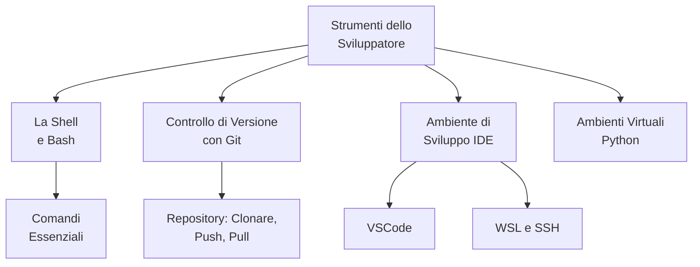


### 02_La_Shell_e_i_Comandi_Bash.md
# La Shell e i Comandi Bash

## 1. Cos'è una Shell?

La **shell** è un'interfaccia a riga di comando che permette di interagire con il sistema operativo. Invece di usare mouse e finestre (GUI - Interfaccia Grafica), si usano comandi testuali. È uno strumento potente e veloce per gestire file, eseguire programmi e automatizzare compiti.

Esistono diverse shell, le più comuni sono:
-   **Bash** (Bourne Again Shell): Lo standard su Linux e macOS. È quella che useremo.
-   **PowerShell**: La shell moderna di Windows.

## 2. Comandi Essenziali di Bash

Ecco i comandi fondamentali per muoversi e operare nel sistema.

### Navigazione nel File System

-   **`pwd`** (Print Working Directory): Mostra il percorso della cartella in cui ti trovi.
    ```bash
    pwd
    # Output: /home/utente/documenti
    ```
-   **`ls`** (List): Elenca i file e le cartelle nella directory corrente.
    ```bash
    ls -la # Mostra una lista dettagliata, inclusi i file nascosti
    ```
-   **`cd`** (Change Directory): Cambia la cartella corrente.
    ```bash
    cd /percorso/altra/cartella # Va a un percorso assoluto
    cd ..                     # Sale alla cartella genitore
    ```

### Gestione di File e Cartelle

-   **`mkdir`** (Make Directory): Crea una nuova cartella.
    ```bash
    mkdir nuova_cartella
    ```
-   **`touch`**: Crea un file vuoto.
    ```bash
    touch mio_file.txt
    ```
-   **`cp`** (Copy): Copia un file o una cartella.
    ```bash
    cp file_originale.txt file_copiato.txt
    ```
-   **`mv`** (Move): Sposta o rinomina un file/cartella.
    ```bash
    mv vecchio_nome.txt nuovo_nome.txt # Rinomina
    mv file.txt ./un_altra_cartella/   # Sposta
    ```
-   **`rm`** (Remove): Elimina un file. **Attenzione: l'eliminazione è permanente!**
    ```bash
    rm file_da_cancellare.txt
    rm -r cartella_da_cancellare # L'opzione -r cancella le cartelle e il loro contenuto
    ```

### Visualizzazione di File

-   **`cat`** (Concatenate): Mostra l'intero contenuto di un file.
    ```bash
    cat file.txt
    ```
-   **`less`**: Mostra il contenuto di un file una pagina alla volta (utile per file lunghi). Premi `q` per uscire.
    ```bash
    less file_molto_lungo.log
    ```

### Ottenere Aiuto

-   **`man`** (Manual): Mostra la pagina di manuale per un comando, spiegandone l'uso e le opzioni.
    ```bash
    man ls
    ```

### 03_Controllo_di_Versione_con_Git.md
# Controllo di Versione con Git e GitHub

## 1. A Cosa Serve il Controllo di Versione?

Il **controllo di versione** è un sistema che tiene traccia delle modifiche apportate ai file nel tempo. Permette di:
-   **Salvare "fotografie"** del progetto in momenti specifici.
-   **Tornare a versioni precedenti** se qualcosa va storto.
-   **Collaborare** con altre persone sullo stesso progetto senza creare conflitti.
-   Capire **chi ha modificato cosa e quando**.

**Git** è il software di controllo di versione più usato al mondo. **GitHub** è una piattaforma online che ospita i repository Git e facilita la collaborazione.

## 2. Il Repository: L'Archivio del Tuo Progetto

Un **repository** (o "repo") è semplicemente una cartella che contiene tutti i file del tuo progetto, insieme alla cronologia completa di tutte le modifiche.

### Creare un Repository su GitHub

1.  Vai su [GitHub](https://github.com) e accedi.
2.  Clicca su `+` in alto a destra e seleziona `New repository`.
3.  Dai un nome al repository, scegli se renderlo pubblico o privato e clicca su `Create repository`.

### Clonare un Repository Esistente

"Clonare" significa creare una copia locale di un repository che esiste su GitHub.

1.  Sulla pagina del repository su GitHub, clicca su `Code` e copia l'URL (HTTPS).
2.  In VSCode, apri la Palette dei Comandi (`Ctrl+Shift+P` o `F1`).
3.  Digita `Git: Clone` e premi Invio.
4.  Incolla l'URL e scegli una cartella sul tuo computer dove salvare il progetto.

## 3. Il Flusso di Lavoro Fondamentale

Il ciclo di lavoro con Git consiste nel salvare le modifiche (commit) e sincronizzarle con il repository remoto (push/pull).

### a) Fare un Commit: Salvare una "Fotografia" delle Modifiche

Un **commit** è un salvataggio permanente delle modifiche nel tuo repository locale.

1.  **Modifica i file**: Lavora sul tuo codice come faresti normalmente.
2.  **Visualizza le modifiche**: Vai alla scheda `Source Control` (`Ctrl+Shift+G`) in VSCode. Vedrai una lista dei file che hai modificato.
3.  **Stage (Prepara) le modifiche**: Clicca sul `+` accanto ai file che vuoi includere nel salvataggio. Questo li sposta nell'area di "staging".
4.  **Scrivi un messaggio di commit**: Nella casella di testo in alto, scrivi un messaggio breve ma descrittivo che spieghi cosa hai fatto (es. "Aggiunta funzione di login").
5.  **Esegui il commit**: Clicca sul segno di spunta (✓) per salvare le modifiche nel tuo repository locale.

### b) Sincronizzare con GitHub: Push e Pull

Una volta che hai salvato le modifiche localmente, devi sincronizzarle con GitHub.

*   **Push**: Invia i tuoi commit locali al repository remoto su GitHub. È come caricare i tuoi salvataggi.
    *   **Come fare**: Nella scheda `Source Control`, clicca sui tre puntini (`...`) e seleziona `Push`.

*   **Pull**: Scarica i commit che altri hanno caricato sul repository remoto. È come aggiornare il tuo progetto con le modifiche fatte dai tuoi collaboratori.
    *   **Come fare**: Clicca sui tre puntini (`...`) e seleziona `Pull`.

> **Buona pratica**: Esegui sempre un `pull` prima di iniziare a lavorare per assicurarti di avere la versione più aggiornata del progetto.

### Il Tasto "Sync Changes"

VSCode offre un comodo pulsante "Sync Changes" (Sincronizza Modifiche) nella barra di stato in basso a sinistra. Questo comando esegue prima un `pull` e poi un `push`, mantenendo il tuo repository locale e quello remoto perfettamente allineati.


### 04_Ambiente_di_Sviluppo_con_VSCode.md
# Ambiente di Sviluppo con VSCode

## 1. Cos'è un IDE?

Un **IDE (Integrated Development Environment)**, o Ambiente di Sviluppo Integrato, è un'applicazione software che fornisce agli sviluppatori tutti gli strumenti necessari per scrivere, testare e correggere il codice in un unico posto.

Un buon IDE include:
-   **Editor di Codice Avanzato**: Con evidenziazione della sintassi e suggerimenti automatici.
-   **Debugger**: Per trovare e risolvere errori nel codice.
-   **Terminale Integrato**: Per eseguire comandi senza lasciare l'editor.
-   **Integrazione con Git**: Per gestire il controllo di versione.

**Visual Studio Code (VSCode)** è uno degli IDE più popolari al mondo. È leggero, veloce e incredibilmente personalizzabile grazie a un vasto marketplace di estensioni.

## 2. WSL: Linux dentro Windows

**WSL (Windows Subsystem for Linux)** è una funzionalità di Windows che permette di eseguire un ambiente Linux completo direttamente su Windows, senza bisogno di macchine virtuali.

**Perché è utile per uno sviluppatore?**
-   **Compatibilità**: Molti strumenti di sviluppo e server di produzione sono basati su Linux. Sviluppare in un ambiente simile a quello di produzione riduce i problemi.
-   **Potenza della Shell**: La shell Bash di Linux è molto più potente del Command Prompt di Windows.
-   **Integrazione Perfetta**: VSCode si integra perfettamente con WSL, permettendoti di scrivere codice su Windows ma di eseguirlo e testarlo in un ambiente Linux.

**Come installare WSL:**
1.  Apri PowerShell come Amministratore.
2.  Esegui il comando: `wsl --install`
3.  Riavvia il computer. Al riavvio, verrà installata automaticamente la distribuzione Ubuntu.

Una volta installato, puoi aprire un terminale Ubuntu direttamente da VSCode per lavorare con i comandi Bash.

## 3. SSH: Lavorare su Server Remoti

**SSH (Secure Shell)** è un protocollo che permette di connettersi e interagire in modo sicuro con un computer remoto (come un server in cloud).

VSCode, tramite l'estensione **"Remote - SSH"**, ti permette di aprire una cartella su un server remoto e lavorarci come se fosse sul tuo computer locale.

**Perché è utile?**
-   Puoi modificare i file direttamente sul server di test o produzione.
-   Puoi sfruttare la potenza di calcolo di un server potente dal tuo laptop.
-   L'ambiente di sviluppo è identico a quello di esecuzione.

**Come connettersi via SSH da VSCode:**
1.  Installa l'estensione "Remote - SSH" dal marketplace di VSCode.
2.  Apri la Palette dei Comandi (`F1` o `Ctrl+Shift+P`).
3.  Digita `Remote-SSH: Connect to Host...` e seleziona `Add New SSH Host...`.
4.  Inserisci il comando di connessione, ad esempio: `ssh nome_utente@indirizzo_ip_server`
5.  Una volta configurato, potrai connetterti al server direttamente da VSCode e aprire le sue cartelle.

### 06_Qualita_del_Codice_Linter_e_Formatter.md
# Qualità del Codice: Linter e Formatter

Scrivere codice che funziona è solo metà del lavoro. Scrivere codice **pulito, leggibile e coerente** è fondamentale per poterci lavorare in futuro e per collaborare con altri. Due strumenti essenziali ci aiutano in questo: i linter e i formatter.

## 1. Il Linter: Il Correttore Ortografico del Codice

Un **linter** è uno strumento che analizza il codice sorgente per trovare errori di programmazione, bug, errori stilistici e costrutti sospetti.

*   **Analogia**: Pensa al linter come al correttore ortografico e grammaticale di un editor di testo. Ti sottolinea in rosso gli errori di battitura o le frasi costruite male.

Un linter può segnalare:
-   Variabili definite ma mai utilizzate.
-   Errori di sintassi comuni.
-   Violazioni delle convenzioni di stile (es. nomi di variabili non standard).
-   Potenziali bug logici.

## 2. Il Formatter: L'Ordinatore Automatico

Un **formatter** è uno strumento che riscrive automaticamente il tuo codice per assicurarsi che segua delle regole di stile precise e coerenti. Si occupa di spazi, a capo, parentesi e indentazione.

*   **Analogia**: Pensa al formatter come a una funzione di "giustifica testo" che sistema automaticamente i margini e l'interlinea di un documento per renderlo uniforme e professionale.

L'uso di un formatter elimina le discussioni sullo stile e garantisce che tutto il codice del progetto abbia lo stesso aspetto, indipendentemente da chi lo ha scritto.

## 3. Ruff: Il Coltello Svizzero per il Codice Python

**Ruff** è uno strumento moderno ed estremamente veloce che funge sia da **linter** che da **formatter** per Python. È diventato lo standard de facto in molti progetti professionali.

### a) Installazione

Con l'ambiente virtuale attivo, installiamo Ruff:
```bash
pip install ruff
```

### b) Come Usarlo

Ruff si usa da terminale.

*   **Per controllare il codice (linting)**:
    ```bash
    # Analizza tutti i file nella cartella corrente e sottocartelle
    ruff check .
    ```
    Ruff ti mostrerà una lista di errori e suggerimenti.

*   **Per formattare il codice**:
    ```bash
    # Formatta automaticamente tutti i file
    ruff format .
    ```

### c) Integrazione con VSCode

La vera potenza di Ruff si ottiene integrandolo in VSCode.

1.  Installa l'estensione **"Ruff"** dal marketplace di VSCode.
2.  Configura VSCode per formattare il codice automaticamente al salvataggio. Vai nelle impostazioni (`settings.json`) e aggiungi:
    ```json
    "[python]": {
        "editor.defaultFormatter": "charliermarsh.ruff",
        "editor.formatOnSave": true,
        "editor.codeActionsOnSave": {
            "source.fixAll": "explicit"
        }
    }
    ```

Con questa configurazione, ogni volta che salvi un file Python, Ruff lo pulirà e lo formatterà automaticamente, aiutandoti a scrivere codice di alta qualità fin dal primo giorno.

### 07_Uso_Responsabile_dell_IA_GitHub_Copilot.md
# Uso Responsabile dell'IA: GitHub Copilot

## 1. Cos'è GitHub Copilot?

Immagina di avere al tuo fianco un programmatore esperto che non si stanca mai, conosce quasi tutti i linguaggi di programmazione e può darti suggerimenti in tempo reale mentre scrivi. Questo è, in sintesi, GitHub Copilot.

**Copilot è un assistente di programmazione basato sull'Intelligenza Artificiale.** Non scrive il codice *al posto tuo*, ma ti aiuta a scriverlo meglio e più velocemente, completando righe di codice, suggerendo intere funzioni e persino aiutandoti a capire parti di codice complesse.

*   **Analogia**: Pensa a Copilot non come a un pilota automatico che guida l'aereo per te, ma come a un **copilota esperto**. Tu, il pilota, hai sempre il controllo e la responsabilità finale. Il copilota ti aiuta con i compiti di routine, ti avvisa di possibili problemi e ti fornisce informazioni, ma la decisione su cosa fare spetta sempre a te.

## 2. Configurazione in VS Code

Integrare Copilot nel tuo ambiente di lavoro è semplicissimo:

1.  Apri Visual Studio Code.
2.  Vai alla vista "Estensioni" (`Ctrl+Shift+X`).
3.  Cerca l'estensione **"GitHub Copilot"** e installala.
4.  La prima volta ti verrà chiesto di effettuare l'accesso con il tuo account GitHub per autorizzare l'estensione. Segui le istruzioni a schermo.

Una volta attivato, vedrai una piccola icona di Copilot nella barra di stato in basso a destra di VS Code.

## 3. Le Regole d'Oro: Come Usarlo Correttamente

Usare l'IA in modo efficace è un'abilità. Seguire queste regole ti impedirà di usare Copilot come una "stampella" e ti aiuterà a usarlo come un "propulsore" per il tuo apprendimento.

#### Regola n.1: Tu sei il Pilota, l'IA è il Copilota
La responsabilità finale del codice che scrivi è **sempre e solo tua**. Devi essere in grado di capire, spiegare e giustificare ogni singola riga del tuo programma. Se non capisci un suggerimento di Copilot, non usarlo.

#### Regola n.2: Mai Fidarsi Ciecamente
Copilot è incredibilmente potente, ma **non è infallibile**. Può generare codice che contiene bug, che è inefficiente o che non fa esattamente quello che vuoi. Ogni suggerimento va letto, analizzato e mentalmente verificato prima di essere accettato.

#### Regola n.3: Usa l'IA per Accelerare, non per Sostituire il Pensiero
L'IA è uno strumento per automatizzare i compiti ripetitivi o per superare piccoli blocchi, non per evitare di pensare. La progettazione del programma, la logica generale e la struttura del codice devono venire da te.

## 4. Casi d'Uso Virtuosi (Come Sfruttarlo al Meglio)

Ecco alcuni modi intelligenti per collaborare con il tuo copilota IA:

*   **Completamento Automatico Potenziato:** Inizia a scrivere un ciclo `for` per iterare su una lista e Copilot probabilmente ti suggerirà l'intero blocco di codice corretto.
    ```python
    voti =
    # Inizia a scrivere "for voto in voti:" e osserva...
    ```

*   **Generare Codice Ripetitivo (Boilerplate):** Invece di riscrivere per l'ennesima volta il codice per leggere un file, puoi chiederlo a Copilot.
    ```python
    # Scrivi un commento e osserva il suggerimento:
    # funzione che legge un file JSON e restituisce il suo contenuto
    ```

*   **Imparare e Scoprire:** Se non ricordi come si fa qualcosa, puoi chiederlo direttamente.
    ```python
    # come si ordina una lista di dizionari in base alla chiave "eta"?
    studenti = [{"nome": "Mario", "eta": 17}, {"nome": "Luisa", "eta": 16}]
    # Inizia a scrivere "studenti_ordinati = sorted(...)"
    ```

*   **Scrivere Commenti e Documentazione:** Se hai scritto una funzione complessa, puoi chiedere a Copilot di documentarla per te. Seleziona la funzione e usa la chat di Copilot per chiedere: "Scrivi una docstring per questa funzione".

## 5. Anti-Pattern (Cosa NON Fare)

*   **Scrivere un commento con la traccia dell'esercizio:** Non scrivere `# Esercizio 04: Gestore della lista della spesa` e aspettarti che Copilot scriva l'intera soluzione. Questo non ti insegna nulla.
*   **Accettare i suggerimenti senza leggerli:** Premere `Tab` a ripetizione senza capire cosa si sta aggiungendo al codice è il modo più veloce per creare un programma pieno di bug e che non capisci.
*   **Chiedere all'IA di risolvere un errore al posto tuo:** Invece di fare copia-incolla di un messaggio di errore e chiedere "risolvi", chiedi "Quali sono le possibili cause di questo errore?". In questo modo, impari a fare debug.

**In conclusione:** GitHub Copilot è uno strumento rivoluzionario. Imparare a usarlo bene fin da subito ti renderà uno sviluppatore più rapido, efficiente e consapevole.


### 01_Mappa_Concettuale_Basi_Python.md
# Mappa Concettuale: Basi della Programmazione Python

Questa mappa delinea il percorso di apprendimento per i fondamenti della programmazione procedurale in Python.

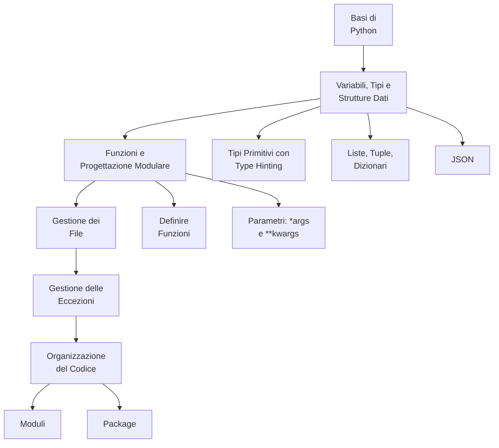

### 05_Gestione_delle_Eccezioni.md
# Gestione delle Eccezioni

## 1. Cos'è un'Eccezione?

Un'**eccezione** è un errore che si verifica durante l'esecuzione di un programma e che ne interrompe il normale flusso. Se non viene gestita, l'eccezione causa l'arresto anomalo (crash) del programma con un messaggio di errore.

*   **Analogia**: Stai seguendo una ricetta e ti accorgi che manca un ingrediente fondamentale (es. le uova). Non puoi continuare. Questo "imprevisto" è un'eccezione. Invece di fermarti, puoi avere un piano B: "se mancano le uova, usa le banane". Questo è "gestire l'eccezione".

## 2. Il Blocco `try...except`

Per gestire le eccezioni, Python usa il blocco `try...except`.

-   **`try`**: In questo blocco inseriamo il codice "rischioso", quello che potrebbe generare un'eccezione.
-   **`except`**: In questo blocco inseriamo il codice da eseguire *solo se* si verifica un'eccezione nel blocco `try`.

**Esempio Pratico:**
```python
try:
    # Codice che potrebbe causare un errore
    eta_str = input("Inserisci la tua età: ")
    eta = int(eta_str) # Questa riga può fallire se l'input non è un numero
    print(f"Tra un anno avrai {eta + 1} anni.")

except ValueError:
    # Codice da eseguire se si verifica un ValueError
    print("Errore: devi inserire un numero valido, non del testo!")
```

Senza `try...except`, se l'utente scrivesse "dieci" invece di "10", il programma si arresterebbe. Con questo blocco, invece, il programma mostra un messaggio di errore amichevole e termina in modo controllato.

## 3. Gestire Tipi Diversi di Eccezioni

Puoi gestire diversi tipi di errori in modo specifico, aggiungendo più blocchi `except`.

```python
try:
    numeratore = int(input("Inserisci il numeratore: "))
    denominatore = int(input("Inserisci il denominatore: "))
    risultato = numeratore / denominatore
    print(f"Il risultato è {risultato}")

except ValueError:
    print("Errore: devi inserire numeri validi.")

except ZeroDivisionError:
    print("Errore: è impossibile dividere per zero.")
```

## 4. Il Blocco `finally`

Il blocco **`finally`** contiene codice che viene eseguito **sempre**, indipendentemente dal fatto che si sia verificata un'eccezione o meno. È fondamentale per le operazioni di "pulizia", come chiudere una connessione o un file.

```python
file = None # Inizializziamo la variabile
try:
    file = open("dati.txt", "r")
    contenuto = file.read()
    print(contenuto)
except FileNotFoundError:
    print("Il file non esiste.")
finally:
    if file:
        file.close() # Questa operazione viene eseguita sempre
        print("File chiuso correttamente.")
```

### 06_Organizzazione_del_Codice_Moduli_e_Package.md
# Organizzazione del Codice: Moduli e Package

Quando un programma cresce, tenere tutto il codice in un unico file diventa confusionario e insostenibile. Per questo motivo, Python ci offre due strumenti per organizzare il codice in modo logico e riutilizzabile: i **moduli** e i **package**.

## 1. Moduli: File di Codice Riutilizzabili

Un **modulo** non è altro che un singolo file Python (`.py`).

**A cosa serve?**
-   **Organizzazione**: Invece di avere un file di 2000 righe, puoi dividere la logica in file più piccoli e tematici. Ad esempio, `calcoli.py` per le funzioni matematiche e `grafica.py` per quelle di disegno.
-   **Riusabilità**: Puoi importare un modulo in altri script per riutilizzarne le funzioni e le classi senza doverle riscrivere.

### Come si usa un modulo?
Si usa l'istruzione **`import`**.

**Esempio Concettuale**:
*   File `matematica.py`:
    ```python
    PI_GRECO: float = 3.14159

    def area_cerchio(raggio: float) -> float:
        return PI_GRECO * (raggio ** 2)
    ```
*   File `main.py` (nella stessa cartella):
    ```python
    import matematica

    area = matematica.area_cerchio(5)
    print(f"L'area è: {area}")
    ```

## 2. Package: Cartelle di Moduli

Un **package** (o pacchetto) è una cartella che contiene più moduli correlati. Permette di creare una struttura gerarchica per progetti molto grandi.

**Come si crea un package?**
Basta creare una cartella e, al suo interno, inserire un file speciale (anche vuoto) chiamato `__init__.py`. Questo file comunica a Python che la cartella non è una cartella qualsiasi, ma un package.

### Struttura di un Package

```
mio_progetto/
├── main.py
└── geometria/              <-- Questo è un package
    ├── __init__.py
    ├── forme_piane.py      <-- Modulo
    └── solidi.py           <-- Modulo
```

### Come si usa un package?
Si usa la "dot notation" (notazione col punto) per accedere ai moduli interni.

**Esempio Concettuale**:
*   File `geometria/forme_piane.py`:
    ```python
    def area_quadrato(lato: float) -> float:
        return lato * lato
    ```
*   File `main.py`:
    ```python
    from geometria.forme_piane import area_quadrato

    area = area_quadrato(4)
    print(f"L'area del quadrato è {area}")
    ```

**In sintesi**:
-   **Modulo**: un file `.py`.
-   **Package**: una cartella di moduli (con `__init__.py`).
-   **Libreria**: un insieme di uno o più package distribuiti insieme per risolvere un problema specifico (es. `requests` o `Flask`).


### 01_Mappa_Concettuale_Testing.md
# Mappa Concettuale: Testing e Qualità del Codice

Questa mappa riassume i concetti chiave che affronteremo in questo modulo, introducendo il testing automatico come pratica fondamentale per uno sviluppatore professionista.

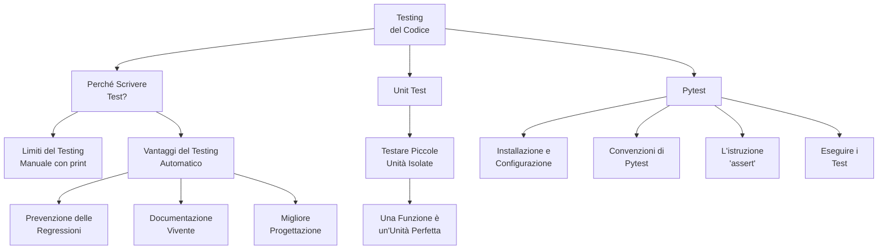

### 02_Perche_Scrivere_Test.md
# Perché Scrivere Test?

Fino ad ora, per verificare se il nostro codice funzionava, abbiamo probabilmente usato un metodo molto semplice: aggiungere delle istruzioni `print()` e lanciare lo script per vedere cosa succedeva. Questo si chiama **testing manuale**.

Il testing manuale va bene per script di poche righe, ma ha enormi limiti quando i progetti crescono:
*   **È noioso e ripetitivo:** Devi lanciare il programma e inserire gli stessi input ogni volta.
*   **È soggetto a errori:** È facile dimenticarsi di provare un caso specifico o interpretare male un risultato.
*   **Non è scalabile:** Se hai 50 funzioni, testarle tutte a mano dopo ogni modifica diventa un lavoro a tempo pieno.

Per questi motivi, gli sviluppatori professionisti si affidano al **testing automatico**.

## 1. Cos'è il Testing Automatico?

Il testing automatico consiste nello scrivere del codice il cui unico scopo è **verificare che altro codice funzioni come previsto**. Questi "script di verifica" si chiamano **test**.

*   **Analogia**: Pensa di costruire un ponte. Il testing manuale è come farci passare sopra un'auto e sperare che regga. Il testing automatico è come portare il ponte in un laboratorio e usare macchinari specializzati per applicare carichi precisi e misurare la resistenza, garantendo che rispetti le specifiche di progetto.

## 2. I Vantaggi del Testing Automatico

Scrivere test richiede tempo, ma è un investimento che ripaga enormemente.

### a) La Rete di Sicurezza (Prevenzione delle Regressioni)
Questa è la ragione più importante. Una "regressione" è un bug che si introduce in una funzionalità che prima funzionava.
Immagina di avere un'applicazione complessa. Aggiungi una nuova funzionalità e, senza accorgertene, rompi qualcos'altro in un'altra parte del programma. Con una buona suite di test, puoi lanciare un singolo comando e verificare in pochi secondi che tutto il resto dell'applicazione funzioni ancora perfettamente. I test sono la tua **rete di sicurezza** contro gli errori imprevisti.

### b) Documentazione Vivente
Un test ben scritto è una forma di documentazione. Mostra in modo inequivocabile cosa dovrebbe fare una funzione con un dato input. Un nuovo sviluppatore può leggere i test per capire come usare il tuo codice.
A differenza della documentazione tradizionale, i test non possono diventare obsoleti: se il codice cambia e il test non viene aggiornato, il test fallirà.

### c) Migliore Progettazione del Codice
Scrivere codice "testabile" ti spinge a progettarlo meglio. Incoraggia a scrivere funzioni piccole, focalizzate su un singolo compito e che non dipendano da troppe parti esterne (le cosiddette "funzioni pure"). Questo porta naturalmente a un codice più pulito, modulare e facile da mantenere.

## 3. La Piramide del Testing: Focus sugli Unit Test

Esistono diversi tipi di test. Una famosa metafora è la "piramide del testing", che li classifica in base al loro scopo e al loro numero. Alla base della piramide ci sono gli **Unit Test**.

Uno **Unit Test** verifica la più piccola unità di codice possibile in modo isolato. Nel nostro caso, l'unità perfetta è una singola **funzione**.

L'obiettivo di uno unit test è rispondere a una domanda molto semplice e precisa: "Se passo a *questa* funzione *questo* input, mi restituisce *questo* output atteso?".

Per il momento, ci concentreremo esclusivamente sugli unit test. Sono i più veloci da scrivere ed eseguire, e costituiscono la solida base di ogni strategia di testing professionale.

### 03_Il_Tuo_Primo_Unit_Test_con_Pytest.md
# Il Tuo Primo Unit Test con Pytest

Abbiamo visto *perché* è importante testare. Ora vediamo *come* farlo. Useremo `pytest`, la libreria di testing più popolare e potente nell'ecosistema Python.

### 1. Cos'è `pytest`?

`pytest` è un framework di testing che rende la scrittura di test semplice e leggibile. Richiede pochissima "cerimonia" (codice standard ripetitivo) e si basa su convenzioni intelligenti per trovare ed eseguire i test automaticamente.

### 2. Preparazione del Progetto

Un progetto ben organizzato separa il codice dell'applicazione dal codice di test. La struttura standard è la seguente:

```
progetto_calcolatrice/
├── src/                      <-- Cartella per il codice sorgente
│   └── calcolatrice.py
└── tests/                    <-- Cartella per i test
    └── test_calcolatrice.py
```

1.  **Crea le cartelle:** Crea una cartella per il progetto e, al suo interno, le sottocartelle `src` e `tests`.
2.  **Crea l'ambiente virtuale e installa pytest:**
    ```bash
    # Dalla cartella principale del progetto
    python -m venv .venv
    source .venv/Scripts/activate  # o .venv/bin/activate
    pip install pytest
    ```

### 3. Il Codice da Testare

Creiamo una funzione molto semplice nel file `src/calcolatrice.py`.

```python
# File: src/calcolatrice.py

def somma(a: int, b: int) -> int:
    """Restituisce la somma di due numeri interi."""
    return a + b
```

### 4. Scrivere il Primo Test

Ora scriviamo il codice che verificherà la nostra funzione `somma`. `pytest` si basa su due semplici convenzioni:
1.  I file di test devono iniziare con `test_` (es. `test_calcolatrice.py`).
2.  Le funzioni di test al loro interno devono iniziare con `test_` (es. `test_somma`).

Ecco il contenuto del file `tests/test_calcolatrice.py`:

```python
# File: tests/test_calcolatrice.py

# 1. Importa la funzione che vuoi testare
from src.calcolatrice import somma

# 2. Definisci la funzione di test
def test_somma_due_numeri_positivi():
    # 3. Prepara gli input e l'output atteso
    input1 = 5
    input2 = 3
    risultato_atteso = 8
    
    # 4. Chiama la funzione e verifica il risultato con 'assert'
    assert somma(input1, input2) == risultato_atteso

def test_somma_un_positivo_e_un_negativo():
    """Un test può essere anche più conciso."""
    assert somma(10, -5) == 5
```

### 5. L'Istruzione `assert`: il Cuore del Test

`assert` è una parola chiave di Python che controlla se una condizione è `True`.
*   Se `condizione` è `True`, l'istruzione non fa nulla e il test prosegue.
*   Se `condizione` è `False`, l'istruzione solleva un errore (`AssertionError`) e il test **fallisce**.

`pytest` usa `assert` per verificare le nostre aspettative. La riga `assert somma(5, 3) == 8` si legge come: "Affermo che il risultato di `somma(5, 3)` deve essere uguale a `8`".

### 6. Eseguire i Test

Con l'ambiente virtuale attivo, posizionati nella cartella principale del progetto (`progetto_calcolatrice/`) e lancia questo semplice comando:

```bash
pytest
```

`pytest` troverà automaticamente la cartella `tests`, i file `test_*.py` e le funzioni `test_*()` al loro interno, e li eseguirà.

**Output in caso di successo:**
Se tutto va bene, vedrai un output simile a questo, con dei puntini verdi che indicano i test passati.
```
============================= test session starts ==============================
...
collected 2 items

tests/test_calcolatrice.py ..                                            [100%]

============================== 2 passed in 0.01s ===============================
```

**Output in caso di fallimento:**
Proviamo a rovinare la nostra funzione `somma` in `src/calcolatrice.py`:
```python
def somma(a: int, b: int) -> int:
    return a * b # Errore intenzionale!
```
Ora, rieseguiamo `pytest`:
```
============================= test session starts ==============================
...
collected 2 items

tests/test_calcolatrice.py FF                                            [100%]

=================================== FAILURES ===================================
______________________ test_somma_due_numeri_positivi ______________________

    def test_somma_due_numeri_positivi():
        input1 = 5
        input2 = 3
        risultato_atteso = 8
    
>       assert somma(input1, input2) == risultato_atteso
E       assert 15 == 8
E        +  where 15 = somma(5, 3)

tests/test_calcolatrice.py:11: AssertionError
...
=========================== 2 failed in 0.03s ============================
```
`pytest` non solo ci dice che i test sono falliti (`FF`), ma ci mostra esattamente *perché*: si aspettava `8` ma ha ricevuto `15`. Questo feedback immediato e preciso è ciò che rende il testing automatico così potente.

### 01_Mappa_Concettuale_Logica.md
# Mappa Concettuale: Logica di Programmazione e Manipolazione Dati

Questa mappa delinea il percorso che seguiremo per imparare a "pensare da programmatori", trasformando problemi reali in soluzioni software attraverso la manipolazione efficace dei dati.

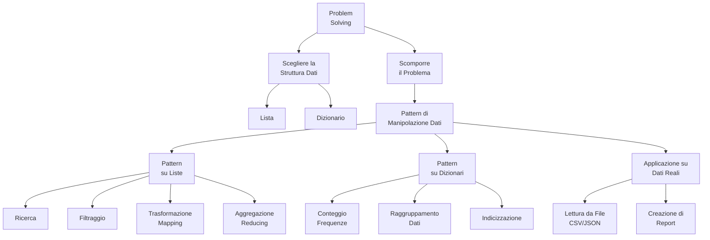

### 02_Dall_Idea_al_Codice_Problem_Solving.md
# Dall'Idea al Codice: Un Approccio al Problem Solving

Sapere come funzionano `for`, `if`, liste e dizionari è come conoscere le lettere dell'alfabeto e le regole grammaticali. Ora dobbiamo imparare a scrivere una storia: come trasformare un'idea o un problema in un programma funzionante.

Questo processo si chiama **problem solving** e segue alcuni passaggi logici.

### Il Problema di Esempio
Immaginiamo di dover risolvere questo problema:
> "Data una lista di studenti, ognuno con un nome e un voto, trovare il nome dello studente con il voto più alto."

### Passaggio 1: Capire e Scomporre il Problema
La prima cosa da fare non è scrivere codice, ma pensare. Dobbiamo assicurarci di aver capito la richiesta e scomporla in passaggi più piccoli.

1.  Dobbiamo avere una lista di studenti.
2.  Per ogni studente, ci servono due informazioni: il nome e il voto.
3.  Dobbiamo esaminare *tutti* gli studenti.
4.  Mentre li esaminiamo, dobbiamo tenere traccia di chi ha il voto più alto *fino a quel momento*.
5.  Una volta esaminati tutti, il nome che abbiamo tenuto da parte sarà la nostra risposta.

### Passaggio 2: Scegliere le Strutture Dati
Come rappresentiamo i nostri dati?

*   Per "una lista di studenti", una **lista Python** sembra la scelta perfetta.
*   Per rappresentare un singolo studente con "nome e voto", un **dizionario** è ideale, perché ci permette di associare delle etichette (`"nome"`, `"voto"`) ai valori.

La nostra struttura dati sarà quindi una **lista di dizionari**:
```python
studenti = [
    {"nome": "Alice", "voto": 85},
    {"nome": "Bob", "voto": 92},
    {"nome": "Carla", "voto": 78},
]
```

### Passaggio 3: Scrivere lo Pseudo-Codice
Prima di scrivere codice Python, è utile scrivere una bozza in linguaggio umano. Questo si chiama **pseudo-codice**. Ci aiuta a definire la logica senza preoccuparci della sintassi.

```
# Inizializza una variabile per il miglior studente trovato finora a "nessuno".
# Inizializza una variabile per il voto più alto trovato finora a un valore molto basso (es. -1).

# Per ogni studente nella lista degli studenti:
#   Se il voto dello studente attuale è maggiore del voto più alto trovato finora:
#     Aggiorna il voto più alto con il voto dello studente attuale.
#     Aggiorna il miglior studente con lo studente attuale.

# Alla fine del ciclo, stampa il nome del miglior studente.
```

### Passaggio 4: Tradurre lo Pseudo-Codice in Python
Solo ora, con un piano chiaro in mente, iniziamo a scrivere il codice vero e proprio.

```python
# Dati iniziali
studenti = [
    {"nome": "Alice", "voto": 85},
    {"nome": "Bob", "voto": 92},
    {"nome": "Carla", "voto": 78},
]

# Inizializzazione delle variabili
miglior_studente_trovato = None
voto_piu_alto = -1

# Ciclo per esaminare ogni studente
for studente in studenti:
    # Condizione per verificare se abbiamo trovato un nuovo "migliore"
    if studente["voto"] > voto_piu_alto:
        voto_piu_alto = studente["voto"]
        miglior_studente_trovato = studente

# Stampa del risultato finale
if miglior_studente_trovato:
    print(f"Lo studente con il voto più alto è: {miglior_studente_trovato['nome']}")
# Output: Lo studente con il voto più alto è: Bob
```

Questo approccio strutturato (Capire -> Scegliere Dati -> Pianificare -> Codificare) è una delle abilità più importanti per un programmatore e ti aiuterà a risolvere problemi sempre più complessi.

### 03_Pattern_Comuni_su_Liste.md
# Pattern Comuni di Manipolazione delle Liste

Quando lavoriamo con i dati, ci troviamo spesso a ripetere le stesse operazioni logiche. Imparare a riconoscere e implementare questi "pattern" (schemi) ci rende programmatori più veloci ed efficaci.

Consideriamo di avere la seguente lista di dati per tutti gli esempi:
```python
prodotti = [
    {"id": 1, "nome": "Laptop", "prezzo": 1200, "categoria": "Elettronica"},
    {"id": 2, "nome": "Tastiera", "prezzo": 80, "categoria": "Elettronica"},
    {"id": 3, "nome": "Libro Python", "prezzo": 35, "categoria": "Libri"},
    {"id": 4, "nome": "Scrivania", "prezzo": 200, "categoria": "Arredamento"},
]
```

### 1. Ricerca (Trovare un elemento)
**Obiettivo:** Trovare un elemento specifico che soddisfa una condizione.

**Problema:** Trovare il prodotto con `id` uguale a 3.

```python
prodotto_cercato = None
for prodotto in prodotti:
    if prodotto["id"] == 3:
        prodotto_cercato = prodotto
        break # Trovato! Inutile continuare il ciclo.

print(prodotto_cercato)
# Output: {'id': 3, 'nome': 'Libro Python', 'prezzo': 35, 'categoria': 'Libri'}
```

### 2. Filtraggio (Selezionare un sottoinsieme)
**Obiettivo:** Creare una nuova lista contenente solo gli elementi che soddisfano una condizione.

**Problema:** Trovare tutti i prodotti della categoria "Elettronica".

```python
prodotti_elettronici = [] # Inizializza una lista vuota
for prodotto in prodotti:
    if prodotto["categoria"] == "Elettronica":
        prodotti_elettronici.append(prodotto)

print(prodotti_elettronici)
# Output: [{'id': 1, ...}, {'id': 2, ...}]
```

### 3. Trasformazione (Mapping)
**Obiettivo:** Creare una nuova lista trasformando ogni elemento della lista originale.

**Problema:** Creare una lista contenente solo i nomi di tutti i prodotti.

```python
nomi_prodotti = []
for prodotto in prodotti:
    nomi_prodotti.append(prodotto["nome"])

print(nomi_prodotti)
# Output: ['Laptop', 'Tastiera', 'Libro Python', 'Scrivania']
```

### 4. Aggregazione (Reducing)
**Obiettivo:** Calcolare un singolo valore riassuntivo a partire da un'intera lista.

**Problema:** Calcolare il prezzo totale di tutti i prodotti in magazzino.

```python
prezzo_totale = 0
for prodotto in prodotti:
    prezzo_totale += prodotto["prezzo"]

print(f"Il valore totale del magazzino è: {prezzo_totale}€")
# Output: Il valore totale del magazzino è: 1515€

# Si può anche fare in modo più "Pythonico" usando la trasformazione
# e la funzione sum()
prezzi = [prodotto["prezzo"] for prodotto in prodotti] # Questo si chiama "list comprehension"
prezzo_totale_pythonico = sum(prezzi)
print(f"Valore totale (modo Pythonico): {prezzo_totale_pythonico}€")
```
Questi quattro pattern sono i mattoni fondamentali per quasi ogni operazione di analisi e manipolazione dei dati.

### 04_Pattern_Comuni_su_Dizionari.md
# Pattern Comuni di Manipolazione con i Dizionari

Le liste sono ottime per contenere collezioni di dati, ma i dizionari brillano quando dobbiamo organizzarli, contarli o accedervi in modo più strutturato.

### 1. Conteggio delle Frequenze
**Obiettivo:** Contare quante volte ogni elemento appare in una collezione.

**Problema:** Data una lista di voti, contare quanti studenti hanno preso ciascun voto.

```python
voti = [8, 7, 8, 9, 7, 10, 6, 8]

frequenze_voti = {} # Inizializza un dizionario vuoto
for voto in voti:
    if voto in frequenze_voti:
        frequenze_voti[voto] += 1
    else:
        frequenze_voti[voto] = 1

print(frequenze_voti)
# Output: {8: 3, 7: 2, 9: 1, 10: 1, 6: 1}
# Si legge: "3 studenti hanno preso 8, 2 studenti hanno preso 7, ..."
```

### 2. Raggruppamento di Dati
**Obiettivo:** Organizzare una lista di elementi in gruppi basati su una proprietà comune. Questo è uno dei pattern più potenti.

**Problema:** Data la lista di prodotti, raggrupparli per categoria.

```python
prodotti = [
    {"id": 1, "nome": "Laptop", "prezzo": 1200, "categoria": "Elettronica"},
    {"id": 2, "nome": "Tastiera", "prezzo": 80, "categoria": "Elettronica"},
    {"id": 3, "nome": "Libro Python", "prezzo": 35, "categoria": "Libri"},
    {"id": 4, "nome": "Scrivania", "prezzo": 200, "categoria": "Arredamento"},
]

prodotti_per_categoria = {}
for prodotto in prodotti:
    categoria = prodotto["categoria"]
    if categoria not in prodotti_per_categoria:
        # Se è la prima volta che vediamo questa categoria,
        # creiamo una nuova lista vuota per essa.
        prodotti_per_categoria[categoria] = []
    
    # Aggiungiamo il prodotto corrente alla lista della sua categoria.
    prodotti_per_categoria[categoria].append(prodotto)

# Per una stampa più leggibile, usiamo il modulo pprint
import pprint
pprint.pprint(prodotti_per_categoria)
# Output:
# {'Arredamento': [{'id': 4, ...}],
#  'Elettronica': [{'id': 1, ...}, {'id': 2, ...}],
#  'Libri': [{'id': 3, ...}]}
```

### 3. Indicizzazione (per Ricerche Veloci)
**Obiettivo:** Trasformare una lista di dati in un dizionario per poter accedere a un elemento istantaneamente tramite un suo identificatore univoco (ID), invece di dover ciclare ogni volta l'intera lista.

**Problema:** Data la lista di prodotti, creare una struttura che permetta di trovare un prodotto dato il suo `id` in modo immediato.

```python
# La nostra lista originale
prodotti_lista = [
    {"id": "A101", "nome": "Laptop", "prezzo": 1200},
    {"id": "B205", "nome": "Tastiera", "prezzo": 80},
    {"id": "C310", "nome": "Libro Python", "prezzo": 35},
]

# Creiamo un "indice" usando un dizionario
prodotti_indicizzati = {}
for prodotto in prodotti_lista:
    prodotti_indicizzati[prodotto["id"]] = prodotto

# Ora la ricerca è istantanea, senza bisogno di un ciclo 'for'!
id_da_cercare = "B205"
prodotto_cercato = prodotti_indicizzati[id_da_cercare]

print(prodotto_cercato)
# Output: {'id': 'B205', 'nome': 'Tastiera', 'prezzo': 80}
```
Questo approccio è molto più efficiente della ricerca lineare su una lista, specialmente quando la collezione di dati è molto grande.

### 05_Lavorare_con_Dati_Strutturati.md
# Mettere Tutto Insieme: Lavorare con Dati Strutturati

Abbiamo imparato i pattern di problem-solving e di manipolazione dei dati. Ora applichiamoli a uno scenario realistico: analizzare dati provenienti da un file esterno, come un file CSV o JSON.

### Lo Scenario
Immaginiamo di essere i gestori di un piccolo e-commerce e di avere un file `ordini.csv` con i dati delle vendite. Il nostro obiettivo è scrivere uno script Python che legga questo file e produca un piccolo report.

**Contenuto del file `ordini.csv`:**
```csv
id_ordine,prodotto,categoria,quantita,prezzo_unitario
1,Laptop,Elettronica,1,1200
2,Tastiera,Elettronica,2,80
3,Libro Python,Libri,5,35
4,Webcam,Elettronica,1,50
5,Libro SQL,Libri,3,30
```

**Il nostro compito è rispondere a queste domande:**
1.  Qual è il ricavo totale di tutte le vendite?
2.  Quanti prodotti della categoria "Libri" sono stati venduti in totale?
3.  Qual è l'ordine con il ricavo più alto?

### Il Processo: Leggere, Analizzare, Stampare

Il nostro script seguirà tre passaggi, proprio come abbiamo imparato:
1.  **Leggere:** Aprire il file `ordini.csv` e caricare i dati in una struttura dati comoda (una lista di dizionari).
2.  **Analizzare:** Applicare i pattern di manipolazione (aggregazione, filtraggio, ricerca) per calcolare le risposte.
3.  **Stampare:** Mostrare i risultati in un report leggibile.

### Il Codice Completo

```python
import csv

NOME_FILE = 'ordini.csv'

# --- 1. FASE DI LETTURA ---
def carica_ordini(nome_file: str) -> list[dict]:
    """Legge un file CSV e lo converte in una lista di dizionari."""
    ordini = []
    try:
        with open(nome_file, mode='r', encoding='utf-8') as file:
            reader = csv.DictReader(file)
            for riga in reader:
                # Converte i valori numerici da stringa a numero
                riga['quantita'] = int(riga['quantita'])
                riga['prezzo_unitario'] = int(riga['prezzo_unitario'])
                ordini.append(riga)
    except FileNotFoundError:
        print(f"Errore: il file {nome_file} non è stato trovato.")
    return ordini

# --- 2. FASE DI ANALISI ---
def analizza_dati(ordini: list[dict]):
    """Esegue tutte le analisi e restituisce i risultati."""
    # Domanda 1: Ricavo totale (Aggregazione)
    ricavo_totale = 0
    for ordine in ordini:
        ricavo_totale += ordine['quantita'] * ordine['prezzo_unitario']

    # Domanda 2: Quantità totale libri (Filtraggio + Aggregazione)
    quantita_libri = 0
    for ordine in ordini:
        if ordine['categoria'] == 'Libri':
            quantita_libri += ordine['quantita']

    # Domanda 3: Ordine con ricavo più alto (Ricerca)
    ordine_piu_ricco = None
    ricavo_massimo = -1
    for ordine in ordini:
        ricavo_ordine = ordine['quantita'] * ordine['prezzo_unitario']
        if ricavo_ordine > ricavo_massimo:
            ricavo_massimo = ricavo_ordine
            ordine_piu_ricco = ordine
            
    return {
        "ricavo_totale": ricavo_totale,
        "quantita_libri": quantita_libri,
        "ordine_piu_ricco": ordine_piu_ricco
    }

# --- 3. FASE DI STAMPA ---
def stampa_report(risultati: dict):
    """Stampa i risultati in un formato leggibile."""
    print("--- Report Analisi Vendite ---")
    print(f"Ricavo totale: {risultati['ricavo_totale']}€")
    print(f"Totale libri venduti: {risultati['quantita_libri']}")
    if risultati['ordine_piu_ricco']:
        prodotto = risultati['ordine_piu_ricco']['prodotto']
        ricavo = risultati['ordine_piu_ricco']['quantita'] * risultati['ordine_piu_ricco']['prezzo_unitario']
        print(f"L'ordine più redditizio è stato per '{prodotto}' con un ricavo di {ricavo}€.")
    print("----------------------------")

# --- PROGRAMMA PRINCIPALE ---
def main():
    """Orchestra l'esecuzione del programma."""
    ordini_caricati = carica_ordini(NOME_FILE)
    if ordini_caricati:
        risultati_analisi = analizza_dati(ordini_caricati)
        stampa_report(risultati_analisi)

# Esecuzione
if __name__ == "__main__":
    main()
```
Questo esempio finale dimostra come i semplici pattern che abbiamo studiato possano essere combinati per creare script di analisi dati potenti e utili.

### 01_Mappa_Concettuale_Modulo_01.md
# Mappa Concettuale: Modellazione e Oggetti

Questa mappa riassume il flusso logico del modulo: dall'idea astratta di "oggetto" fino alla sua concreta implementazione, usando UML come ponte tra il design e il codice.

```mermaid
graph TD
    A[Paradigma a Oggetti] --> B{Concetti Chiave};
    A --> C{Strumenti di Rappresentazione};

    subgraph Concetti
        B --> B1[Classe: Il Progetto];
        B --> B2[Oggetto: L'Istanza Concreta];
        B1 --> B3[Attributi: I Dati];
        B1 --> B4[Metodi: I Comportamenti];
    end

    subgraph Strumenti
        C --> C1[Testo: I Requisiti];
        C --> C2[Diagramma UML: Il Disegno Tecnico];
        C --> C3[Codice Python: L'Implementazione];
    end

    C1 -- Traduzione --> C2;
    C2 -- Traduzione --> C3;

    B3 -- Rappresentati in --> C2;
    B4 -- Rappresentati in --> C2;

    style A fill:#345,stroke:#fff,stroke-width:2px,color:#fff

### 03_Dal_Progetto_al_Codice_Python.md
# Lezione 2: Dal Progetto al Codice - La Sintassi `class`

Abbiamo il nostro progetto UML per la classe `Personaggio`. Ora, vediamo come "costruirla" usando il codice Python. La traduzione da un diagramma UML di base a una classe Python è quasi diretta.

## 1. Tradurre UML in Codice Python

Ecco di nuovo il nostro diagramma:

```mermaid
classDiagram
    class Personaggio {
        +nome: str
        +punti_vita: int
        +livello: int
        +presentati() void
        +attacca(bersaglio) void
    }
```

E questa è la sua implementazione in Python:

```python
class Personaggio:
    # Questo è il costruttore, che vedremo in dettaglio nel prossimo modulo.
    # Per ora, usiamolo per definire gli attributi di ogni oggetto.
    def __init__(self, nome: str):
        self.nome: str = nome
        self.punti_vita: int = 100
        self.livello: int = 1

    # Traduzione del metodo presentati()
    def presentati(self) -> None:
        print(f"Sono {self.nome}, un eroe di livello {self.livello}!")

    # Traduzione del metodo attacca()
    def attacca(self, bersaglio) -> None:
        print(f"{self.nome} attacca {bersaglio.nome}!")
        # La logica del danno verrà aggiunta in futuro
```

Analizziamo la corrispondenza:
*   `class Personaggio`: La dichiarazione della classe in UML corrisponde a `class Personaggio:`.
*   **Attributi:** Gli attributi UML (`nome`, `punti_vita`, `livello`) diventano **attributi di istanza** in Python, definiti nel costruttore `__init__` e preceduti da `self.`.
*   **Metodi:** I metodi UML (`presentati`, `attacca`) diventano **metodi di istanza** in Python, ovvero funzioni definite dentro la classe che accettano `self` come primo parametro.

### Cos'è `self`?
`self` è una variabile speciale che rappresenta **l'oggetto specifico** su cui il metodo viene chiamato. Quando scriviamo `eroe1.presentati()`, `self` all'interno del metodo `presentati` si riferirà proprio a `eroe1`. Se chiamiamo `eroe2.presentati()`, `self` si riferirà a `eroe2`. È il modo con cui un oggetto accede a sé stesso.

## 2. Attributi di Istanza vs. Attributi di Classe

Gli attributi che abbiamo definito con `self.` sono **attributi di istanza**, perché ogni oggetto (istanza) avrà la sua copia personale. Se creiamo due personaggi, `eroe1` ed `eroe2`, ognuno avrà il suo `nome` e i suoi `punti_vita`.

Esistono anche gli **attributi di classe**, che sono condivisi da *tutti* gli oggetti creati da quella classe. Si definiscono direttamente sotto la dichiarazione della classe.

```python
class Personaggio:
    # Attributo di classe: tutti i personaggi appartengono allo stesso gioco
    nome_gioco = "Le Cronache di Pythonia"

    def __init__(self, nome: str):
        # Attributi di istanza
        self.nome: str = nome
        self.punti_vita: int = 100
```

## 3. Metodi di Istanza, di Classe e Statici

*   **Metodi di Istanza (i più comuni):** Lavorano sui dati di un oggetto specifico (`self`). Esempi: `attacca()`, `subisci_danno()`.

*   **Metodi di Classe:** Lavorano sui dati della classe (`cls`), non di un singolo oggetto. Si dichiarano con il decoratore `@classmethod`. Sono utili per creare "costruttori alternativi".

    ```python
    @classmethod
    def crea_personaggio_base(cls, nome: str):
        # 'cls' qui è come dire 'Personaggio'
        return cls(nome)
    ```

*   **Metodi Statici:** Sono funzioni logicamente collegate alla classe, ma che **non dipendono né dallo stato della classe né da quello di un oggetto**. Non ricevono né `cls` né `self`. Si dichiarano con `@staticmethod`.

    ```python
    @staticmethod
    def calcola_danno_critico(danno_base: int) -> int:
        return danno_base * 2
    ```
    Questa funzione è utile nel contesto del `Personaggio`, ma non ha bisogno di sapere il nome o i punti vita di un personaggio specifico per funzionare.

### 01_Mappa_Concettuale_Modulo_02.md
# Mappa Concettuale: Costruzione delle Classi

Questa mappa illustra come trasformare una classe semplice in un componente software robusto, controllando come viene creata, come i suoi dati vengono protetti e come si presenta al mondo esterno.

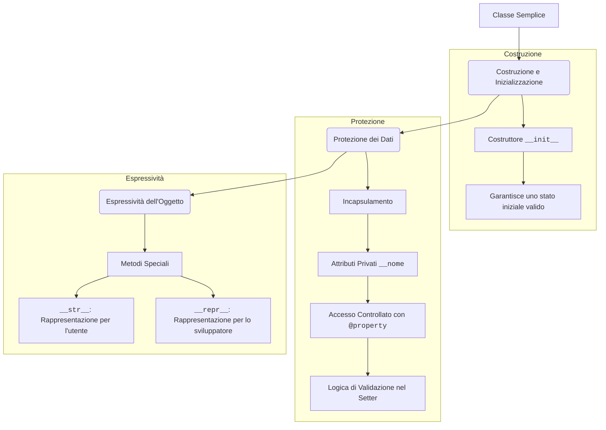

### 02_Costruttori_e_Incapsulamento.md
# Lezione 1: Costruttori e Incapsulamento

Nel modulo precedente abbiamo creato una classe `Personaggio`, ma la sua creazione e gestione dei dati è ancora fragile. Vediamo come renderla più solida.

## 1. Il Metodo Speciale `__init__`: Il Costruttore

Finora, per creare un personaggio, abbiamo fatto così:

```python
eroe = Personaggio()
eroe.nome = "Aragorn" # Imposto gli attributi dopo la creazione
```

Questo approccio è scomodo e soggetto a errori: potremmo dimenticarci di impostare un attributo fondamentale. La soluzione è il **costruttore**, un metodo speciale chiamato `__init__` che viene eseguito **automaticamente** ogni volta che creiamo un nuovo oggetto.

Il suo scopo è **inizializzare lo stato dell'oggetto**, ovvero impostare i valori iniziali dei suoi attributi.

```python
class Personaggio:
    # Il costruttore accetta i parametri necessari per creare l'oggetto
    def __init__(self, nome: str, livello: int):
        print(f"È nato un nuovo eroe: {nome}!")
        self.nome = nome
        self.punti_vita = 100
        self.livello = livello

# Ora la creazione è più pulita e sicura
eroe = Personaggio(nome="Aragorn", livello=5)
# L'output sarà: È nato un nuovo eroe: Aragorn!
```

Con il costruttore, garantiamo che ogni oggetto `Personaggio` nasca già con tutti gli attributi necessari.

## 2. Il Principio dell'Incapsulamento

Ora abbiamo un altro problema. Cosa succede se qualcuno scrive questo codice?

```python
eroe.punti_vita = -50 # Un valore senza senso!
```

Nulla glielo impedisce. Per evitare accessi diretti e incontrollati ai dati interni di un oggetto, usiamo l'**incapsulamento**.

L'incapsulamento consiste nel "nascondere" gli attributi, rendendoli **privati**, e fornire dei metodi pubblici per interagire con essi in modo controllato.

In Python, per convenzione, un attributo è considerato privato se il suo nome inizia con un doppio underscore (`__`).

```python
class Personaggio:
    def __init__(self, nome: str, livello: int):
        self.nome = nome # Attributo pubblico
        self.__punti_vita = 100 # Attributo PRIVATO
        self.__livello = livello # Attributo PRIVATO
```

Se ora proviamo ad accedere a `eroe.__punti_vita`, Python ci darà un `AttributeError`. I dati sono protetti!

## 3. Aggiornare il Diagramma UML

L'incapsulamento si riflette anche nel nostro progetto UML. La **visibilità** di attributi e metodi viene indicata con dei simboli:
*   `+` : Pubblico (accessibile da chiunque)
*   `-` : Privato (accessibile solo dalla classe stessa)
*   `#` : Protetto (un concetto legato all'ereditarietà, che vedremo più avanti)

Il nostro diagramma `Personaggio` aggiornato diventa così:

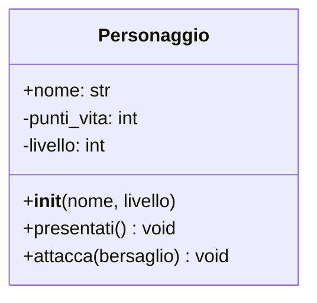
Abbiamo reso `punti_vita` e `livello` privati, proteggendoli da modifiche esterne incontrollate. Nella prossima lezione vedremo come interagire con questi dati in modo sicuro.

### 03_Accesso_Controllato_Properties.md
# Lezione 2: Accesso Controllato con le Properties

Abbiamo incapsulato i nostri dati, ma ora come facciamo a leggerli o a modificarli in modo sicuro? La risposta in Python è elegante e potente: le **properties**.

## 1. Getter e Setter: L'Approccio Tradizionale

In molti linguaggi, per accedere a un attributo privato `__punti_vita` si creano due metodi:
*   `get_punti_vita()`: per leggere il valore.
*   `set_punti_vita(valore)`: per modificare il valore, aggiungendo della logica di controllo.

Questo funziona, ma in Python c'è un modo migliore.

## 2. Le `@property`: L'Approccio "Pythonic"

Python ci permette di creare metodi `getter` e `setter` che si comportano come se fossero dei semplici attributi. Questo si ottiene con i **decoratori** `@property` e `@*.setter`.

Vediamo come applicarlo al nostro `Personaggio`:

```python
class Personaggio:
    def __init__(self, nome: str, livello: int):
        self.nome = nome
        self.__punti_vita = 100
        self.__livello = livello

    # GETTER: Questo metodo viene eseguito quando leggiamo 'eroe.punti_vita'
    @property
    def punti_vita(self) -> int:
        print("(Accesso in lettura ai punti vita)")
        return self.__punti_vita

    # SETTER: Questo metodo viene eseguito quando scriviamo 'eroe.punti_vita = valore'
    @punti_vita.setter
    def punti_vita(self, nuovo_valore: int) -> None:
        print("(Tentativo di modifica dei punti vita)")
        if nuovo_valore < 0:
            self.__punti_vita = 0 # Logica di validazione!
            print("I punti vita non possono essere negativi. Impostati a 0.")
        else:
            self.__punti_vita = nuovo_valore

    # Property in sola lettura per il livello (non ha un setter)
    @property
    def livello(self) -> int:
        return self.__livello

# --- Esempio di utilizzo ---
eroe = Personaggio("Gandalf", 20)

# 1. Lettura tramite il GETTER (@property)
print(f"PV iniziali: {eroe.punti_vita}")

# 2. Scrittura tramite il SETTER (@punti_vita.setter)
eroe.punti_vita = 50
print(f"PV dopo attacco: {eroe.punti_vita}")

# 3. Tentativo di assegnare un valore non valido
eroe.punti_vita = -30
print(f"PV dopo colpo quasi mortale: {eroe.punti_vita}")

# 4. Tentativo di modificare un attributo in sola lettura
# eroe.livello = 21 # Questo causerebbe un AttributeError!
```

### Vantaggi delle Properties:
1.  **Sintassi Pulita:** L'utente della classe accede a `eroe.punti_vita` come se fosse un attributo normale, senza dover chiamare `get...()` o `set...()`.
2.  **Controllo Totale:** Lo sviluppatore della classe mantiene il controllo totale su cosa succede quando un attributo viene letto o modificato.
3.  **Flessibilità:** Puoi iniziare con un attributo pubblico e, se in futuro avrai bisogno di aggiungere logica, puoi trasformarlo in una property senza dover cambiare tutto il codice che lo utilizzava.

### 04_Metodi_Speciali.md
# Lezione 3: Rendere le Classi Espressive con i Metodi Speciali

Un oggetto in Python può fare molto di più che chiamare i propri metodi. Può essere "stampato", "confrontato" con altri oggetti, e persino "sommato". Per fare questo, dobbiamo implementare i **metodi speciali** (o "magici", o "dunder" da *double underscore*).

Questi metodi iniziano e finiscono sempre con un doppio underscore.

## 1. `__str__`: La Rappresentazione per l'Utente

Cosa succede se proviamo a stampare il nostro oggetto `Personaggio`?

```python
eroe = Personaggio("Gimli", 8)
print(eroe)
# Output: <__main__.Personaggio object at 0x...>
```

L'output di default non è molto utile. Per fornire una rappresentazione testuale chiara e leggibile, implementiamo il metodo `__str__`.

```python
class Personaggio:
    def __init__(self, nome: str, livello: int):
        self.nome = nome
        self.__punti_vita = 100
        self.__livello = livello

    def __str__(self) -> str:
        # Questo metodo deve restituire (return) una stringa
        return f"Personaggio: {self.nome} | Livello: {self.__livello} | PV: {self.__punti_vita}"

# --- Esempio di utilizzo ---
eroe = Personaggio("Gimli", 8)
print(eroe)
# Output: Personaggio: Gimli | Livello: 8 | PV: 100
```
Il metodo `__str__` viene chiamato automaticamente ogni volta che un oggetto viene convertito in stringa, ad esempio con `print()` o `str()`.

## 2. `__repr__`: La Rappresentazione per lo Sviluppatore

Esiste un altro metodo simile, `__repr__`, che ha uno scopo diverso. La sua rappresentazione dovrebbe essere **inequivocabile** e, idealmente, dovrebbe essere un codice Python valido che può ricreare l'oggetto.

```python
class Personaggio:
    # ... (init e str come prima) ...

    def __repr__(self) -> str:
        return f"Personaggio(nome='{self.nome}', livello={self.__livello})"

# --- Esempio di utilizzo ---
eroe = Personaggio("Legolas", 10)
print(repr(eroe)) # Chiamata esplicita
# Output: Personaggio(nome='Legolas', livello=10)
```

**Regola pratica:** Se implementate solo uno dei due, implementate `__repr__`. Se `__str__` non è definito, Python userà `__repr__` al suo posto.

## 3. Altri Metodi Speciali Utili

Esistono decine di metodi speciali. Eccone alcuni comuni:

*   `__eq__(self, other)`: Definisce il comportamento dell'operatore di uguaglianza (`==`). Permette di decidere quando due oggetti sono da considerarsi "uguali".
    ```python
    def __eq__(self, other):
        # Due personaggi sono uguali se hanno lo stesso nome
        if isinstance(other, Personaggio):
            return self.nome == other.nome
        return False
    ```

*   **Metodi per operazioni aritmetiche:** `__add__` (+), `__sub__` (-), `__mul__` (*), etc.
*   **Metodi per il confronto:** `__lt__` (<), `__gt__` (>), `__le__` (<=), `__ge__` (>=).

Padroneggiare i metodi speciali permette di creare oggetti che si integrano perfettamente con il linguaggio Python, rendendo il codice più intuitivo e leggibile.

### 01_Mappa_Concettuale_Modulo_03.md
# Mappa Concettuale: Relazioni tra Classi

Questa mappa mostra i due modi principali con cui le classi possono interagire, formando la struttura portante di un'applicazione a oggetti.

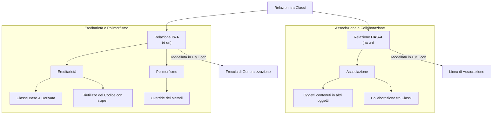

### 03_Associazioni_e_Collaborazione.md
# Lezione 2: Associazioni e Collaborazione tra Oggetti (Relazione "HAS-A")

La relazione "HAS-A" (un oggetto "ha un" altro oggetto) è fondamentale nella OOP e si modella tramite **Associazioni**. A differenza dell'ereditarietà, che crea una gerarchia di "tipi", le associazioni descrivono come oggetti indipendenti collaborano tra loro.

Comprendere come implementare i diversi tipi di associazione è cruciale per tradurre un diagramma UML in codice funzionante.

## 1. Cardinalità e Direzionalità

Prima di scrivere il codice, dobbiamo capire due concetti chiave del nostro progetto UML:

*   **Cardinalità:** Indica *quanti* oggetti sono coinvolti in una relazione. Le più comuni sono `1` (esattamente uno), `*` (zero o più, cioè "molti") e `1..*` (uno o più).
*   **Direzionalità:** Indica *chi conosce chi*. Una freccia (`-->`) indica una navigazione unidirezionale (una classe conosce l'altra, ma non viceversa). Una linea semplice (`--`) indica una relazione bidirezionale (entrambe le classi si conoscono a vicenda).

Vediamo come implementare i tre casi principali nel contesto del nostro RPG.

---

## 2. Associazione Uno-a-Uno (1-a-1)

Un'istanza della Classe A è associata a una sola istanza della Classe B, e viceversa.

**Esempio RPG:** Ogni `Personaggio` ha esattamente un `Inventario`, e ogni `Inventario` appartiene a un solo `Personaggio`.

#### Diagramma UML
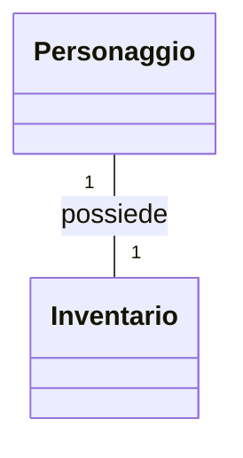

#### Implementazione in Python
Per una relazione bidirezionale, entrambe le classi devono avere un attributo per fare riferimento all'altra. È fondamentale gestire l'associazione in modo coerente da entrambi i lati.

```python
class Inventario:
    def __init__(self):
        self.capacita = 10
        self.oggetti = []
        self.proprietario = None # Riferimento al Personaggio

class Personaggio:
    def __init__(self, nome: str):
        self.nome = nome
        self.inventario = None # Inizialmente non ha inventario

    def assegna_inventario(self, inventario: "Inventario"):
        # Assegna l'inventario al personaggio
        self.inventario = inventario
        # E contemporaneamente, dice all'inventario chi è il suo proprietario
        if inventario.proprietario is not self:
            inventario.proprietario = self

# --- Utilizzo ---
eroe = Personaggio("Aragorn")
inventario_eroe = Inventario()

eroe.assegna_inventario(inventario_eroe)

print(f"Proprietario dell'inventario: {inventario_eroe.proprietario.nome}")
print(f"L'eroe {eroe.nome} ha un inventario con capacità {eroe.inventario.capacita}")
```

---

## 3. Associazione Uno-a-Molti (1-a-N)

Un'istanza della Classe A è associata a zero o più istanze della Classe B. Ogni istanza della Classe B è associata a una sola istanza della Classe A.

**Esempio RPG:** Un `Inventario` può contenere molti `Oggetti`, ma un `Oggetto` specifico si trova in un solo `Inventario` alla volta.

#### Diagramma UML
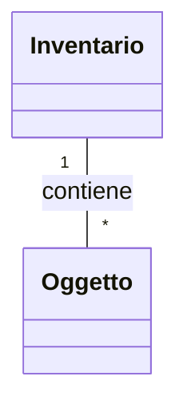

#### Implementazione in Python
La classe "uno" (`Inventario`) avrà una lista per contenere gli oggetti "molti" (`Oggetto`).

```python
class Oggetto:
    def __init__(self, nome: str):
        self.nome = nome
        self.contenitore = None # Riferimento all'Inventario

    def __str__(self):
        return self.nome

class Inventario:
    def __init__(self):
        self.oggetti: list[Oggetto] = [] # La lista per contenere i "molti"

    def aggiungi_oggetto(self, oggetto: Oggetto):
        self.oggetti.append(oggetto)
        oggetto.contenitore = self # Mantiene la coerenza
        print(f"'{oggetto.nome}' aggiunto all'inventario.")

    def mostra_contenuto(self):
        if not self.oggetti:
            print("L'inventario è vuoto.")
        else:
            nomi = ", ".join(str(o) for o in self.oggetti)
            print(f"Contenuto: [{nomi}]")

# --- Utilizzo ---
inventario = Inventario()
spada = Oggetto("Spada di Ferro")
scudo = Oggetto("Scudo di Legno")

inventario.aggiungi_oggetto(spada)
inventario.aggiungi_oggetto(scudo)

inventario.mostra_contenuto()
print(f"La {spada.nome} si trova in un inventario: {isinstance(spada.contenitore, Inventario)}")
```
---

## 4. Associazione Molti-a-Molti (N-a-N)

Un'istanza della Classe A può essere associata a più istanze della Classe B, e viceversa.

**Esempio RPG:** Un `Personaggio` può apprendere più `Abilita` (es. "Attacco Rapido", "Palla di Fuoco"), e una stessa `Abilita` può essere appresa da più `Personaggi`.

#### Diagramma UML
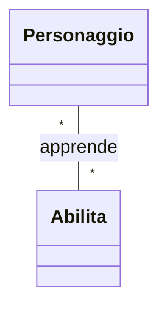

#### Implementazione in Python
Questa è la relazione più complessa. Entrambe le classi devono avere una lista per contenere i riferimenti all'altra. Sono necessari metodi specifici per creare il legame in modo consistente da entrambe le parti.

```python
# È necessario definire prima Personaggio per usarlo nel type hint di Abilita
class Personaggio:
    def __init__(self, nome: str):
        self.nome = nome
        # Lista di abilità conosciute da questo personaggio
        self.abilita_apprese: list[Abilita] = []

    def apprendi_abilita(self, abilita: "Abilita"):
        if abilita not in self.abilita_apprese:
            self.abilita_apprese.append(abilita) # Aggiunge l'abilità al personaggio
            abilita.aggiungi_utilizzatore(self) # E aggiunge il personaggio all'abilità
            print(f"{self.nome} ha appreso '{abilita.nome_abilita}'!")

class Abilita:
    def __init__(self, nome_abilita: str):
        self.nome_abilita = nome_abilita
        # Lista di personaggi che conoscono questa abilità
        self.utilizzatori: list[Personaggio] = []

    def aggiungi_utilizzatore(self, personaggio: Personaggio):
        if personaggio not in self.utilizzatori:
            self.utilizzatori.append(personaggio)

# --- Utilizzo ---
guerriero = Personaggio("Conan")
mago = Personaggio("Merlino")

attacco_rapido = Abilita("Attacco Rapido")
palla_di_fuoco = Abilita("Palla di Fuoco")

guerriero.apprendi_abilita(attacco_rapido)
mago.apprendi_abilita(palla_di_fuoco)
mago.apprendi_abilita(attacco_rapido) # Anche il mago può essere veloce!

print(f"\nAbilità di {guerriero.nome}: {[a.nome_abilita for a in guerriero.abilita_apprese]}")
print(f"Abilità di {mago.nome}: {[a.nome_abilita for a in mago.abilita_apprese]}")
print(f"Chi conosce '{attacco_rapido.nome_abilita}'? {[p.nome for p in attacco_rapido.utilizzatori]}")
```

### 01_Mappa_Concettuale_Modulo_04.md
# Mappa Concettuale: Relazioni tra Classi

Questa mappa mostra i due modi principali con cui le classi possono interagire, formando la struttura portante di un'applicazione a oggetti.

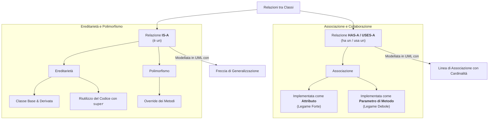

### 03_Processo_di_Modellazione_Guidato.md
# Lezione 2: Il Processo di Modellazione - Una Guida Pratica

Abbiamo analizzato diversi scenari e creato diagrammi UML. Ora, formalizziamo il processo con due diagrammi di flusso che possono servirvi come una "checklist" o una guida passo-passo quando affrontate un nuovo problema di design, specialmente per il progetto finale.

## 1. Guida al Design: Dai Requisiti al Diagramma UML

Questo flowchart vi aiuta a decidere come trasformare le informazioni di un testo in elementi UML.

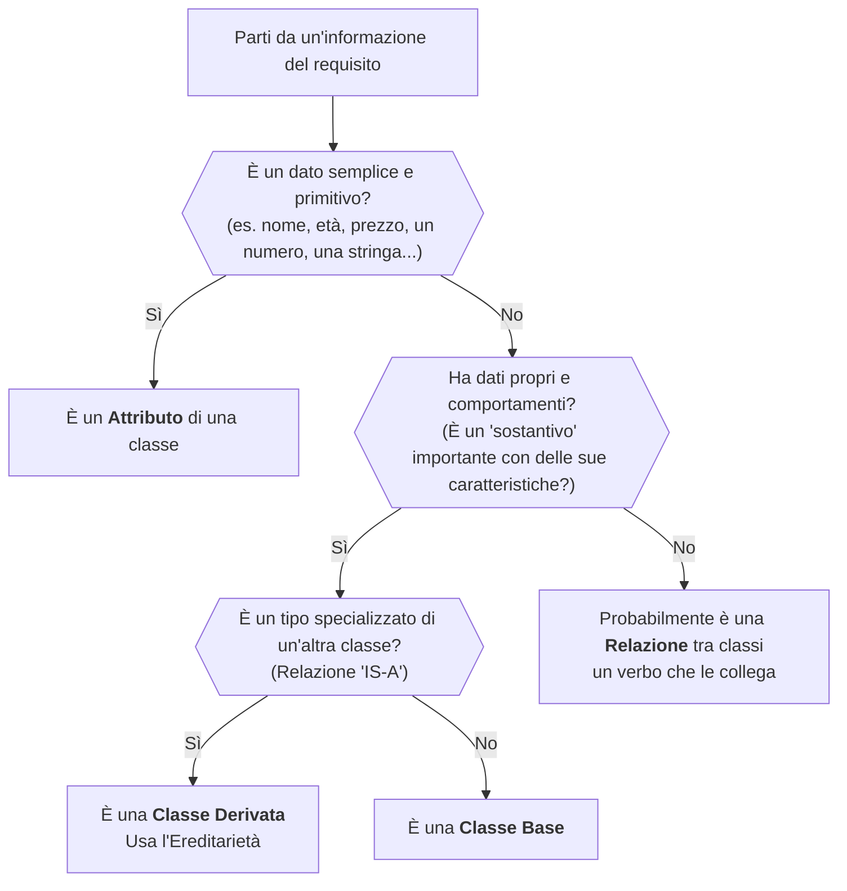

## 2. Guida all'Implementazione: Dal Diagramma UML al Codice Python

Una volta che avete il vostro diagramma UML, questo flowchart vi guida su come tradurre le associazioni in attributi Python.

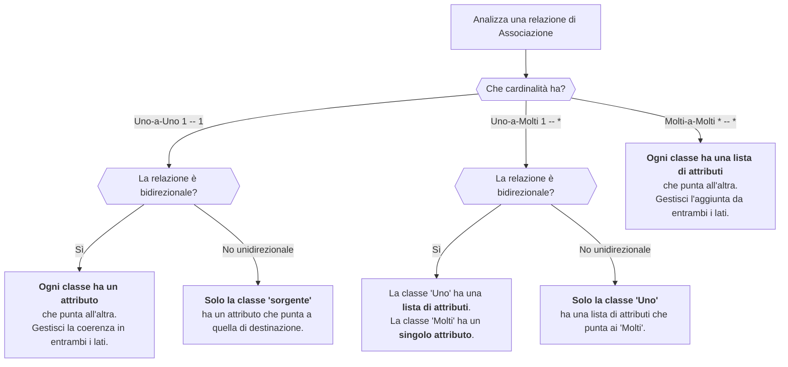


### 01_Mappa_Concettuale_Modulo_05.md
# Mappa Concettuale: Contesto e Qualità del Codice

Questa mappa mostra come, una volta costruito un sistema a oggetti, ci si assicura che funzioni correttamente (Qualità) e si definisce come può essere usato da altri (Contesto).

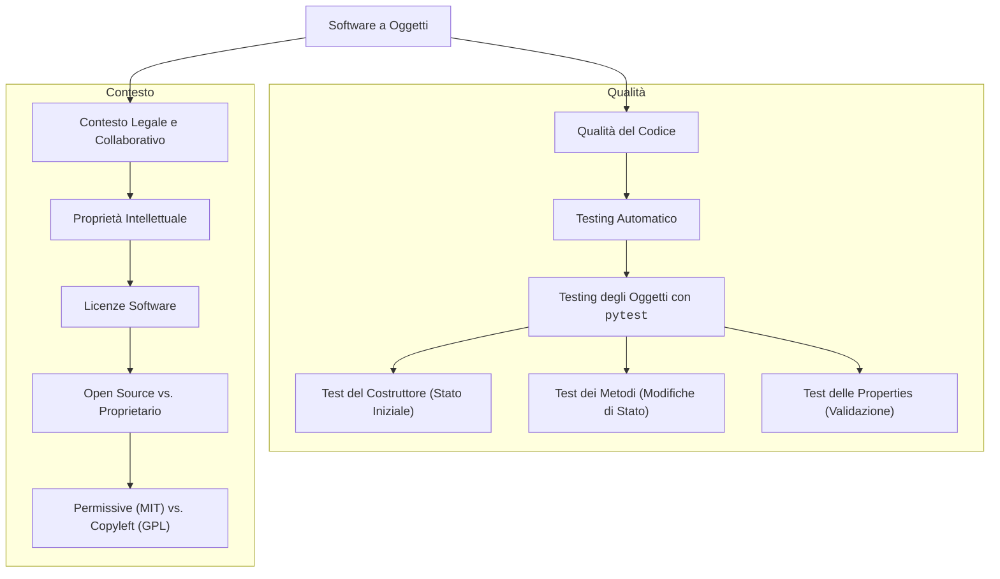

### 03_Le_Licenze_Software.md
# Lezione 2: Le Licenze Software

Quando creiamo un'opera dell'ingegno (un libro, una canzone, un software), questa è automaticamente protetta dal diritto d'autore. Nessuno può copiarla, modificarla o distribuirla senza il nostro permesso.

Ma cosa succede se **vogliamo** che altri usino, modifichino e condividano il nostro codice? Dobbiamo concedere loro il permesso in modo formale. Questo permesso si chiama **licenza**.

## 1. Software Proprietario vs. Software Libero (Open Source)

*   **Software Proprietario:** Il codice sorgente è un segreto industriale. L'utente non può vederlo, modificarlo o distribuirlo. La licenza d'uso (chiamata EULA) è molto restrittiva. *Esempi: Windows, Microsoft Office, Adobe Photoshop.*

*   **Software Libero / Open Source:** Il codice sorgente è pubblico. La licenza concede a tutti delle libertà fondamentali:
    1.  **Libertà di eseguire** il programma per qualsiasi scopo.
    2.  **Libertà di studiare** come funziona il programma e di modificarlo.
    3.  **Libertà di ridistribuire** copie.
    4.  **Libertà di distribuire** copie delle proprie versioni modificate.

## 2. Le Principali Categorie di Licenze Open Source

Non tutte le licenze open source sono uguali. Si dividono principalmente in due famiglie.

### a) Licenze Permissive (es. MIT, Apache 2.0)
*   **Filosofia:** Massima libertà. "Prendi il mio codice e facci quello che vuoi".
*   **Caratteristiche:**
    *   Puoi usare il codice in progetti personali, open source o **anche commerciali e proprietari**.
    *   L'unico obbligo, di solito, è mantenere l'attribuzione originale (il nome dell'autore e il testo della licenza).
*   **Licenza MIT (la più semplice e popolare):**
    > In pratica dice: "Ti do il mio codice così com'è, senza nessuna garanzia. L'unica cosa che ti chiedo è di includere il mio nome e questa licenza se lo usi."

### b) Licenze Copyleft (es. GNU GPL)
*   **Filosofia:** La libertà deve essere protetta. "Se usi il mio codice libero, anche il tuo codice derivato deve essere libero".
*   **Caratteristiche:**
    *   Se modifichi il codice o lo includi in un progetto più grande, **devi distribuire anche il tuo progetto con la stessa licenza GPL**.
    *   Questo impedisce a un'azienda di prendere un software GPL, migliorarlo e renderlo proprietario.
*   **GNU General Public License (GPL):**
    > In pratica dice: "Puoi usare, modificare e distribuire il mio codice liberamente, ma qualsiasi software che crei basandoti su questo deve garantire le stesse libertà a tutti gli altri."

## 3. Perché è Importante?

Scegliere una licenza per i propri progetti (anche quelli scolastici pubblicati su GitHub) è una buona pratica professionale. Comunica chiaramente al mondo cosa si può e non si può fare con il nostro lavoro, proteggendo sia noi che gli utilizzatori. Per la maggior parte dei piccoli progetti, una licenza permissiva come la **MIT** è una scelta eccellente e sicura.

### 01_Mappa_Concettuale_Modulo_06.md
# Mappa Concettuale: Il Ciclo di Vita del Progetto Finale

Questa mappa illustra le fasi che trasformeranno i requisiti del progetto in un'applicazione software completa e funzionante, enfatizzando l'approccio "Design-First".

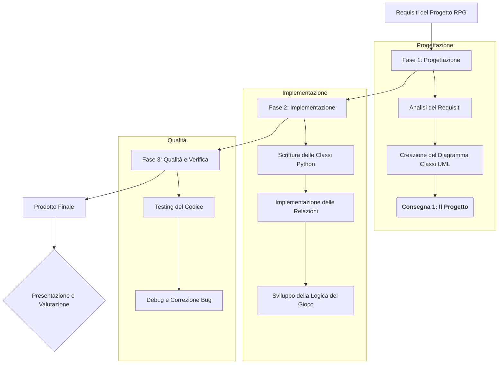

### 01_Mappa_Concettuale_Modulo_01.md
# Mappa Concettuale: Fondamenti e Progettazione di Database Relazionali

Questa mappa illustra il percorso logico del modulo, partendo dai concetti teorici fino alla progettazione e all'interazione pratica con un database.

```mermaid
graph TD
    A[Database Relazionali] --> B[Perché e Come?];
    A --> C[Progettazione];
    A --> D[Interazione e Sicurezza];

    subgraph "Teoria di Base"
        B --> B1[Concetti Fondamentali<br>DB, DBMS];
        B --> B2[Modello Relazionale<br>Tabelle, Chiavi, Vincoli];
    end

    subgraph "Dal Requisito allo Schema"
        C --> C1[Analisi dei Requisiti];
        C1 --> C2[Diagramma Entità-Relazione];
        C2 --> C3[Normalizzazione<br>1NF, 2NF, 3NF];
        C3 --> C4[Schema Logico];
    end

    subgraph "Dal Progetto al Codice"
        D --> D1[SQL DDL<br>CREATE TABLE];
        D1 --> D2[SQL DML<br>CRUD & SELECT];
        D2 --> D3[JOIN<br>Combinare Dati];
        D3 --> D4[Principi di Sicurezza<br>Utenti, Permessi, SQL Injection];
    end

    C4 -.-> D1;

### 06a_Da_ER_a_SQL_La_Guida_Pratica.md
# Dal Diagramma ER al Codice SQL: Una Guida Pratica alla Traduzione

Abbiamo imparato a progettare la struttura dei nostri dati usando i Diagrammi Entità-Relazione (ER). Ora, vediamo come trasformare quel progetto visuale in una vera e propria struttura di database utilizzando il linguaggio SQL.

Questo processo di traduzione non è magico, ma segue delle regole precise. Se le impari, sarai in grado di tradurre qualsiasi diagramma ER in codice `CREATE TABLE` senza errori.

---

### Regola #1: Ogni Entità diventa una Tabella

Questa è la regola più semplice: ogni rettangolo nel tuo diagramma ER corrisponde a una tabella nel tuo database.

**Diagramma ER:**
```mermaid
erDiagram
    STUDENTE
```

**Traduzione SQL:**
```sql
CREATE TABLE Studente (
    -- le colonne verranno definite qui...
);
```

---

### Regola #2: Ogni Attributo diventa una Colonna

Ogni attributo elencato all'interno di un'entità nel diagramma diventa una colonna nella tabella corrispondente. Durante questa fase, definiamo anche il **tipo di dato** e i **vincoli** di base come `PRIMARY KEY` e `NOT NULL`.

**Diagramma ER:**
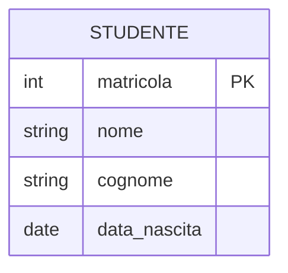

**Traduzione SQL:**
```sql
CREATE TABLE Studente (
    matricola INT PRIMARY KEY,
    nome VARCHAR(50) NOT NULL,
    cognome VARCHAR(50) NOT NULL,
    data_nascita DATE
);
```

---

### Regola #3: Le Relazioni 1-a-N si traducono con una Foreign Key

Questa è la regola fondamentale per creare i collegamenti. In una relazione "uno a molti", la tabella sul lato "molti" deve contenere un riferimento alla tabella sul lato "uno". Questo riferimento è la **chiave esterna (Foreign Key)**.

**Diagramma ER:** (Un `Docente` insegna molti `Corsi`)
```mermaid
erDiagram
    DOCENTE ||--|{ CORSO : insegna
```

**Traduzione SQL:** La chiave esterna (`docente_id`) viene aggiunta alla tabella `CORSO` (il lato "molti").

```sql
CREATE TABLE Docente (
    id INT PRIMARY KEY,
    nome VARCHAR(50) NOT NULL
);

CREATE TABLE Corso (
    id INT PRIMARY KEY,
    nome_corso VARCHAR(100) NOT NULL,
    docente_id INT,
    FOREIGN KEY (docente_id) REFERENCES Docente(id)
);
```
Questa struttura garantisce che ogni corso sia collegato a un solo docente, ma un docente possa essere associato a più corsi.

---

### Regola #4: Le Relazioni N-a-N si traducono con una Tabella di Raccordo

Una relazione "molti a molti" non può essere rappresentata direttamente in un database relazionale. La soluzione è creare una terza tabella, chiamata **tabella di raccordo** (o _junction table_), che collega le due entità.

**Diagramma ER:** (Molti `Studenti` frequentano molti `Corsi`)
```mermaid
erDiagram
    STUDENTE }|--|{ CORSO : frequenta
```

**Traduzione SQL:** Creiamo una nuova tabella `Iscrizione`. Questa tabella conterrà due chiavi esterne: una che punta a `Studente` e una che punta a `Corso`. La loro combinazione formerà la chiave primaria della tabella di raccordo.

```sql
CREATE TABLE Studente (
    id INT PRIMARY KEY,
    nome VARCHAR(50) NOT NULL
);

CREATE TABLE Corso (
    id INT PRIMARY KEY,
    nome_corso VARCHAR(100) NOT NULL
);

-- La Tabella di Raccordo
CREATE TABLE Iscrizione (
    studente_id INT,
    corso_id INT,
    PRIMARY KEY (studente_id, corso_id),
    FOREIGN KEY (studente_id) REFERENCES Studente(id),
    FOREIGN KEY (corso_id) REFERENCES Corso(id)
);
```

Seguendo queste quattro regole, puoi tradurre sistematicamente qualsiasi progetto concettuale in una struttura logica e fisica pronta per essere implementata.

### 07a_Normalizzazione_in_Pratica.md
# Normalizzazione in Pratica: Da un Foglio Excel a un Database Pulito

La normalizzazione può sembrare un concetto teorico e astratto. Vediamo come applicarla in uno scenario pratico per trasformare una singola tabella disordinata (come un foglio di calcolo) in un database relazionale ben strutturato, eliminando le anomalie dei dati.

### Lo Scenario: La Tabella "Incubo"

Immagina di dover gestire i dati delle vendite di un negozio usando questa singola tabella.

**Tabella Iniziale: `REGISTRO_VENDITE`**

| ID_Ordine | Data | ID_Cliente | Nome_Cliente | Indirizzo_Cliente | Prodotti_Ordinati (ID:Nome:Qtà) |
| :--- | :--- | :--- | :--- | :--- | :--- |
| 101 | 2025-11-15 | C01 | Mario Rossi | Via Roma 1, Milano | A1:Mouse:1, B2:Tastiera:1 |
| 102 | 2025-11-16 | C02 | Anna Bianchi| Via Milano 5, Torino| A1:Mouse:2 |
| 103 | 2025-11-17 | C01 | Mario Rossi | Via Roma 1, Milano | C3:Monitor:1 |

**Problemi evidenti:**
1.  **Anomalia di Aggiornamento:** Se Mario Rossi cambia indirizzo, dobbiamo modificare **tutte** le righe dei suoi ordini, rischiando errori.
2.  **Dati non Atomici:** La colonna `Prodotti_Ordinati` contiene più valori. È impossibile fare una ricerca per singolo prodotto.
3.  **Anomalia di Inserimento:** Non possiamo aggiungere un nuovo cliente finché non ha effettuato almeno un ordine.
4.  **Anomalia di Cancellazione:** Se cancelliamo l'ordine 102, perdiamo l'unica informazione che abbiamo su Anna Bianchi.

---

### Passo 1: Raggiungere la Prima Forma Normale (1NF)

**Regola:** Ogni cella della tabella deve contenere un valore singolo (atomico) e ogni riga deve essere unica.

**Azione:** Dividiamo la colonna `Prodotti_Ordinati` in righe separate, una per ogni prodotto acquistato in un ordine.

**Risultato (Tabella in 1NF):**

| ID_Ordine | Data | ID_Cliente | Nome_Cliente | Indirizzo_Cliente | ID_Prodotto | Quantità |
| :--- | :--- | :--- | :--- | :--- | :--- | :--- |
| 101 | 2025-11-15 | C01 | Mario Rossi | Via Roma 1, Milano | A1 | 1 |
| 101 | 2025-11-15 | C01 | Mario Rossi | Via Roma 1, Milano | B2 | 1 |
| 102 | 2025-11-16 | C02 | Anna Bianchi| Via Milano 5, Torino| A1 | 2 |
| 103 | 2025-11-17 | C01 | Mario Rossi | Via Roma 1, Milano | C3 | 1 |

*   **Commento:** Abbiamo risolto il problema dei dati non atomici, ma la ridondanza dei dati del cliente e dell'ordine è addirittura peggiorata! Questo è normale e ci prepara per il passo successivo.

---

### Passo 2: Raggiungere la Seconda Forma Normale (2NF)

**Regola:** Ogni attributo non-chiave deve dipendere dall'**intera** chiave primaria. (Questo si applica quando abbiamo una chiave primaria composta).

**Azione:**
1.  La chiave primaria della nostra tabella in 1NF è `(ID_Ordine, ID_Prodotto)`.
2.  Notiamo che `Data`, `ID_Cliente`, `Nome_Cliente` e `Indirizzo_Cliente` dipendono solo da `ID_Ordine`, non dall'intera chiave.
3.  Per risolvere, dividiamo la tabella in due: una per gli ordini e una per i dettagli dei prodotti in ogni ordine.

**Risultato (Tabelle in 2NF):**

**Tabella `Ordini`**
| ID_Ordine | Data | ID_Cliente | Nome_Cliente | Indirizzo_Cliente |
| :--- | :--- | :--- | :--- | :--- |
| 101 | 2025-11-15 | C01 | Mario Rossi | Via Roma 1, Milano |
| 102 | 2025-11-16 | C02 | Anna Bianchi| Via Milano 5, Torino|
| 103 | 2025-11-17 | C01 | Mario Rossi | Via Roma 1, Milano |

**Tabella `Dettagli_Ordine`**
| ID_Ordine | ID_Prodotto | Quantità |
| :--- | :--- | :--- |
| 101 | A1 | 1 |
| 101 | B2 | 1 |
| 102 | A1 | 2 |
| 103 | C3 | 1 |

*   **Commento:** Ora la struttura è molto più pulita. La maggior parte della ridondanza è sparita. Rimane solo quella dei dati del cliente.

---

### Passo 3: Raggiungere la Terza Forma Normale (3NF)

**Regola:** Non devono esistere dipendenze transitive. Un attributo non-chiave non deve dipendere da un altro attributo non-chiave.

**Azione:** Nella tabella `Ordini`, notiamo che `Nome_Cliente` e `Indirizzo_Cliente` dipendono da `ID_Cliente`, che non è la chiave primaria. Questa è una dipendenza transitiva. Per risolverla, separiamo i dati del cliente in una loro tabella.

**Risultato (Schema Finale Normalizzato in 3NF):**

**Tabella `Clienti`**
| ID_Cliente | Nome_Cliente | Indirizzo_Cliente |
| :--- | :--- | :--- |
| C01 | Mario Rossi | Via Roma 1, Milano |
| C02 | Anna Bianchi| Via Milano 5, Torino|

**Tabella `Ordini`**
| ID_Ordine | Data | ID_Cliente (FK) |
| :--- | :--- | :--- |
| 101 | 2025-11-15 | C01 |
| 102 | 2025-11-16 | C02 |
| 103 | 2025-11-17 | C01 |

**Tabella `Dettagli_Ordine`** (invariata)
| ID_Ordine (FK) | ID_Prodotto (FK) | Quantità |
| :--- | :--- | :--- |
| 101 | A1 | 1 |
| 101 | B2 | 1 |
| 102 | A1 | 2 |
| 103 | C3 | 1 |

*   **Nota:** Per completare lo schema, avremmo bisogno anche di una tabella `Prodotti(ID_Prodotto, Nome_Prodotto, Prezzo)`.

Abbiamo raggiunto uno schema robusto, privo di ridondanze e che previene le anomalie. Ogni pezzo di informazione è memorizzato una sola volta.

### 09_Chiavi_Primaria_Esterna.md
## Chiavi: Primaria ed Esterna <!-- omit in toc -->

- [Chiave Primaria (Primary Key)](#chiave-primaria-primary-key)
- [Chiave Esterna (Foreign Key)](#chiave-esterna-foreign-key)

Le **chiavi** sono attributi (o insiemi di attributi) che svolgono un ruolo speciale all'interno di un database relazionale. Servono a identificare univocamente le righe e a stabilire collegamenti logici tra le tabelle.

### Chiave Primaria (Primary Key)

La **chiave primaria (PK)** è un attributo o un insieme di attributi che **identifica univocamente ogni riga** di una tabella.

Una chiave primaria deve rispettare due vincoli fondamentali:

1.  **Unicità**: Il valore della chiave primaria deve essere unico per ogni riga della tabella. Non possono esistere due righe con lo stesso valore di chiave primaria.
2.  **Non Nullità**: Il valore della chiave primaria non può mai essere `NULL`. Ogni riga deve avere un identificatore valido.

_Esempio_: Nella tabella `Studenti`, l'attributo `Matricola` è un candidato perfetto per essere la chiave primaria, poiché ogni studente ha un numero di matricola unico.

### Chiave Esterna (Foreign Key)

La **chiave esterna (FK)** è un attributo o un insieme di attributi in una tabella che crea un **collegamento** a una chiave primaria di un'altra tabella. È il meccanismo che permette di implementare le relazioni tra le entità.

Una chiave esterna garantisce l'**integrità referenziale**: il valore di una chiave esterna deve corrispondere a un valore di chiave primaria esistente nella tabella di riferimento, oppure può essere `NULL`.

_Esempio_: Consideriamo due tabelle, `Studenti` e `Corsi`. Per sapere quale studente è iscritto a quale corso, creiamo una tabella `Iscrizioni`.

**Studenti**
| **Matricola (PK)** | Nome |
|--------------------|---------|
| 101 | Mario |
| 102 | Anna |

**Corsi**
| **ID_Corso (PK)** | Nome_Corso |
|-------------------|------------|
| C01 | Matematica |
| C02 | Fisica |

**Iscrizioni**
| **ID_Iscrizione (PK)** | **Matricola_Studente (FK)** | **ID_Corso_Iscritto (FK)** |
|------------------------|-----------------------------|----------------------------|
| 1 | 101 | C01 |
| 2 | 102 | C01 |
| 3 | 101 | C02 |

Nella tabella `Iscrizioni`:

- `Matricola_Studente` è una chiave esterna che si riferisce alla chiave primaria `Matricola` della tabella `Studenti`.
- `ID_Corso_Iscritto` è una chiave esterna che si riferisce alla chiave primaria `ID_Corso` della tabella `Corsi`.

Questo garantisce che non si possano inserire iscrizioni per studenti o corsi inesistenti.


### 10_Vincoli_di_Integrita.md
## Vincoli di Integrità <!-- omit in toc -->

- [Tipi di Vincoli di Integrità](#tipi-di-vincoli-di-integrità)

I **vincoli di integrità** sono regole che vengono applicate alle colonne di una tabella per garantire l'accuratezza, la coerenza e la validità dei dati. Sono un meccanismo fondamentale con cui il DBMS protegge l'integrità del database.

### Tipi di Vincoli di Integrità

Oltre ai vincoli di **chiave primaria** e **chiave esterna** già visti, esistono altri vincoli importanti:

1.  **Vincolo di Unicità (`UNIQUE`)**

    - **Scopo**: Assicura che tutti i valori in una colonna (o in un insieme di colonne) siano unici.
    - _Esempio_: In una tabella `Utenti`, l'indirizzo `email` deve essere unico per ogni utente, ma potrebbe non essere la chiave primaria.

2.  **Vincolo di Non Nullità (`NOT NULL`)**

    - **Scopo**: Assicura che una colonna non possa contenere valori `NULL`. Ogni riga deve obbligatoriamente avere un valore per quella colonna.
    - _Esempio_: In una tabella `Studenti`, le colonne `Nome` e `Cognome` non possono essere lasciate vuote.

3.  **Vincolo di Default (`DEFAULT`)**

    - **Scopo**: Fornisce un valore predefinito per una colonna quando nessun valore viene specificato durante l'inserimento di una nuova riga.
    - _Esempio_: In una tabella `Ordini`, la colonna `data_ordine` può avere come valore di default la data e l'ora correnti.

4.  **Vincolo di Controllo (`CHECK`)**
    - **Scopo**: Assicura che tutti i valori in una colonna soddisfino una specifica condizione booleana.
    - _Esempio_: In una tabella `Prodotti`, si può definire un vincolo `CHECK (prezzo > 0)` per assicurarsi che il prezzo sia sempre un numero positivo. Oppure, in una tabella `Studenti`, `CHECK (eta >= 18)`.

Questi vincoli vengono definiti durante la creazione della tabella con il comando `CREATE TABLE` in SQL.


### 11a_SQL_Avanzato_Esempi_Pratici.md
# SQL Avanzato: Esempi Pratici con JOIN e GROUP BY

Scrivere query di base è semplice, ma la vera potenza di SQL risiede nella sua capacità di combinare e aggregare dati da più tabelle per rispondere a domande complesse. In questa lezione, vedremo esempi pratici delle clausole più importanti: `JOIN` e `GROUP BY`.

### Lo Scenario: Il Nostro Database Universitario

Useremo un piccolo database composto da tre tabelle per tutti i nostri esempi.

**Tabella `Studenti`**
| id | nome |
| :-- | :-- |
| 1 | Marco |
| 2 | Laura |
| 3 | Simone|
| 4 | Elena |

**Tabella `Corsi`**
| id | nome_corso |
| :-- | :-- |
| 10 | Matematica |
| 20 | Fisica |
| 30 | Chimica |

**Tabella `Iscrizioni` (Tabella di Raccordo)**
| studente_id | corso_id |
| :-- | :-- |
| 1 | 10 |
| 1 | 20 |
| 2 | 10 |
| 3 | 20 |

---

### 1. JOIN: Combinare solo i dati corrispondenti

`JOIN` restituisce solo le righe in cui c'è una corrispondenza in **entrambe** le tabelle collegate.

**Domanda:** "Mostrami il nome di ogni studente e il nome del corso a cui è iscritto."

```sql
SELECT
    Studenti.nome,
    Corsi.nome_corso
FROM
    Studenti
JOIN Iscrizioni ON Studenti.id = Iscrizioni.studente_id
JOIN Corsi ON Iscrizioni.corso_id = Corsi.id;
```

**Risultato:**

| nome | nome_corso |
| :-- | :-- |
| Marco | Matematica |
| Marco | Fisica |
| Laura | Matematica |
| Simone| Fisica |

*   **Spiegazione:** La query abbina `Studenti` con `Iscrizioni` e poi con `Corsi`. Nota che **Elena non compare**, perché il suo ID non è presente nella tabella `Iscrizioni`.

---

### 2. LEFT JOIN: Includere tutti i dati dalla tabella di sinistra

`LEFT JOIN` restituisce **tutte** le righe della tabella di sinistra (la prima menzionata) e le righe corrispondenti della tabella di destra. Se non c'è corrispondenza, le colonne della tabella di destra avranno valore `NULL`.

**Domanda:** "Mostrami TUTTI gli studenti e, se sono iscritti a un corso, mostra il nome del corso. Voglio vedere anche gli studenti che non frequentano nessun corso."

```sql
SELECT
    Studenti.nome,
    Corsi.nome_corso
FROM
    Studenti
LEFT JOIN Iscrizioni ON Studenti.id = Iscrizioni.studente_id
LEFT JOIN Corsi ON Iscrizioni.corso_id = Corsi.id;
```

**Risultato:**

| nome | nome_corso |
| :-- | :-- |
| Marco | Matematica |
| Marco | Fisica |
| Laura | Matematica |
| Simone| Fisica |
| **Elena** | **NULL** |

*   **Spiegazione:** Ora Elena compare nel risultato. Poiché non è stata trovata una corrispondenza per lei nella tabella `Iscrizioni`, il valore per `nome_corso` è `NULL`. Questo è utilissimo per trovare "elementi orfani".

---

### 3. GROUP BY con HAVING: Raggruppare e Filtrare i Gruppi

`GROUP BY` raggruppa le righe che hanno gli stessi valori in colonne specificate, per poter eseguire funzioni di aggregazione (`COUNT`, `SUM`, etc.) su ogni gruppo.

**Domanda:** "Calcola il numero di studenti iscritti a ciascun corso. Mostra solo i corsi che hanno 2 o più studenti iscritti."

```sql
SELECT
    Corsi.nome_corso,
    COUNT(Iscrizioni.studente_id) AS numero_iscritti
FROM
    Corsi
JOIN Iscrizioni ON Corsi.id = Iscrizioni.corso_id
GROUP BY
    Corsi.nome_corso
HAVING
    numero_iscritti >= 2;
```

**Risultato:**

| nome_corso | numero_iscritti |
| :-- | :-- |
| Matematica | 2 |
| Fisica | 2 |

*   **Spiegazione del processo:**
    1.  `JOIN` combina i dati.
    2.  `GROUP BY Corsi.nome_corso` crea i gruppi: uno per "Matematica", uno per "Fisica" e uno per "Chimica".
    3.  `COUNT(...)` conta gli studenti in ogni gruppo (2 per Matematica, 2 per Fisica, 0 per Chimica).
    4.  `HAVING numero_iscritti >= 2` filtra via il gruppo "Chimica" perché non soddisfa la condizione.

**Ricorda la differenza fondamentale:**
*   `WHERE` filtra le righe **prima** che vengano raggruppate.
*   `HAVING` filtra i gruppi **dopo** che sono stati creati.

### 14_Nozioni_di_Sicurezza.md
## Nozioni di Sicurezza dei Database <!-- omit in toc -->

- [Principi Chiave della Sicurezza](#principi-chiave-della-sicurezza)
- [Principali Vettori di Attacco](#principali-vettori-di-attacco)

La sicurezza dei database è un aspetto fondamentale per garantire l'**integrità**, la **riservatezza** e la **disponibilità** dei dati (principio "CIA" - Confidentiality, Integrity, Availability). Senza adeguate misure di protezione, un database può essere vulnerabile ad accessi non autorizzati, furti di dati e attacchi malevoli.

### Principi Chiave della Sicurezza

1.  **Autenticazione**: È il processo di verifica dell'identità di un utente. È la prima linea di difesa e si basa tipicamente su username e password, ma può includere metodi più robusti come l'autenticazione a più fattori.

2.  **Autorizzazione**: Una volta che un utente è autenticato, l'autorizzazione definisce _cosa_ quell'utente può fare. Questo si gestisce tramite **permessi** e **ruoli**. Il **Principio del Minimo Privilegio** è fondamentale: ogni utente dovrebbe avere solo i permessi strettamente necessari per svolgere le proprie mansioni.

3.  **Audit**: Consiste nel tenere traccia di chi fa cosa e quando. I log del database sono essenziali per monitorare le attività, individuare comportamenti sospetti e analizzare incidenti di sicurezza.

4.  **Crittografia**: Protegge i dati rendendoli illeggibili a chi non possiede la chiave di decifrazione. Si applica a:
    - **Dati in transito**: Dati che viaggiano sulla rete tra l'applicazione e il database (protetti con protocolli come SSL/TLS).
    - **Dati a riposo**: Dati memorizzati fisicamente su disco.

### Principali Vettori di Attacco

- **SQL Injection**: L'iniezione di codice SQL malevolo tramite gli input dell'utente per manipolare le query del database.
- **Credenziali Deboli o Rubate**: L'uso di password semplici o la loro esposizione permette un facile accesso non autorizzato.
- **Configurazioni Errate**: Un DBMS con impostazioni di sicurezza di default o non correttamente configurato (es. porte aperte inutilmente) può esporre a rischi.
- **Mancanza di Aggiornamenti**: Non applicare le patch di sicurezza rilasciate dai produttori del DBMS lascia il sistema vulnerabile a exploit noti.


### 16_SQL_Injection.md
## SQL Injection <!-- omit in toc -->

- [Cos'è la SQL Injection?](#cosè-la-sql-injection)
- [Come Funziona un Attacco](#come-funziona-un-attacco)
- [Prevenzione: La Regola d'Oro](#prevenzione-la-regola-doro)

La **SQL Injection** è una delle vulnerabilità di sicurezza più diffuse e pericolose nelle applicazioni web. Si verifica quando un utente malintenzionato riesce a "iniettare" e a far eseguire comandi SQL malevoli attraverso un campo di input di un'applicazione.

### Cos'è la SQL Injection?

L'attacco sfrutta una gestione non sicura dell'input dell'utente. Se un'applicazione costruisce le sue query SQL concatenando direttamente le stringhe provenienti dall'utente, un utente può inserire del testo che altera la logica originale della query.

### Come Funziona un Attacco

Immaginiamo una query per un form di login, costruita in modo **insicuro**:

```python
# CODICE VULNERABILE - DA NON USARE MAI!
username = request.form['username'] # L'utente inserisce: 'admin'
password = request.form['password'] # L'utente inserisce: 'password' OR '1'='1'

query = "SELECT * FROM users WHERE username = '" + username + "' AND password = '" + password + "'"
# La query risultante diventa:
# SELECT * FROM users WHERE username = 'admin' AND password = 'password' OR '1'='1'
```

La condizione `'1'='1'` è sempre vera, quindi la clausola `WHERE` diventa `... WHERE (condizione_originale) OR TRUE`. Questo fa sì che la query restituisca sempre almeno una riga (probabilmente il primo utente della tabella, che spesso è l'amministratore), bypassando il controllo della password e garantendo l'accesso all'attaccante.

### Prevenzione: La Regola d'Oro

La prevenzione si basa su un unico, fondamentale principio: **separare sempre il codice (la query SQL) dai dati (l'input dell'utente)**.

Questo si ottiene utilizzando le **query parametrizzate** (o _prepared statements_), come già visto nella lezione `12_SQL_in_Python.md`.

Quando si usa una query parametrizzata:

1.  Si invia al database il "template" della query con dei segnaposto (es. `?` o `%s`).
2.  Il database analizza, compila e ottimizza la struttura della query.
3.  Separatamente, si inviano i valori forniti dall'utente.

Il database tratterà questi valori **sempre e solo come dati**, mai come parte eseguibile della query. Anche se un utente inserisse del codice SQL, questo verrebbe interpretato come una semplice stringa da cercare e non verrebbe mai eseguito.

**L'uso di un ORM (Object-Relational Mapper), che vedremo più avanti, è un altro metodo potentissimo per prevenire la SQL injection, poiché genera query parametrizzate per design.**


### 01_Mappa_Concettuale_Modulo_02.md
# Mappa Concettuale: Basi dello Sviluppo Web e API REST

Questa mappa delinea i due pilastri concettuali del modulo: il protocollo di comunicazione HTTP e lo stile architetturale per l'interazione tra applicazioni API REST.

```mermaid
graph TD
    A[Sviluppo Web & API] --> B[Come Funziona il Web<br>I Protocolli];
    A --> C[Come Parlano le Applicazioni<br>Le Architetture];
    A --> D[Come si Implementa<br>Gli Strumenti];

    subgraph "Le Regole del Gioco"
        B --> B1[Modello Client-Server];
        B --> B2[Protocollo HTTP/HTTPS];
        B2 --> B3[Ciclo Richiesta-Risposta];
        B3 --> B4[Metodi GET, POST... e Status Code];
    end

    subgraph "Il Linguaggio Comune"
        C --> C1[API Application Programming Interface];
        C1 --> C2[Stile Architetturale REST];
        C2 --> C3[Risorse ed Endpoint URL];
        C2 --> C4[Formato Dati: JSON];
    end

    subgraph "La Pratica"
        D --> D1[Client Python<br>Libreria `requests`];
        D --> D2[Server Python<br>WSGI / ASGI];
        D --> D3[Introduzione ai<br>Web Framework];
    end

    B --- C;
    C --- D;
```


### 07_Consumare_API_con_Python_Requests.md
# Consumare API con Python e la Libreria `requests`

Abbiamo imparato la teoria dietro le API REST. Ora è il momento di passare alla pratica e vedere come un'applicazione (in questo caso, un semplice script Python) può "consumare" un'API per ottenere e inviare dati.

Lo strumento standard per fare questo in Python è la libreria `requests`, che semplifica enormemente l'invio di richieste HTTP.

### 1. Preparazione

Prima di tutto, dobbiamo installare la libreria. Assicurati che il tuo ambiente virtuale sia attivo e poi esegui:

```bash
pip install requests
```

Per i nostri esempi, useremo **JSONPlaceholder**, un'API finta e gratuita perfetta per fare test.

### 2. Esempio 1: Richiesta `GET` per Leggere Dati

Il nostro primo obiettivo è recuperare le informazioni di un utente specifico. L'endpoint per un singolo utente è `https://jsonplaceholder.typicode.com/users/USER_ID`.

**Obiettivo:** Leggere i dati dell'utente con ID = 1.

```python
import requests
import json

# Definiamo l'URL dell'endpoint a cui vogliamo fare la richiesta
user_id = 1
url = f"https://jsonplaceholder.typicode.com/users/{user_id}"

try:
    # 1. Eseguiamo la richiesta GET
    response = requests.get(url)

    # 2. Controlliamo se la richiesta è andata a buon fine (status code 200 OK)
    response.raise_for_status()  # Solleva un'eccezione per status code 4xx o 5xx

    # 3. Estraiamo i dati JSON dalla risposta
    # Il metodo .json() converte automaticamente il corpo della risposta da stringa JSON a dizionario Python
    dati_utente = response.json()

    # 4. Usiamo i dati
    print("--- Dati Utente Ricevuti ---")
    # Usiamo json.dumps per una stampa "bella" (pretty-print) del dizionario
    print(json.dumps(dati_utente, indent=4))

    print("\n--- Informazioni Specifiche ---")
    print(f"Nome: {dati_utente['name']}")
    print(f"Email: {dati_utente['email']}")
    print(f"Città: {dati_utente['address']['city']}")

except requests.exceptions.HTTPError as err:
    print(f"Errore HTTP: {err}")
except requests.exceptions.RequestException as err:
    print(f"Errore durante la richiesta: {err}")
```

### 3. Esempio 2: Richiesta `POST` per Creare Dati

Ora proviamo a creare una nuova risorsa. Useremo l'endpoint `https://jsonplaceholder.typicode.com/posts` per creare un nuovo "post".

**Obiettivo:** Creare un nuovo post con un titolo e un corpo del testo.

```python
import requests
import json

# L'URL dell'endpoint per la creazione dei post
url = "https://jsonplaceholder.typicode.com/posts"

# 1. Prepariamo i dati da inviare nel corpo della richiesta.
# Deve essere un dizionario Python che verrà convertito in JSON.
nuovo_post = {
    'title': 'Il Mio Nuovo Post',
    'body': 'Questo è il contenuto del mio primo post creato tramite API!',
    'userId': 1
}

try:
    # 2. Eseguiamo la richiesta POST, passando i dati con il parametro `json`
    response = requests.post(url, json=nuovo_post)

    # 3. Controlliamo lo status code
    # Per una creazione, ci aspettiamo uno status code 201 (Created)
    response.raise_for_status()

    # 4. Analizziamo la risposta del server
    # Di solito, l'API restituisce l'oggetto che abbiamo creato, con l'ID assegnato dal server
    post_creato = response.json()

    print("--- Risposta dal Server ---")
    print(f"Status Code: {response.status_code} (Created!)")
    print(json.dumps(post_creato, indent=4))
    print(f"\nIl nostro post è stato creato con ID: {post_creato['id']}")

except requests.exceptions.RequestException as err:
    print(f"Errore durante la richiesta: {err}")
```

Scrivere un client API con `requests` è così semplice. Questa abilità è fondamentale per costruire applicazioni che interagiscono con servizi esterni o per testare le API che costruiremo noi stessi.````

### 09_Il_Ciclo_di_Vita_di_una_Richiesta_Web.md
# Il Ciclo di Vita di una Richiesta Web: La Storia Completa

Abbiamo analizzato i singoli pezzi del puzzle: il protocollo HTTP, l'architettura REST, il ruolo del server WSGI. Ora, uniamoli tutti insieme per seguire il viaggio completo di una richiesta web, dal momento in cui un utente clicca un pulsante nel suo browser fino a quando riceve una risposta dalla nostra applicazione Python.

Capire questo flusso è fondamentale per avere una visione d'insieme di come funzionano le applicazioni web moderne.

### Lo Scenario: L'Accesso a un'Applicazione

Immaginiamo che un utente si trovi sulla pagina di login della nostra applicazione, inserisca le sue credenziali e prema il pulsante "Accedi". Cosa succede esattamente?

---

### Il Viaggio Passo Passo

#### 1. L'Azione dell'Utente
Tutto inizia con un'interazione umana. L'utente compila un form HTML e clicca il pulsante di submit.

#### 2. Il Browser: Il Costruttore della Richiesta
Il browser traduce l'azione dell'utente in una richiesta **HTTP**. Basandosi sugli attributi del tag `<form>`, assembla un messaggio che contiene:
*   **Start-Line:** `POST /login HTTP/1.1` (Il metodo `POST` perché stiamo inviando dati sensibili, e l'**Endpoint** `/login` per l'autenticazione).
*   **Headers:** Informazioni come `Host: mia-app.com` e `Content-Type: application/x-www-form-urlencoded`.
*   **Body:** Le credenziali inserite dall'utente (es. `username=pippo&password=secret`).

#### 3. HTTPS: Il Tunnel Sicuro
Prima che la richiesta venga inviata su Internet, viene incapsulata in un livello di sicurezza **HTTPS**. Grazie al protocollo **TLS/SSL**, l'intero messaggio HTTP viene crittografato. Questo garantisce che, anche se qualcuno intercettasse il pacchetto, non potrebbe leggere la password dell'utente.

#### 4. Il Viaggio su Internet
La richiesta crittografata viaggia attraverso la rete. Il sistema DNS traduce il nome del dominio (`mia-app.com`) nell'indirizzo IP del server, e i router instradano il pacchetto fino a destinazione.

#### 5. Il Server Web (es. Nginx): Il Vigile Urbano
La richiesta non arriva direttamente alla nostra applicazione Python. Arriva prima a un **Web Server** come Nginx o Apache. Questo software ha due compiti principali:
1.  **Gestire la connessione di rete** in modo efficiente e terminare la connessione **HTTPS** (decrittografando la richiesta).
2.  **Agire da "reverse proxy"**: ispeziona la richiesta e decide a quale servizio interno inoltrarla. Per una richiesta dinamica destinata alla nostra app, la passa al server applicativo.

#### 6. Il Server WSGI (es. Gunicorn): L'Interprete
Il server web (Nginx) non sa come eseguire codice Python. Per questo, comunica con un **Server WSGI** come Gunicorn. Gunicorn è un "traduttore" che prende la richiesta HTTP dal server web e la converte in un formato standard che Python può capire, come definito dalle specifiche **WSGI**.

#### 7. L'Applicazione Flask: Il Cervello
Finalmente, la richiesta raggiunge la nostra applicazione!
1.  Il server WSGI (Gunicorn) invoca l'oggetto applicazione Flask.
2.  Il motore di routing di Flask analizza l'**Endpoint** (`/login`) e il metodo (`POST`) e chiama la funzione Python associata (es. la funzione decorata con `@app.route('/login', methods=['POST'])`).
3.  La nostra funzione legge le credenziali dal corpo della richiesta, le confronta con quelle nel database (visto nel Modulo 01) e decide se l'autenticazione ha avuto successo.

#### 8. La Risposta: La Decisione del Cervello
La nostra funzione Flask ora deve generare una risposta. Se il login ha successo, potrebbe creare una risposta di **redirezione**. Questa è a sua volta un messaggio **HTTP**:
*   **Status-Line:** `HTTP/1.1 302 Found` (Lo status code per la redirezione).
*   **Headers:** `Location: /dashboard` (Dice al browser a quale nuova pagina andare).

#### 9. Il Viaggio di Ritorno
La risposta HTTP ripercorre la strada all'indietro:
`Flask` -> `Gunicorn (WSGI)` -> `Nginx` -> `Crittografia HTTPS` -> `Internet` -> `Browser`

#### 10. Il Browser: L'Esecutore Finale
Il browser riceve la risposta `302 Found`. Capisce che deve effettuare una nuova richiesta, questa volta una richiesta `GET` all'endpoint `/dashboard`. Il ciclo ricomincia, ma questa volta il server restituirà la pagina HTML della dashboard dell'utente.

### Schema Riassuntivo del Flusso

```mermaid
sequenceDiagram
    participant Utente
    participant Browser
    participant Internet
    participant Nginx
    participant Gunicorn
    participant Flask

    Utente->>Browser: Invia il form di login
    Browser->>Internet: Richiesta POST /login (crittografata con HTTPS)
    Internet->>Nginx: Inoltra la richiesta
    Nginx->>Gunicorn: Decrittografa e passa la richiesta (standard WSGI)
    Gunicorn->>Flask: Invoca la funzione della route /login
    Flask->>Flask: Esegue la logica (controlla DB, etc.)
    Flask-->>Gunicorn: Restituisce una Risposta HTTP 302 Redirect
    Gunicorn-->>Nginx: Inoltra la risposta
    Nginx-->>Internet: Crittografa la risposta e la invia
    Internet-->>Browser: Inoltra la risposta
    Browser->>Utente: Reindirizza alla dashboard (e inizia una nuova richiesta GET)
```

Questa "storia" dimostra come ogni componente che abbiamo studiato abbia un ruolo preciso e indispensabile nell'ecosistema di un'applicazione web.

### 01_Mappa_Concettuale_Modulo_03.md
# Mappa Concettuale: Architettura Web con Flask

Questa mappa illustra la struttura "professionale" che adotteremo fin dal primo giorno, separando la configurazione, la logica delle route e la visualizzazione.

```mermaid
graph TD
    A[Progetto Flask] --> B[Entry Point<br>run.py];
    A --> C[Package Applicativo<br>app/];

    subgraph "Configurazione (Lesson 1)"
        C --> C1[__init__.py];
        C1 --> C2[Function create_app<br>Application Factory];
    end

    subgraph "Logica di Routing (Lesson 2)"
        C --> D[Blueprints];
        D --> D1[main.py<br>Gestione Pagine Statiche];
        C2 -.->|Registra| D;
    end

    subgraph "Presentazione (Lesson 3)"
        C --> E[Templates HTML];
        E --> E1[base.html<br>Layout Comune];
        E --> E2[home.html<br>Contenuto Specifico];
        D1 -.->|Renderizza| E;
    end
```

### 02_Setup_e_Factory.md
# Lezione 1: Setup Professionale e Application Factory

In questo modulo faremo un salto di qualità. Non scriveremo più tutto il codice in un solo file. Impareremo a organizzare il progetto come fanno i professionisti Python.

Prima di scrivere codice, dobbiamo capire due concetti fondamentali di Python e Flask.

### 1. Concetto Chiave: Pacchetti e `__init__.py`

In Python, come facciamo a dire che una cartella non è solo un contenitore di file, ma un **Modulo** (o Pacchetto) che contiene codice che vogliamo importare e usare?

Lo facciamo creando all'interno della cartella un file speciale chiamato `__init__.py` (due underscore prima e dopo).

*   **Senza `__init__.py`**: La cartella è solo una directory del sistema operativo.
*   **Con `__init__.py`**: La cartella diventa un **Pacchetto Python**.

Quando Python vede questo file, sa che può trattare quella cartella come se fosse una libreria. Il codice scritto dentro `__init__.py` viene eseguito automaticamente appena il pacchetto viene importato.

### 2. Concetto Chiave: La Cartella `instance`

Quando sviluppi un'applicazione web, ci sono file che riguardano il codice (che è uguale per tutti gli sviluppatori) e file che riguardano la **configurazione locale** (che cambiano da computer a computer).

Flask usa una cartella standard chiamata `instance/` per contenere:
1.  **I Segreti:** Chiavi di sicurezza, password (che non vanno mai condivise).
2.  **Il Database:** Il file del database SQLite (che cambia mentre usi l'app).

Questa cartella è speciale perché **non dovrebbe mai essere condivisa** (ad esempio su GitHub). È lo spazio "privato" dell'applicazione sul tuo computer.

### 3. Concetto Chiave: L'Application Factory

Nei tutorial base, spesso si vede:
```python
app = Flask(__name__)  # Creato globalmente
```
Questo ha un difetto: l'applicazione viene creata subito, appena avvii Python. Non puoi cambiarne la configurazione facilmente.

Il pattern **Application Factory** (Fabbrica di Applicazioni) risolve il problema. Invece di creare l'app come variabile globale, scriviamo una **funzione** che crea e restituisce l'app.

```python
def create_app():
    app = Flask(...)
    return app
```
È come avere uno stampino (la funzione): possiamo usarlo per creare l'applicazione quando vogliamo e come vogliamo.

---

### Mettiamoci al Lavoro: Il Codice

Ora creiamo la struttura.

**1. Struttura delle Cartelle**
Crea una cartella `blog_scolastico` e al suo interno questa struttura:

```text
blog_scolastico/
├── .venv/              <-- Il tuo ambiente virtuale
├── instance/           <-- Cartella vuota (per ora)
├── app/                <-- Cartella del pacchetto
│   └── __init__.py     <-- File vuoto (per ora)
└── run.py              <-- File vuoto (per ora)
```

**2. Scriviamo la Factory (`app/__init__.py`)**
Apri `app/__init__.py`. Questo codice definisce come "nasce" la nostra applicazione. Lo terremo pulito e semplice.

```python
import os
from flask import Flask

def create_app():
    # 1. Creiamo l'istanza di Flask
    # instance_relative_config=True dice a Flask: 
    # "Cerca la cartella 'instance' fuori da 'app', non dentro."
    app = Flask(__name__, instance_relative_config=True)

    # 2. Configurazione di base
    # Qui impostiamo le variabili fondamentali.
    app.config.from_mapping(
        # SECRET_KEY serve a Flask per firmare i dati sicuri (es. sessioni).
        # 'dev' va bene per sviluppare, ma in produzione andrà cambiata.
        SECRET_KEY='dev',
        # Diciamo a Flask dove salvare il file del database SQLite
        DATABASE=os.path.join(app.instance_path, 'blog.sqlite'),
    )

    # 3. Assicuriamoci che la cartella 'instance' esista fisicamente.
    # Se non esiste (es. è la prima volta che avvii), Flask la crea.
    try:
        os.makedirs(app.instance_path)
    except OSError:
        pass

    # 4. Una route di prova per vedere se funziona
    @app.route('/hello')
    def hello():
        return 'Ciao! La Factory funziona correttamente.'

    return app
```


**3. L'Entry Point (`run.py`)**
Ora ci serve un file per "accendere" la fabbrica. Questo file sta fuori dalla cartella `app`.

Apri `run.py` e scrivi:

```python
# Importiamo la funzione create_app dal pacchetto 'app'
# Questo è possibile perché 'app' ha un file __init__.py!
from app import create_app

# Chiamiamo la fabbrica per ottenere l'applicazione
app = create_app()

# Se questo file viene eseguito direttamente (non importato), avvia il server
if __name__ == '__main__':
    app.run(debug=True)
```

### 4. Verifica Finale

1.  Apri il terminale nella cartella `blog_scolastico`.
2.  Attiva l'ambiente virtuale (se non l'hai fatto).
3.  Esegui il comando:
    ```bash
    python run.py
    ```
4.  Se leggi `Running on http://127.0.0.1:5000`, apri il browser a quell'indirizzo e aggiungi `/hello`.

Se vedi il messaggio di saluto, hai creato con successo un'architettura Flask professionale!

### 01_Mappa_Concettuale_Modulo_04.md
# Mappa Concettuale: Accesso Dati e Autenticazione

Questa mappa evidenzia l'architettura a tre livelli che implementiamo: Presentazione, Logica Applicativa e Accesso ai Dati.

```mermaid
graph TD
    subgraph "Livello Presentazione (HTML)"
        A[Form Registrazione/Login];
    end

    subgraph "Livello Logico (Blueprint)"
        B[Blueprint auth.py];
        B1[Gestione Request POST];
        B2[Hashing Password];
        B3[Gestione Sessione];
    end

    subgraph "Livello Dati (Repository)"
        C[Repository user_repository.py];
        C1[Funzione create_user];
        C2[Funzione get_by_username];
    end

    subgraph "Database"
        D[(SQLite DB)];
    end

    A -->|Invia Dati| B;
    B -->|Chiama| C;
    C -->|Esegue SQL| D;
    D -->|Restituisce Dati| C;
    C -->|Restituisce Oggetti| B;
```

### 01_Mappa_Concettuale_Modulo_05.md
# Mappa Concettuale: Sviluppo CRUD e Relazioni

Questa mappa mostra il flusso completo per la gestione di un'entità complessa come i Post, integrando sicurezza e database.

```mermaid
graph TD
    A[Utente Autenticato] --> B{Azione Richiesta};

    subgraph "READ"
        B -->|Vedi Homepage| C[Route index];
        C --> D[Repo: get_all_posts];
    end

    subgraph "CREATE"
        B -->|Crea Post| E[Route create];
        E -->|Check @login_required| F[Repo: create_post];
    end

    subgraph "UPDATE / DELETE"
        B -->|Modifica Post| G[Route edit/delete];
        G -->|Check @login_required| H[Repo: get_post_by_id];
        G --> I{È l'autore?};
        I -- NO --> L[Errore 403 Forbidden];
        I -- SI --> M[Repo: update/delete];
    end

    D -->|SELECT con JOIN| DB[(Database)];
    F -->|INSERT con author_id| DB;
    H -->|SELECT| DB;
    M -->|UPDATE / DELETE| DB;
```

### 03_Blueprint_Create_Read.md
# Lezione 2: Visualizzare e Creare i Post

Ora che abbiamo il repository, dobbiamo aggiornare il nostro sito per usarlo.
Non creeremo nuovi file: modificheremo `app/main.py` per mostrare i post veri invece di quelli finti.

### 1. Aggiornare la Homepage (`app/main.py`)

Apri `app/main.py`. Dobbiamo:
1.  Importare il repository.
2.  Aggiornare la funzione `index` per leggere dal DB.
3.  Aggiungere la route `create` per scrivere nuovi post.

Sostituisci il contenuto con questo:

```python
from flask import (
    Blueprint, flash, g, redirect, render_template, request, url_for
)
from app.repositories import post_repository

# Usiamo 'main' perché è il blueprint principale del sito
bp = Blueprint('main', __name__)

@bp.route('/')
def index():
    # 1. Prendiamo i post veri dal database
    posts = post_repository.get_all_posts()
    
    # 2. Passiamo la variabile 'posts' al template
    return render_template('index.html', posts=posts)

@bp.route('/about')
def about():
    return render_template('about.html')

# --- NUOVA ROUTE: CREAZIONE POST ---
@bp.route('/create', methods=('GET', 'POST'))
def create():
    # Protezione: Se non sei loggato, vai al login
    if g.user is None:
        return redirect(url_for('auth.login'))

    if request.method == 'POST':
        title = request.form['title']
        body = request.form['body']
        error = None

        if not title:
            error = 'Il titolo è obbligatorio.'

        if error is not None:
            flash(error)
        else:
            # Creiamo il post usando l'ID dell'utente loggato (g.user['id'])
            post_repository.create_post(title, body, g.user['id'])
            return redirect(url_for('main.index'))

    return render_template('blog/create.html')
```

### 2. Aggiornare il Template `index.html`

Apri `app/templates/index.html`. Ora i dati che arrivano (`posts`) sono oggetti reali del database, non stringhe. Dobbiamo accedere ai campi giusti (`title`, `body`, `username`).

```html



  <h1>Blog della Classe</h1>
  
  <!-- Mostra il tasto 'Nuovo' solo se sei loggato -->
  
    <a href="{{ url_for('main.create') }}" class="btn">Scrivi un nuovo post</a>
    <hr>
  

  
    <article>
      <header>
          <!-- Titolo del post -->
          <h2>{{ post['title'] }}</h2>
          <!-- Info autore e data -->
          <small>Scritto da <strong>{{ post['username'] }}</strong> il {{ post['created'].strftime('%Y-%m-%d') }}</small>
      </header>
      
      <!-- Corpo del post -->
      <p>{{ post['body'] }}</p>
      
      <!-- Tasto Modifica (visibile solo all'autore) -->
      
        <a href="{{ url_for('main.update', id=post['id']) }}">Modifica</a>
      
    </article>
    <hr>
  

```

### 3. Creare il Template `blog/create.html`

Crea la cartella `app/templates/blog/` e dentro il file `create.html`.

```html



  <h1>Nuovo Post</h1>
  <form method="post">
    <label for="title">Titolo</label>
    <input name="title" id="title" required>

    <label for="body">Testo del post</label>
    <textarea name="body" id="body" rows="5" required></textarea>

    <input type="submit" value="Pubblica">
  </form>

```

### 01_Mappa_Concettuale_Modulo_06.md
# Mappa Concettuale: Deployment e Produzione

Questa mappa illustra la trasformazione dell'ambiente, dal PC dello studente al Cloud.

```mermaid
graph TD
    subgraph "Ambiente Locale &lpar;Sviluppo&rpar;"
        A[Codice Sorgente] --> B[Server Flask Integrato];
        B --> C[SQLite File];
        A -->|Push| D[GitHub Repo];
    end

    subgraph "Configurazione Produzione"
        E[requirements.txt<br>Dipendenze];
        F[Procfile / Start Command<br>Avvio con Gunicorn];
        G[Variabili d'Ambiente<br>Secrets & Config];
    end

    subgraph "Ambiente Cloud &lpar;Render.com&rpar;"
        D -->|Deploy Automatico| H[Build System];
        H -->|Installa| E;
        H -->|Avvia| I[Gunicorn Server WSGI];
        G -.->|Configura| I;
        I --> L[PostgreSQL DB<br>&lpar;Opzionale/Pro&rpar;];
        I --> M[Internet Pubblica];
    end
```

### 02_Gunicorn_Requirements.md
# Lezione 1: Prepararsi al Cloud (Gunicorn e Requirements)

Fino ad ora abbiamo lanciato il sito con `flask run` o `python run.py`.
Questo va bene sul tuo PC, ma è pericoloso su Internet. Il server di sviluppo di Flask è come uno scooter: comodo per brevi distanze, ma non puoi usarlo per trasportare merci in autostrada.

Per andare online ("in Produzione"), ci serve un **Camion**. Ci serve **Gunicorn**.

### 1. Installare Gunicorn

Gunicorn (Green Unicorn) è un server **WSGI** professionale. Gestisce molte richieste contemporaneamente, è stabile e sicuro.

Apri il terminale (col venv attivo) e installalo:
```bash
pip install gunicorn
```

### 2. Provare Gunicorn in locale

Possiamo testarlo subito. Invece di `python run.py`, scrivi nel terminale:

```bash
# Sintassi: gunicorn nome_file:nome_variabile_app
gunicorn run:app
```

Se vedi partire il server (di solito sulla porta 8000), funziona!
Puoi spegnerlo con `CTRL+C`.

### 3. Il file `requirements.txt`

Quando caricheremo il codice sul Cloud (Render.com), il server remoto riceverà solo i nostri file `.py`. Non avrà le librerie installate (`flask`, `gunicorn`, ecc.).

Dobbiamo fornirgli una "Lista della Spesa". In Python, questa lista si chiama `requirements.txt`.

Generala automaticamente con questo comando:
```bash
pip freeze > requirements.txt
```

Apri il file creato. Dovrebbe contenere righe come:
```text
Flask==3.0.0
gunicorn==21.2.0
Werkzeug==3.0.1
...
```

### 4. Il file `.gitignore`

Assicuriamoci di non caricare file inutili o pericolosi su GitHub.
Crea un file chiamato `.gitignore` nella cartella principale (se non c'è già) e scrivi:

```text
# Ignora la cartella dell'ambiente virtuale
.venv/
venv/

# Ignora i file compilati di Python
__pycache__/
*.pyc

# Ignora il database locale e i segreti (IMPORTANTE!)
instance/
.env
```

Ora siamo pronti per configurare la sicurezza.

### 5m_Esempio_Documento_Requisiti.md
# Esempio di Documento dei Requisiti

> Questo esempio mostra come preparare un documento dei requisiti per un progetto di fine anno del modulo `03_Sviluppo_Web_e_Database`.
> Il tema è libero: qui usiamo un esempio pratico per un **ricettario digitale condiviso** (`RecipeHub`).

## 1. Introduzione

### 1.1 Scopo del documento

Lo scopo di questo documento è:
- descrivere in modo chiaro il prodotto che gli studenti dovranno realizzare;
- raccogliere i requisiti funzionali e non funzionali;
- fornire una prima progettazione concettuale con diagrammi ER, UML e casi d'uso;
- definire una roadmap di lavoro con milestone e attività principali.

### 1.2 Contesto

Gli studenti del quinto anno devono realizzare un piccolo progetto web con backend in Python/Flask e database relazionale. Il tema è libero, ma è consigliabile scegliere un prodotto che preveda:
- una gestione dati persistente;
- una parte di autenticazione e sicurezza;
- un'interfaccia web con visualizzazione dinamica;
- relazioni tra più tabelle nel database.

### 1.3 Tema d'esempio

Tema scelto per l'esempio: **RecipeHub**.
RecipeHub è un ricettario digitale in cui gli utenti possono creare, condividere e salvare ricette.

> Nota: il tema è un esempio. Gli studenti possono scegliere un progetto diverso, come un diario di allenamenti, un gestore di eventi, una wallet app o un catalogo personalizzato.

## 2. Obiettivi generali

- Permettere a un utente di registrarsi e autenticarsi.
- Consentire la creazione, modifica, eliminazione e visualizzazione delle ricette.
- Consentire la ricerca e il filtro delle ricette per categoria, difficoltà o tempo di preparazione.
- Permettere di salvare ricette tra i preferiti.
- Fornire una pagina di profilo dove l'utente vede le proprie ricette.

## 3. Stakeholder e attori

| Stakeholder | Ruolo | Interesse |
| --- | --- | --- |
| Studente | Sviluppatore | Realizzare il progetto rispettando i requisiti |
| Docente | Valutatore | Verificare correttezza tecnica e completezza |
| Utente finale | Studentessa o studente | Usare l'app per salvare e consultare ricette |

### Attori principali

- `Utente autenticato`
- `Visitatore` (utente non autenticato)
- `Amministratore` (opzionale, se si vuole aggiungere gestione contenuti)

## 4. Requisiti funzionali

### 4.1 Requisiti principali

1. Registrazione e login.
2. Creazione di una nuova ricetta con titolo, lista ingredienti, descrizione, categoria, tempo di preparazione, livello di difficoltà.
3. Visualizzazione dei dettagli di ogni ricetta.
4. Modifica ed eliminazione delle ricette create dall'utente.
5. Ricerca e filtro delle ricette.
6. Aggiunta di ricette ai preferiti.
7. Visualizzazione delle ricette preferite e delle proprie ricette.

### 4.2 User stories

- Come **utente**, voglio registrarmi e accedere affinché le mie ricette siano salvate sotto il mio account.
- Come **utente autenticato**, voglio creare una ricetta per condividerla con altri.
- Come **utente**, voglio cercare ricette per categoria in modo da trovare rapidamente quelle che mi interessano.
- Come **utente autenticato**, voglio salvare ricette ai preferiti per ritrovarle facilmente.
- Come **visitatore**, voglio vedere l'elenco delle ricette pubbliche senza dover fare il login.

## 5. Requisiti non funzionali

- L'app deve avere un'interfaccia semplice e chiara.
- Il login deve essere protetto con hashing delle password.
- Il backend deve usare un database relazionale (es. SQLite / PostgreSQL).
- Il codice deve essere organizzato con Blueprints e repository pattern.
- Deve essere possibile eseguire il progetto localmente con un ambiente virtuale Python.
- I dati devono essere persistenti tra una sessione e l'altra.

## 6. Glossario dei termini

- `Ricetta`: un contenuto creato da un utente, composto da titolo, ingredienti, procedimento e metadati.
- `Categoria`: un raggruppamento tematico di ricette (es. `vegan`, `dolci`, `antipasti`).
- `Ingrediente`: voce testuale associata a una ricetta.
- `Preferito`: associazione tra utente e ricetta salvata.
- `Utente`: account registrato che può gestire ricette e preferiti.

## 7. Entità e relazioni (schema ER)

Di seguito un esempio di schema concettuale. Questo diagramma aiuta a capire le tabelle principali e i loro legami.

```mermaid
erDiagram
    UTENTE {
        int id PK
        string nome
        string email
        string password_hash
        datetime data_creazione
    }
    RICETTA {
        int id PK
        string titolo
        string descrizione
        string livello_difficolta
        int tempo_preparazione
        int categoria_id FK
        int autore_id FK
        datetime data_creazione
    }
    CATEGORIA {
        int id PK
        string nome
    }
    INGREDIENTE {
        int id PK
        string nome
    }
    RICETTA_INGREDIENTE {
        int ricetta_id FK
        int ingrediente_id FK
        string quantita
    }
    PREFERITO {
        int id PK
        int utente_id FK
        int ricetta_id FK
        datetime data_aggiunta
    }
    COMMENTO {
        int id PK
        int ricetta_id FK
        int utente_id FK
        string testo
        datetime data_creazione
    }

    UTENTE ||--o{ RICETTA : crea
    CATEGORIA ||--o{ RICETTA : contiene
    RICETTA ||--o{ RICETTA_INGREDIENTE : ha
    INGREDIENTE ||--o{ RICETTA_INGREDIENTE : utilizzato_in
    UTENTE ||--o{ PREFERITO : salva
    RICETTA ||--o{ PREFERITO : salvata_come
    UTENTE ||--o{ COMMENTO : scrive
    RICETTA ||--o{ COMMENTO : riceve
```

> Questo ER è utile per la fase di progettazione, ma non è obbligatorio: può essere sostituito da un disegno a mano libera o da un elenco di entità/relazioni.

## 8. Diagramma UML delle classi

Di seguito un esempio di diagramma delle classi che mostra le classi principali dell'app.

```mermaid
classDiagram
    class Utente {
        +int id
        +string nome
        +string email
        +string password_hash
        +datetime data_creazione
        +login(password)
        +logout()
        +isPasswordValida(password)
    }
    class Ricetta {
        +int id
        +string titolo
        +string descrizione
        +string livello_difficolta
        +int tempo_preparazione
        +int categoria_id
        +int autore_id
        +datetime data_creazione
        +aggiungiIngrediente(ingrediente, quantita)
        +rimuoviIngrediente(ingrediente)
    }
    class Categoria {
        +int id
        +string nome
    }
    class Ingrediente {
        +int id
        +string nome
    }
    class Preferito {
        +int id
        +int utente_id
        +int ricetta_id
        +datetime data_aggiunta
    }
    class Commento {
        +int id
        +int ricetta_id
        +int utente_id
        +string testo
        +datetime data_creazione
    }
    class RecipeRepository {
        +getAll()
        +getById(id)
        +create(data)
        +update(id, data)
        +delete(id)
    }
    class UserRepository {
        +getByEmail(email)
        +create(data)
        +getById(id)
    }

    Utente "1" -- "*" Ricetta : crea
    Categoria "1" -- "*" Ricetta : contiene
    Ricetta "1" -- "*" Commento : riceve
    Utente "1" -- "*" Commento : scrive
    Utente "1" -- "*" Preferito : salva
    Ricetta "1" -- "*" Preferito : ricevuta
```

> Il diagramma UML aiuta a capire le classi e i servizi principali. È utile ma non indispensabile; anche uno schema di classi semplificato è valido.

## 9. Casi d'uso

### 9.1 Casi d'uso principali

1. `Registrazione utente`
2. `Login`
3. `Crea ricetta`
4. `Modifica ricetta`
5. `Elimina ricetta`
6. `Visualizza elenco ricette`
7. `Cerca ricette`
8. `Aggiungi ai preferiti`
9. `Visualizza ricette preferite`

### 9.2 Descrizione semplificata dei casi d'uso

- **Registrazione utente**: il visitatore inserisce nome, email e password; il sistema crea un account e invia una conferma di registrazione.
- **Login**: l'utente inserisce email e password; il sistema verifica le credenziali e apre la sessione.
- **Crea ricetta**: l'utente autenticato compila un form con titolo, ingredienti, procedimento e categorie; il sistema salva la ricetta.
- **Cerca ricette**: l'utente inserisce parole chiave o filtra per categoria/difficoltà; il sistema mostra i risultati corrispondenti.
- **Aggiungi ai preferiti**: l'utente autenticato seleziona una ricetta e la salva tra i preferiti.

### 9.3 Diagramma dei casi d'uso

Il diagramma dei casi d'uso è stato generato come immagine a partire dal file PlantUML `5m_Requisiti_UseCase.puml`.


## 10. Pianificazione e milestone

Un possibile piano di lavoro su 5 settimane:

| Settimana | Attività |
| --- | --- |
| 1 | Analisi dei requisiti, scelta del tema, disegno ER e UML, preparazione ambiente di lavoro |
| 2 | Configurazione Flask, sistema di autenticazione, gestione utenti |
| 3 | Implementazione CRUD delle ricette e delle categorie |
| 4 | Ricerca/filter, preferiti, commenti opzionali |
| 5 | Testing, correzioni bug, documentazione, preparazione consegna GitHub |

### 10.1 Gantt semplificato

```mermaid
gantt
    dateFormat  YYYY-MM-DD
    title Piano di progetto esempio
    section Analisi
    Requisiti e schema ER         :a1, 2026-04-15, 5d
    Diagramma UML                  :a2, after a1, 3d
    section Sviluppo
    Autenticazione utente          :b1, after a2, 5d
    CRUD ricette                   :b2, after b1, 6d
    Filtri e ricerca               :b3, after b2, 4d
    Preferiti e profilo            :b4, after b3, 4d
    section Rifinitura
    Test e documentazione          :c1, after b4, 4d
    Consegna su GitHub             :c2, after c1, 2d
```

> Il Gantt è uno strumento utile per pianificare, ma in classe può bastare anche una tabella di milestone.

## 11. Suggerimenti per la consegna

- Caricare il progetto su GitHub con una struttura chiara.
- Tenere un file `README.md` con istruzioni di installazione e uso.
- Usare `.gitignore` per escludere `__pycache__`, `.venv` e `instance/`.
- Includere i diagrammi di progetto se sono stati realizzati.
- Fare commit frequenti e significativi.


