# Cors

CORS (Cross-Origin Resource Sharing) is a browser security mechanism controlling cross-domain resource access. Uses HTTP headers and preflight requests to determine allowed origins. Extends Same-Origin Policy while preventing unauthorized access to sensitive data.

Visit the following resources to learn more:

- [@article@Cross-Origin Resource Sharing (CORS)](https://developer.mozilla.org/en-US/docs/Web/HTTP/CORS)
- [@article@Understanding CORS](https://rbika.com/blog/understanding-cors)
- [@video@CORS in 100 Seconds](https://www.youtube.com/watch?v=4KHiSt0oLJ0)
- [@video@CORS in 6 minutes](https://www.youtube.com/watch?v=PNtFSVU-YTI)

## 📚 Appunti Personali (IT)

### _percorso_di_studi.md
# Percorso di studi

```mermaid
graph TD
    AB[Percorso di studi]

    AB --> AD
    AD[Concetti fondamentali]

    AB --> A
    A[Strumenti di Sviluppo] --> B[IDE]
    B --> C[SSH]
    B --> D[WSL]
    B --> E[Bash]
    B --> I[Testing]
    E --> F[Version Control]
    F --> G[Repository]
    G --> H[Ambiente Virtuale]

    AB --> AC
    AC[Licenze Software]

    AB --> J
    J[Livelli di Astrazione dei Linguaggi] --> K[Paradigmi di Programmazione]

    K --> L[Programmazione Imperativa]
    L --> M[Variabili e Tipi di Dati]
    M --> N[Strutture di Controllo]
    N --> O[Funzioni]

    K --> P
    P[Programmazione Orientata agli Oggetti] --> Q[Classi e Oggetti]
    Q --> R[Incapsulamento]
    R --> S[Ereditarietà]
    S --> T[Polimorfismo]
    T .-> Z[Diagrammi delle Classi UML]
    style Z fill:#444

    K --> U
    U[Database] --> V[Modello Relazionale]
    V --> W[SQL]
    W .-> AA[Diagrammi ER]
    style AA fill:#444

    K --> AE
    AE[Programmazione Web] --> AF[Programmazione lato server]
    AF --> AG[Pagine web dinamiche]


```




### 03_Mappa_Generale_del_Corso.md
[Rendered version](https://rawcdn.githack.com/angelogalantiscuola/IT/refs/heads/main/argomenti_fondamentali.html)

```markmap
# Argomenti
## Unità di Misura e Prefissi
### Bit, Byte, Hertz
### Kilo, Mega, Giga, Tera
## Architettura dei Computer
### Componenti: CPU, GPU, Bus
### Memorie: Cache, RAM, SSD, HD
### I/O (Input/Output)
### Architettura Multicore
## Formati dei File di Testo: TXT, CSV, XML, JSON
## Programmazione
### Paradigmi di Programmazione
#### Imperativo
##### Strutture di Controllo: Condizionali, Cicli, Funzioni
##### Variabili e Assegnazioni
##### Gestione degli Errori
#### OOP
##### Classi e Oggetti
##### Attributi e Metodi
##### Visibilità: Pubblica, Privata
##### Incapsulamento
##### Ereditarietà
##### Polimorfismo
##### **Diagramma delle Classi UML**
### Compilatori e Interpreti
### Linguaggi di Programmazione: Alto Livello, Basso Livello
### Tipi di Dati
#### Primitivi
#### Composti: Liste, Dizionari, Array
### Ambiente Virtuale in Python
#### Creazione di un Ambiente Virtuale
#### Attivazione e Disattivazione
#### Gestione dei Pacchetti
### Programmazione Web: Frontend, Backend
## Strumenti di Versionamento: Git
### Comandi Principali: Commit, Pull, Push
### Workflow di Sviluppo
### Gestione dei Repository: Creazione, Clonazione
### Branching e Merging
## Sistemi Operativi
### Gestione dei Processi
#### Programma vs Processo
#### Stati dei Processi
#### Scheduling dei Processi
### Gestione della Memoria: Allocazione, Memoria Virtuale
### Gestione del File System
#### Struttura del File System
#### Operazioni sui File
#### Percorso Assoluto e Relativo
#### Permessi e Sicurezza
### Interfaccia Utente: CLI, GUI
### Virtualizzazione
## Reti di Calcolatori
### Modello OSI e TCP/IP
### Indirizzamento IP
#### IPv4, IPv6
#### Subnetting e Netmask
#### NAT
#### DHCP
#### IP pubblici e privati
### TCP, UDP
### Reti LAN, WAN
### DNS
### HTTP/HTTPS
#### Struttura delle Richieste e Risposte
#### Metodi HTTP: Get e Post
#### Codici di Stato HTTP
## Ingegneria del Software
### Diagrammi UML: Progettazione di Sistemi Software
#### Classi
##### Attributi
##### Metodi
#### Relazioni
##### Associazione
##### Aggregazione
##### Composizione
##### Ereditarietà
### Diagrammi ER: Progettazione dei Database
```


