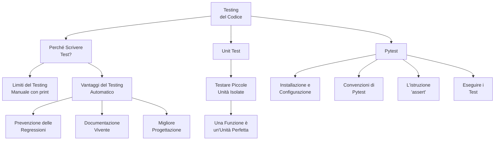

# Functional Testing

Functional testing ensures software meets functional requirements through black box testing. Testers provide input and compare expected vs actual output without understanding source code. Contrasts with non-functional testing (performance, load, scalability).

Visit the following resources to learn more:

- [@official@Playwright - End-to-End Testing Documentation](https://playwright.dev/docs/intro)
- [@article@What is Functional Testing?](https://www.guru99.com/functional-testing.html)
- [@article@Functional Testing: What It Is and How to Do It Right](https://www.atlassian.com/continuous-delivery/software-testing/functional-testing)
- [@video@Functional Testing vs Non-Functional Testing](https://www.youtube.com/watch?v=NgQT7miTP9M)
- [@video@Software Testing Tutorial for Beginners](https://www.youtube.com/watch?v=u6QfIXgjwGQ)
- [@feed@Explore top posts about Testing](https://app.daily.dev/tags/testing?ref=roadmapsh)

## 📚 Appunti Personali (IT)

### 01_Mappa_Concettuale_Testing.md
# Mappa Concettuale: Testing e Qualità del Codice

Questa mappa riassume i concetti chiave che affronteremo in questo modulo, introducendo il testing automatico come pratica fondamentale per uno sviluppatore professionista.

