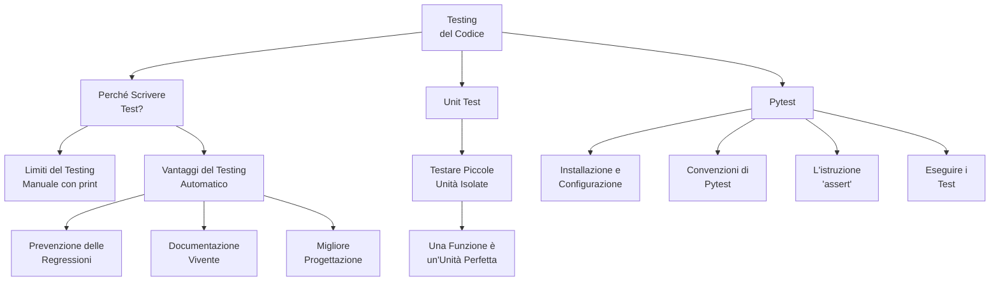

# Integration Testing

Integration testing verifies interactions between software components to ensure they work together correctly. Tests module communication via APIs, databases, and third-party services. Catches integration issues like data mismatches and protocol errors that unit tests miss.

Visit the following resources to learn more:

- [@opensource@Supertest - HTTP Integration Testing for Node.js](https://github.com/ladjs/supertest)
- [@article@Integration Testing](https://www.guru99.com/integration-testing.html)
- [@article@Unit Test vs Integration Test: What's the Difference?](https://www.testim.io/blog/unit-test-vs-integration-test/)
- [@article@How to Integrate and Test Your Tech Stack](https://thenewstack.io/how-to-integrate-and-test-your-tech-stack/)
- [@video@What is Integration Testing?](https://www.youtube.com/watch?v=kRD6PA6uxiY)
- [@video@Integration Testing in Node.js](https://www.youtube.com/watch?v=r9HdJ8P6GQI)
- [@feed@Explore top posts about Testing](https://app.daily.dev/tags/testing?ref=roadmapsh)

## 📚 Appunti Personali (IT)

### 01_Mappa_Concettuale_Testing.md
# Mappa Concettuale: Testing e Qualità del Codice

Questa mappa riassume i concetti chiave che affronteremo in questo modulo, introducendo il testing automatico come pratica fondamentale per uno sviluppatore professionista.

