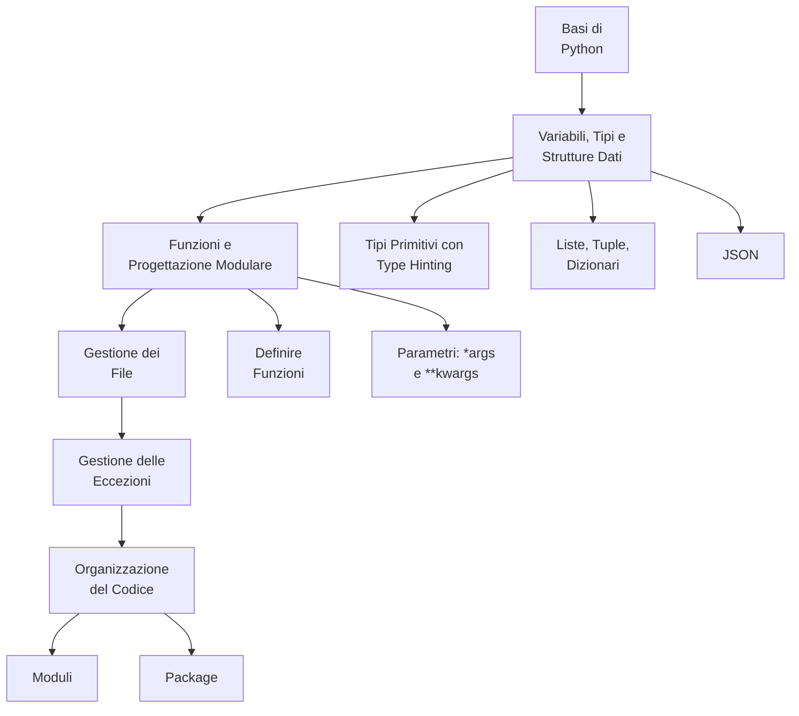
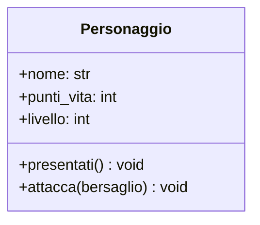

# Python

Python is a high-level, interpreted language known for readability, simplicity, and versatility. Supports multiple paradigms with rich ecosystem including Django/Flask (web), Pandas/NumPy (data), TensorFlow/PyTorch (ML). Used for web development, data science, automation, and scripting.

Visit the following resources to learn more:

- [@roadmap@Visit Dedicated Python Roadmap](https://roadmap.sh/python)
- [@course@Python Full Course for free](https://www.youtube.com/watch?v=ix9cRaBkVe0)
- [@official@Python Website](https://www.python.org/)
- [@article@Automate the Boring Stuff](https://automatetheboringstuff.com/)
- [@article@An Introduction to Python for Non-Programmers](https://thenewstack.io/an-introduction-to-python-for-non-programmers/)
- [@feed@Explore top posts about Python](https://app.daily.dev/tags/python?ref=roadmapsh)

## 📚 Appunti Personali (IT)

### 05_Ambienti_Virtuali_in_Python.md
# Ambienti Virtuali: Introduzione

## 1. Perché Isolare i Progetti?

Quando lavori a un progetto software, userai del codice scritto da te e del codice scritto da altri (chiamato **librerie** o **dipendenze**). Con il tempo, ti capiterà di lavorare su più progetti contemporaneamente.

Il problema è che progetti diversi potrebbero aver bisogno di "attrezzi" (librerie) diversi o di versioni diverse dello stesso attrezzo. Se installi tutto nello stesso posto (a livello di sistema), i progetti inizieranno a interferire tra loro, creando conflitti e bug difficili da risolvere.

## 2. La Soluzione: Una "Scatola" per Ogni Progetto

Un **ambiente virtuale** è la soluzione a questo problema. È come creare una "scatola degli attrezzi" separata e isolata per ogni progetto su cui lavori.

*   **Analogia**: Immagina di avere una scatola di LEGO per costruire un castello e un'altra per costruire un'astronave. Non mescoleresti mai i pezzi, giusto? Ogni progetto ha la sua scatola con solo i pezzi che gli servono.

Un ambiente virtuale è una cartella che contiene:
-   Una copia dell'interprete Python.
-   Tutte le librerie necessarie **solo per quel progetto**.

Questo garantisce che i tuoi progetti siano ordinati, indipendenti e riproducibili su qualsiasi computer.

## 3. Come Creare e Attivare un Ambiente

Python include uno strumento chiamato `venv` per creare ambienti virtuali.

### a) Creazione

1.  Apri il terminale e naviga nella cartella del tuo progetto.
2.  Esegui il comando per creare l'ambiente (la convenzione è chiamarlo `.venv`).
    ```bash
    python -m venv .venv
    ```
    Questo creerà una nuova cartella `.venv` nel tuo progetto.

### b) Attivazione

Prima di poterlo usare, l'ambiente deve essere "attivato".

*   **Su Windows (Bash/WSL o Git Bash):**
    ```bash
    source .venv/Scripts/activate
    ```
*   **Su macOS e Linux:**
    ```bash
    source .venv/bin/activate
    ```

Una volta attivato, vedrai `(.venv)` all'inizio del prompt del terminale. Questo ti conferma che sei dentro la "scatola" isolata del tuo progetto.

### c) Disattivazione

Quando hai finito, per uscire dall'ambiente, digita:
```bash
deactivate
```

**Nota**: Approfondiremo come installare e gestire le librerie con `pip` in una lezione successiva, dopo aver preso confidenza con le basi di Python. Per ora, è importante abituarsi a creare e attivare un ambiente virtuale per ogni nuovo progetto.

### 01_Mappa_Concettuale_Basi_Python.md
# Mappa Concettuale: Basi della Programmazione Python

Questa mappa delinea il percorso di apprendimento per i fondamenti della programmazione procedurale in Python.



### 07_Riepilogo_Basi_di_Python_Mappa_Mentale.md
# Python Mindmap

Render the file using <https://markmap.js.org/repl>
Copy and paste the following code

```markmap
---
markmap:
  height: 852
---
# Python
## execute files
## indentation
## I/O
### print()
### input()
## variables
## comments
## data types
### type()
### casting
#### str()
#### int()
#### float()
### str
#### slicing
#### len()
#### concatenation
#### f-strings
#### escape characters
### bool
### int
### float
### list
#### len()
#### append()
#### remove()
### dict
#### values()
#### keys()
#### items()
## operators
### arithmetic
### assignment
### comparison
### logical (and, or, not)
## if...else
## loops
### for
#### for .. in []
#### for .. in {}
#### for .. in range()
### while
## functions
### def (definition)
### parameters (input)
### return (output)
### *args & **kwargs
## modules
### import
### from ... import ...
### as (alias)
## JSON
### json.loads() (from string to dict)
### json.dumps() (from dict to string)
## file handling
### with open()
### modes
#### 'r' (read)
#### 'w' (write)
#### 'a' (append)
## error handling
### try
### except
### finally
### raise
```

### 03_Dal_Progetto_al_Codice_Python.md
# Lezione 2: Dal Progetto al Codice - La Sintassi `class`

Abbiamo il nostro progetto UML per la classe `Personaggio`. Ora, vediamo come "costruirla" usando il codice Python. La traduzione da un diagramma UML di base a una classe Python è quasi diretta.

## 1. Tradurre UML in Codice Python

Ecco di nuovo il nostro diagramma:



E questa è la sua implementazione in Python:

```python
class Personaggio:
    # Questo è il costruttore, che vedremo in dettaglio nel prossimo modulo.
    # Per ora, usiamolo per definire gli attributi di ogni oggetto.
    def __init__(self, nome: str):
        self.nome: str = nome
        self.punti_vita: int = 100
        self.livello: int = 1

    # Traduzione del metodo presentati()
    def presentati(self) -> None:
        print(f"Sono {self.nome}, un eroe di livello {self.livello}!")

    # Traduzione del metodo attacca()
    def attacca(self, bersaglio) -> None:
        print(f"{self.nome} attacca {bersaglio.nome}!")
        # La logica del danno verrà aggiunta in futuro
```

Analizziamo la corrispondenza:
*   `class Personaggio`: La dichiarazione della classe in UML corrisponde a `class Personaggio:`.
*   **Attributi:** Gli attributi UML (`nome`, `punti_vita`, `livello`) diventano **attributi di istanza** in Python, definiti nel costruttore `__init__` e preceduti da `self.`.
*   **Metodi:** I metodi UML (`presentati`, `attacca`) diventano **metodi di istanza** in Python, ovvero funzioni definite dentro la classe che accettano `self` come primo parametro.

### Cos'è `self`?
`self` è una variabile speciale che rappresenta **l'oggetto specifico** su cui il metodo viene chiamato. Quando scriviamo `eroe1.presentati()`, `self` all'interno del metodo `presentati` si riferirà proprio a `eroe1`. Se chiamiamo `eroe2.presentati()`, `self` si riferirà a `eroe2`. È il modo con cui un oggetto accede a sé stesso.

## 2. Attributi di Istanza vs. Attributi di Classe

Gli attributi che abbiamo definito con `self.` sono **attributi di istanza**, perché ogni oggetto (istanza) avrà la sua copia personale. Se creiamo due personaggi, `eroe1` ed `eroe2`, ognuno avrà il suo `nome` e i suoi `punti_vita`.

Esistono anche gli **attributi di classe**, che sono condivisi da *tutti* gli oggetti creati da quella classe. Si definiscono direttamente sotto la dichiarazione della classe.

```python
class Personaggio:
    # Attributo di classe: tutti i personaggi appartengono allo stesso gioco
    nome_gioco = "Le Cronache di Pythonia"

    def __init__(self, nome: str):
        # Attributi di istanza
        self.nome: str = nome
        self.punti_vita: int = 100
```

## 3. Metodi di Istanza, di Classe e Statici

*   **Metodi di Istanza (i più comuni):** Lavorano sui dati di un oggetto specifico (`self`). Esempi: `attacca()`, `subisci_danno()`.

*   **Metodi di Classe:** Lavorano sui dati della classe (`cls`), non di un singolo oggetto. Si dichiarano con il decoratore `@classmethod`. Sono utili per creare "costruttori alternativi".

    ```python
    @classmethod
    def crea_personaggio_base(cls, nome: str):
        # 'cls' qui è come dire 'Personaggio'
        return cls(nome)
    ```

*   **Metodi Statici:** Sono funzioni logicamente collegate alla classe, ma che **non dipendono né dallo stato della classe né da quello di un oggetto**. Non ricevono né `cls` né `self`. Si dichiarano con `@staticmethod`.

    ```python
    @staticmethod
    def calcola_danno_critico(danno_base: int) -> int:
        return danno_base * 2
    ```
    Questa funzione è utile nel contesto del `Personaggio`, ma non ha bisogno di sapere il nome o i punti vita di un personaggio specifico per funzionare.

### 12_SQL_in_Python.md
## Uso di SQL in un Linguaggio di Programmazione <!-- omit in toc -->

- [Il Flusso di Lavoro Standard](#il-flusso-di-lavoro-standard)
- [Esempio 1: SQLite (Database basato su file)](#esempio-1-sqlite-database-basato-su-file)
- [Esempio 2: MariaDB/MySQL (Database client-server)](#esempio-2-mariadbmysql-database-client-server)
- [Sicurezza: Prevenire la SQL Injection con Query Parametrizzate](#sicurezza-prevenire-la-sql-injection-con-query-parametrizzate)

Per creare applicazioni dinamiche, non basta saper scrivere SQL: bisogna eseguirlo tramite un linguaggio di programmazione come Python. L'interazione tra l'applicazione e il database segue un flusso di lavoro ben definito.

### Il Flusso di Lavoro Standard

Indipendentemente dal linguaggio o dal database, i passaggi sono quasi sempre gli stessi:

1.  **Importare la libreria** del driver del database.
2.  **Stabilire una connessione** al database.
3.  **Creare un "cursore"**, un oggetto per eseguire comandi.
4.  **Eseguire la query SQL** tramite il cursore.
5.  **Recuperare i risultati** (`fetch`) o **confermare le modifiche** (`commit`).
6.  **Chiudere la connessione** per rilasciare le risorse.

### Esempio 1: SQLite (Database basato su file)

SQLite è il modo più semplice per iniziare perché è incluso in Python e non richiede un server. Il database è un singolo file.

```python
import sqlite3

# 2. Connessione: crea il file 'scuola.db' se non esiste
conn = sqlite3.connect('scuola.db')
# 3. Creazione Cursore
cursor = conn.cursor()

try:
    # Eseguo DDL per creare la tabella se non esiste
    cursor.execute("""
        CREATE TABLE IF NOT EXISTS Studenti (
            Matricola INTEGER PRIMARY KEY,
            Nome TEXT NOT NULL,
            Cognome TEXT NOT NULL
        )
    """)

    # 4. Esecuzione Query DML (parametrizzata)
    # Il segnaposto per SQLite è '?'
    cursor.execute(
        "INSERT INTO Studenti (Matricola, Nome, Cognome) VALUES (?, ?, ?)",
        (101, 'Mario', 'Rossi')
    )

    # 5. Conferma delle modifiche
    conn.commit()

    # Eseguo una SELECT
    cursor.execute("SELECT Nome, Cognome FROM Studenti WHERE Matricola = ?", (101,))
    studente = cursor.fetchone() # I risultati sono tuple
    if studente:
        print(f"Studente trovato (SQLite): {studente} {studente}")

finally:
    # 6. Chiusura Connessione
    conn.close()
```

### Esempio 2: MariaDB/MySQL (Database client-server)

Questo approccio è usato per applicazioni più complesse che richiedono un server di database dedicato.

```python
import mysql.connector

# 2. Connessione
db_connection = mysql.connector.connect(
    host="localhost",
    user="tuo_utente",
    password="tua_password",
    database="scuola"
)

# 3. Creazione Cursore
cursor = db_connection.cursor(dictionary=True) # dictionary=True restituisce righe come dizionari

try:
    # 4. Esecuzione Query (parametrizzata)
    # Il segnaposto per mysql-connector è '%s'
    query = "SELECT Nome, Cognome FROM Studenti WHERE Matricola = %s"

    # 5. Recupero Risultati
    cursor.execute(query, (101,))
    studente = cursor.fetchone()
    if studente:
        print(f"Studente trovato (MariaDB): {studente['Nome']} {studente['Cognome']}")

finally:
    # 6. Chiusura Connessione
    cursor.close()
    db_connection.close()
```

### Sicurezza: Prevenire la SQL Injection con Query Parametrizzate

Un errore gravissimo è costruire query concatenando stringhe con l'input dell'utente. La soluzione è usare le **query parametrizzate**, dove la query e i dati vengono inviati separatamente al database.

**Ogni libreria ha il suo segnaposto:**

- **SQLite (`sqlite3`)**: Usa il punto di domanda (`?`).

  ```python
  matricola = 101
  cursor.execute("SELECT * FROM Studenti WHERE Matricola = ?", (matricola,))
  ```

- **MariaDB/MySQL (`mysql.connector`)**: Usa `%s`.
  ```python
  matricola = 101
  cursor.execute("SELECT * FROM Studenti WHERE Matricola = %s", (matricola,))
  ```

**Regola d'oro**: Mai, mai inserire l'input dell'utente direttamente in una stringa SQL. Usa sempre i parametri forniti dalla tua libreria.


### 07_Consumare_API_con_Python_Requests.md
# Consumare API con Python e la Libreria `requests`

Abbiamo imparato la teoria dietro le API REST. Ora è il momento di passare alla pratica e vedere come un'applicazione (in questo caso, un semplice script Python) può "consumare" un'API per ottenere e inviare dati.

Lo strumento standard per fare questo in Python è la libreria `requests`, che semplifica enormemente l'invio di richieste HTTP.

### 1. Preparazione

Prima di tutto, dobbiamo installare la libreria. Assicurati che il tuo ambiente virtuale sia attivo e poi esegui:

```bash
pip install requests
```

Per i nostri esempi, useremo **JSONPlaceholder**, un'API finta e gratuita perfetta per fare test.

### 2. Esempio 1: Richiesta `GET` per Leggere Dati

Il nostro primo obiettivo è recuperare le informazioni di un utente specifico. L'endpoint per un singolo utente è `https://jsonplaceholder.typicode.com/users/USER_ID`.

**Obiettivo:** Leggere i dati dell'utente con ID = 1.

```python
import requests
import json

# Definiamo l'URL dell'endpoint a cui vogliamo fare la richiesta
user_id = 1
url = f"https://jsonplaceholder.typicode.com/users/{user_id}"

try:
    # 1. Eseguiamo la richiesta GET
    response = requests.get(url)

    # 2. Controlliamo se la richiesta è andata a buon fine (status code 200 OK)
    response.raise_for_status()  # Solleva un'eccezione per status code 4xx o 5xx

    # 3. Estraiamo i dati JSON dalla risposta
    # Il metodo .json() converte automaticamente il corpo della risposta da stringa JSON a dizionario Python
    dati_utente = response.json()

    # 4. Usiamo i dati
    print("--- Dati Utente Ricevuti ---")
    # Usiamo json.dumps per una stampa "bella" (pretty-print) del dizionario
    print(json.dumps(dati_utente, indent=4))

    print("\n--- Informazioni Specifiche ---")
    print(f"Nome: {dati_utente['name']}")
    print(f"Email: {dati_utente['email']}")
    print(f"Città: {dati_utente['address']['city']}")

except requests.exceptions.HTTPError as err:
    print(f"Errore HTTP: {err}")
except requests.exceptions.RequestException as err:
    print(f"Errore durante la richiesta: {err}")
```

### 3. Esempio 2: Richiesta `POST` per Creare Dati

Ora proviamo a creare una nuova risorsa. Useremo l'endpoint `https://jsonplaceholder.typicode.com/posts` per creare un nuovo "post".

**Obiettivo:** Creare un nuovo post con un titolo e un corpo del testo.

```python
import requests
import json

# L'URL dell'endpoint per la creazione dei post
url = "https://jsonplaceholder.typicode.com/posts"

# 1. Prepariamo i dati da inviare nel corpo della richiesta.
# Deve essere un dizionario Python che verrà convertito in JSON.
nuovo_post = {
    'title': 'Il Mio Nuovo Post',
    'body': 'Questo è il contenuto del mio primo post creato tramite API!',
    'userId': 1
}

try:
    # 2. Eseguiamo la richiesta POST, passando i dati con il parametro `json`
    response = requests.post(url, json=nuovo_post)

    # 3. Controlliamo lo status code
    # Per una creazione, ci aspettiamo uno status code 201 (Created)
    response.raise_for_status()

    # 4. Analizziamo la risposta del server
    # Di solito, l'API restituisce l'oggetto che abbiamo creato, con l'ID assegnato dal server
    post_creato = response.json()

    print("--- Risposta dal Server ---")
    print(f"Status Code: {response.status_code} (Created!)")
    print(json.dumps(post_creato, indent=4))
    print(f"\nIl nostro post è stato creato con ID: {post_creato['id']}")

except requests.exceptions.RequestException as err:
    print(f"Errore durante la richiesta: {err}")
```

Scrivere un client API con `requests` è così semplice. Questa abilità è fondamentale per costruire applicazioni che interagiscono con servizi esterni o per testare le API che costruiremo noi stessi.````

