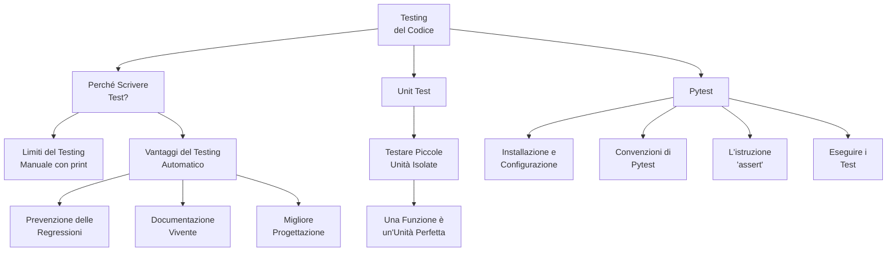

# Test Driven Development

Test Driven Development (TDD) writes tests for requirements that fail until software meets those requirements. Once tests pass, cycle repeats for refactoring or new features. Ensures software meets requirements in simplest form and avoids defects.

Visit the following resources to learn more:

- [@article@What is Test Driven Development (TDD)?](https://www.guru99.com/test-driven-development.html)
- [@article@Test-driven development](https://www.ibm.com/garage/method/practices/code/practice_test_driven_development/)
- [@video@Test-Driven Development](https://www.youtube.com/watch?v=Jv2uxzhPFl4)
- [@feed@Explore top posts about TDD](https://app.daily.dev/tags/tdd?ref=roadmapsh)


## 📚 Appunti Personali (IT)

### 01_Mappa_Concettuale_Testing.md
# Mappa Concettuale: Testing e Qualità del Codice

Questa mappa riassume i concetti chiave che affronteremo in questo modulo, introducendo il testing automatico come pratica fondamentale per uno sviluppatore professionista.



### 02_Perche_Scrivere_Test.md
# Perché Scrivere Test?

Fino ad ora, per verificare se il nostro codice funzionava, abbiamo probabilmente usato un metodo molto semplice: aggiungere delle istruzioni `print()` e lanciare lo script per vedere cosa succedeva. Questo si chiama **testing manuale**.

Il testing manuale va bene per script di poche righe, ma ha enormi limiti quando i progetti crescono:
*   **È noioso e ripetitivo:** Devi lanciare il programma e inserire gli stessi input ogni volta.
*   **È soggetto a errori:** È facile dimenticarsi di provare un caso specifico o interpretare male un risultato.
*   **Non è scalabile:** Se hai 50 funzioni, testarle tutte a mano dopo ogni modifica diventa un lavoro a tempo pieno.

Per questi motivi, gli sviluppatori professionisti si affidano al **testing automatico**.

## 1. Cos'è il Testing Automatico?

Il testing automatico consiste nello scrivere del codice il cui unico scopo è **verificare che altro codice funzioni come previsto**. Questi "script di verifica" si chiamano **test**.

*   **Analogia**: Pensa di costruire un ponte. Il testing manuale è come farci passare sopra un'auto e sperare che regga. Il testing automatico è come portare il ponte in un laboratorio e usare macchinari specializzati per applicare carichi precisi e misurare la resistenza, garantendo che rispetti le specifiche di progetto.

## 2. I Vantaggi del Testing Automatico

Scrivere test richiede tempo, ma è un investimento che ripaga enormemente.

### a) La Rete di Sicurezza (Prevenzione delle Regressioni)
Questa è la ragione più importante. Una "regressione" è un bug che si introduce in una funzionalità che prima funzionava.
Immagina di avere un'applicazione complessa. Aggiungi una nuova funzionalità e, senza accorgertene, rompi qualcos'altro in un'altra parte del programma. Con una buona suite di test, puoi lanciare un singolo comando e verificare in pochi secondi che tutto il resto dell'applicazione funzioni ancora perfettamente. I test sono la tua **rete di sicurezza** contro gli errori imprevisti.

### b) Documentazione Vivente
Un test ben scritto è una forma di documentazione. Mostra in modo inequivocabile cosa dovrebbe fare una funzione con un dato input. Un nuovo sviluppatore può leggere i test per capire come usare il tuo codice.
A differenza della documentazione tradizionale, i test non possono diventare obsoleti: se il codice cambia e il test non viene aggiornato, il test fallirà.

### c) Migliore Progettazione del Codice
Scrivere codice "testabile" ti spinge a progettarlo meglio. Incoraggia a scrivere funzioni piccole, focalizzate su un singolo compito e che non dipendano da troppe parti esterne (le cosiddette "funzioni pure"). Questo porta naturalmente a un codice più pulito, modulare e facile da mantenere.

## 3. La Piramide del Testing: Focus sugli Unit Test

Esistono diversi tipi di test. Una famosa metafora è la "piramide del testing", che li classifica in base al loro scopo e al loro numero. Alla base della piramide ci sono gli **Unit Test**.

Uno **Unit Test** verifica la più piccola unità di codice possibile in modo isolato. Nel nostro caso, l'unità perfetta è una singola **funzione**.

L'obiettivo di uno unit test è rispondere a una domanda molto semplice e precisa: "Se passo a *questa* funzione *questo* input, mi restituisce *questo* output atteso?".

Per il momento, ci concentreremo esclusivamente sugli unit test. Sono i più veloci da scrivere ed eseguire, e costituiscono la solida base di ogni strategia di testing professionale.

### 03_Il_Tuo_Primo_Unit_Test_con_Pytest.md
# Il Tuo Primo Unit Test con Pytest

Abbiamo visto *perché* è importante testare. Ora vediamo *come* farlo. Useremo `pytest`, la libreria di testing più popolare e potente nell'ecosistema Python.

### 1. Cos'è `pytest`?

`pytest` è un framework di testing che rende la scrittura di test semplice e leggibile. Richiede pochissima "cerimonia" (codice standard ripetitivo) e si basa su convenzioni intelligenti per trovare ed eseguire i test automaticamente.

### 2. Preparazione del Progetto

Un progetto ben organizzato separa il codice dell'applicazione dal codice di test. La struttura standard è la seguente:

```
progetto_calcolatrice/
├── src/                      <-- Cartella per il codice sorgente
│   └── calcolatrice.py
└── tests/                    <-- Cartella per i test
    └── test_calcolatrice.py
```

1.  **Crea le cartelle:** Crea una cartella per il progetto e, al suo interno, le sottocartelle `src` e `tests`.
2.  **Crea l'ambiente virtuale e installa pytest:**
    ```bash
    # Dalla cartella principale del progetto
    python -m venv .venv
    source .venv/Scripts/activate  # o .venv/bin/activate
    pip install pytest
    ```

### 3. Il Codice da Testare

Creiamo una funzione molto semplice nel file `src/calcolatrice.py`.

```python
# File: src/calcolatrice.py

def somma(a: int, b: int) -> int:
    """Restituisce la somma di due numeri interi."""
    return a + b
```

### 4. Scrivere il Primo Test

Ora scriviamo il codice che verificherà la nostra funzione `somma`. `pytest` si basa su due semplici convenzioni:
1.  I file di test devono iniziare con `test_` (es. `test_calcolatrice.py`).
2.  Le funzioni di test al loro interno devono iniziare con `test_` (es. `test_somma`).

Ecco il contenuto del file `tests/test_calcolatrice.py`:

```python
# File: tests/test_calcolatrice.py

# 1. Importa la funzione che vuoi testare
from src.calcolatrice import somma

# 2. Definisci la funzione di test
def test_somma_due_numeri_positivi():
    # 3. Prepara gli input e l'output atteso
    input1 = 5
    input2 = 3
    risultato_atteso = 8
    
    # 4. Chiama la funzione e verifica il risultato con 'assert'
    assert somma(input1, input2) == risultato_atteso

def test_somma_un_positivo_e_un_negativo():
    """Un test può essere anche più conciso."""
    assert somma(10, -5) == 5
```

### 5. L'Istruzione `assert`: il Cuore del Test

`assert` è una parola chiave di Python che controlla se una condizione è `True`.
*   Se `condizione` è `True`, l'istruzione non fa nulla e il test prosegue.
*   Se `condizione` è `False`, l'istruzione solleva un errore (`AssertionError`) e il test **fallisce**.

`pytest` usa `assert` per verificare le nostre aspettative. La riga `assert somma(5, 3) == 8` si legge come: "Affermo che il risultato di `somma(5, 3)` deve essere uguale a `8`".

### 6. Eseguire i Test

Con l'ambiente virtuale attivo, posizionati nella cartella principale del progetto (`progetto_calcolatrice/`) e lancia questo semplice comando:

```bash
pytest
```

`pytest` troverà automaticamente la cartella `tests`, i file `test_*.py` e le funzioni `test_*()` al loro interno, e li eseguirà.

**Output in caso di successo:**
Se tutto va bene, vedrai un output simile a questo, con dei puntini verdi che indicano i test passati.
```
============================= test session starts ==============================
...
collected 2 items

tests/test_calcolatrice.py ..                                            [100%]

============================== 2 passed in 0.01s ===============================
```

**Output in caso di fallimento:**
Proviamo a rovinare la nostra funzione `somma` in `src/calcolatrice.py`:
```python
def somma(a: int, b: int) -> int:
    return a * b # Errore intenzionale!
```
Ora, rieseguiamo `pytest`:
```
============================= test session starts ==============================
...
collected 2 items

tests/test_calcolatrice.py FF                                            [100%]

=================================== FAILURES ===================================
______________________ test_somma_due_numeri_positivi ______________________

    def test_somma_due_numeri_positivi():
        input1 = 5
        input2 = 3
        risultato_atteso = 8
    
>       assert somma(input1, input2) == risultato_atteso
E       assert 15 == 8
E        +  where 15 = somma(5, 3)

tests/test_calcolatrice.py:11: AssertionError
...
=========================== 2 failed in 0.03s ============================
```
`pytest` non solo ci dice che i test sono falliti (`FF`), ma ci mostra esattamente *perché*: si aspettava `8` ma ha ricevuto `15`. Questo feedback immediato e preciso è ciò che rende il testing automatico così potente.

### 02_Testare_gli_Oggetti.md
# Lezione 1: Testare gli Oggetti con `pytest`

Abbiamo già visto nel corso precedente come testare le funzioni "pure", quelle che dato un input restituiscono semplicemente un output. Ma come si testa una classe, un'entità che ha uno **stato** interno che cambia nel tempo?

L'idea di base rimane la stessa: **Arrange, Act, Assert**.

1.  **Arrange:** Prepara l'oggetto da testare, creandone un'istanza.
2.  **Act:** Esegui un'azione sull'oggetto, chiamando uno dei suoi metodi.
3.  **Assert:** Verifica che lo stato dell'oggetto sia cambiato come previsto.

Vediamo come applicare questo schema ai nostri personaggi.

## 1. Testare il Costruttore (`__init__`)

Il primo test da scrivere per una classe è verificare che il costruttore inizializzi correttamente lo stato dell'oggetto.

**Codice da Testare (`Personaggio`)**
```python
class Personaggio:
    def __init__(self, nome: str, livello: int = 1):
        self.nome = nome
        self.__punti_vita = 100
        self.__livello = livello
```

**Test (`test_personaggio.py`)**
```python
from src.personaggio import Personaggio # Assumendo che il codice sia in src/

def test_costruttore_personaggio():
    # Arrange: crea un'istanza della classe
    eroe = Personaggio(nome="Aragorn", livello=5)

    # Act: nessuna azione necessaria, testiamo lo stato post-creazione

    # Assert: verifica che gli attributi siano stati impostati correttamente
    assert eroe.nome == "Aragorn"
    assert eroe.livello == 5
    assert eroe.punti_vita == 100 # Assumendo di avere una property "punti_vita"
```

## 2. Testare i Metodi che Modificano lo Stato

Questo è il tipo di test più comune in OOP. Verifichiamo che un'azione (un metodo) produca il risultato atteso sullo stato interno dell'oggetto.

**Codice da Testare (`Personaggio`)**
```python
class Personaggio:
    # ... init e property ...

    def subisci_danno(self, danno: int):
        self.punti_vita -= danno # Usa il setter della property

    def is_sconfitto(self) -> bool:
        return self.punti_vita == 0
```

**Test (`test_personaggio.py`)**

```python
def test_subisci_danno():
    # Arrange
    eroe = Personaggio(nome="Gimli", livello=8)
    
    # Act
    eroe.subisci_danno(30)
    
    # Assert
    assert eroe.punti_vita == 70

def test_sconfitta_personaggio():
    # Arrange
    eroe = Personaggio(nome="Boromir", livello=7)
    
    # Act
    eroe.subisci_danno(150) # Danno superiore ai PV iniziali
    
    # Assert
    assert eroe.is_sconfitto() is True
    assert eroe.punti_vita == 0 # Verifichiamo anche che il setter abbia impedito PV negativi
```

## 3. Testare le Properties (Logica di Validazione)

Se i nostri setter contengono logica di validazione (come nel caso di `punti_vita` che non possono scendere sotto zero), dobbiamo scrivere test specifici per assicurarci che quella logica funzioni. Il test `test_sconfitta_personaggio` già verifica implicitamente questo comportamento.

Il testing nella OOP non è più complicato, richiede solo di spostare l'attenzione dalla verifica del "valore di ritorno" alla verifica dello "stato dell'oggetto".

