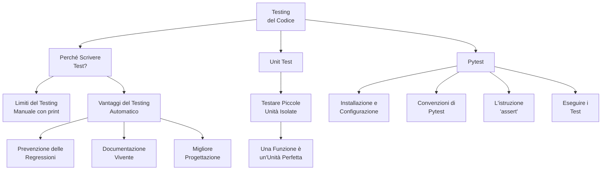

# Testing

Testing systematically evaluates software functionality, performance, and quality against requirements. Includes unit, integration, system, and acceptance testing levels. Can be manual or automated to identify defects, validate features, and ensure reliable performance before deployment.

Visit the following resources to learn more:

- [@article@What is Software Testing?](https://www.guru99.com/software-testing-introduction-importance.html)
- [@article@Testing Pyramid](https://www.browserstack.com/guide/testing-pyramid-for-test-automation)
- [@feed@Explore top posts about Testing](https://app.daily.dev/tags/testing?ref=roadmapsh)

## 📚 Appunti Personali (IT)

### 01_Mappa_Concettuale_Testing.md
# Mappa Concettuale: Testing e Qualità del Codice

Questa mappa riassume i concetti chiave che affronteremo in questo modulo, introducendo il testing automatico come pratica fondamentale per uno sviluppatore professionista.

