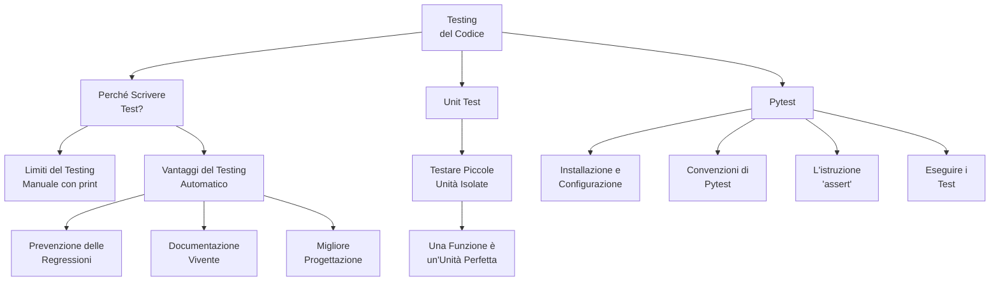

# Testing

Testing in programming means checking if your code works as expected. It's a systematic way to find and fix errors (bugs) before your code goes live. Imagine building a beautiful house without checking if the walls are straight or the roof doesn't leak—that's what coding without testing can feel like!

Visit the following resources to learn more:

- [@official@Unit Testing in Python](https://docs.python.org/3/library/unittest.html)
- [@article@Python Testing Tutorial](https://realpython.com/python-testing/)

## 📚 Appunti Personali (IT)

### 01_Mappa_Concettuale_Testing.md
# Mappa Concettuale: Testing e Qualità del Codice

Questa mappa riassume i concetti chiave che affronteremo in questo modulo, introducendo il testing automatico come pratica fondamentale per uno sviluppatore professionista.

